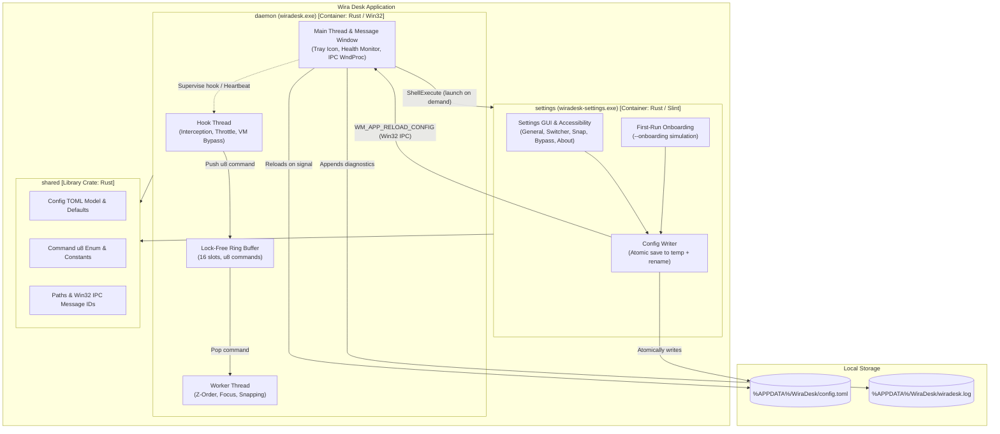

# blueprint

> Generated by `.constitution/method/scripts/validate.py --generate`. MUST NOT be hand-edited.

This is what the owner reads at **G3 Blueprint** — one page, every one of the gate's seven questions answerable from it. Its content is affected by neither `mode` nor `risk_accepted`.

## Use case catalogue

**7 use cases**, 0 marked `critical`. Rendered from `usecases.yaml`.

| id | Use case | Component | Satisfies | critical |
| --- | --- | --- | --- | --- |
| `UC-1` | Cycle to the next window of the same app on this monitor | `window-management` | `FR-1`, `FR-2`, `FR-3`, `FR-4`, `FR-5`, `FR-6` | no |
| `UC-2` | Snap the active window to half the screen | `window-management` | `FR-14`, `FR-22` | no |
| `UC-3` | See the tray icon return after Windows Explorer restarts | `window-management` | `FR-10`, `FR-11`, `FR-12` | no |
| `UC-4` | Change a keyboard shortcut in Settings | `settings` | `FR-7`, `FR-18` | no |
| `UC-5` | Complete or skip the first-run tutorial | `settings` | `FR-17` | no |
| `UC-6` | Turn auto-start on boot on or off | `settings` | `FR-13` | no |
| `UC-7` | Move the active window to the next monitor | `window-management` | `FR-23` | no |

## Actor list

### settings

| Actor | Who they are | What they may do |
| --- | --- | --- |
| Power User | Desktop user wanting customized shortcut chords, auto-start management, or diagnostic preferences. | Customize primary/fallback shortcuts, toggle auto-start on boot, modify passthrough lists. |
| New User | First-time user encountering Wira Desk upon installation or initial launch. | Step through interactive mock window cycling simulation or dismiss onboarding via Skip Tutorial. |

### window-management

| Actor | Who they are | What they may do |
| --- | --- | --- |
| Power User | Desktop user managing multiple windows of the same application across multi-monitor or virtual desktop workspaces. | Trigger same-app cycling, snap active windows to any half or to full screen, move the active window to the next monitor, access tray menu, open diagnostic logs. |
| New User | First-time user running Wira Desk on Windows. | Experience default cycling and snapping shortcuts without opening configuration. |
| Sysadmin | System administrator operating standard and elevated command shells or administrative tools. | Cycle seamlessly between standard and elevated administrator windows without UIPI refusal. |

## Domain model

### settings

### Model — settings

Conceptual domain model for the `settings` component. Represents domain entities, relationships, state transitions, and invariants governing user preferences, first-run onboarding, and auto-start configuration. Physical file layouts, TOML serialization models, and window message structs belong in `.how/settings/05-model/data-model.md`.

#### Entities

| Entity | What it is | Identified by |
| --- | --- | --- |
| `user-shortcut-preference` | The user's customized physical key combinations for primary cycling, fallback cycling, window snapping, and application passthrough lists. | Shortcut action identifier (e.g. `cycle_primary`, `cycle_fallback`, `snap_left`) |
| `onboarding-completion` | The status record indicating whether the initial interactive simulation tutorial has been completed, skipped, or is still pending. | User profile configuration identity and completion timestamp |
| `auto-start-preference` | The persistent configuration controlling whether Wira Desk launches silently at user logon via Windows Task Scheduler with elevated privileges. | Scheduled task identifier (`WiraDesk`, frozen as `shared::constants::TASK_NAME`) and target user profile |

#### Relationships

- `user-shortcut-preference` is **persisted within** the shared platform configuration schema (`app-config`).
- `onboarding-completion` **gates** the presentation of the interactive tutorial dialog on application startup.
- `auto-start-preference` **governs** the registration and removal of the Windows Scheduled Task, which the daemon performs when it reloads configuration; this component only records the preference.
- Saving `user-shortcut-preference` **triggers** an atomic write to `app-config` followed by an explicit `ipc-reload-signal` dispatch.

#### State Lifecycle

##### onboarding-completion Lifecycle

| From | To | Trigger | Who may |
| --- | --- | --- | --- |
| `Pending` | `Completed` | User finishes interactive cycling simulation through mock windows | New User |
| `Pending` | `Skipped` | User clicks or activates "Skip Tutorial" button | New User |
| `Completed` / `Skipped` | `Pending` | User manually resets tutorial state from Settings advanced options | Power User |

##### Shortcut Listening State

| From | To | Trigger | Who may |
| --- | --- | --- | --- |
| `Idle` | `Listening` | User focuses or clicks into a shortcut capture field | Power User |
| `Listening` | `Captured` | User presses a valid modifier + non-modifier key combination | Power User |
| `Listening` | `Cancelled` | User presses Escape or clicks away without entering a valid chord | Power User |
| `Captured` | `Idle` | Captured shortcut validated, stored in memory, and field unfocused | Power User |

#### Invariants

- **Atomic Persistence Invariant:** Configuration changes must be completely and safely committed to `%APPDATA%\WiraDesk\config.toml` before the `WM_APP_RELOAD_CONFIG` IPC message is dispatched to the daemon (BR-1, BR-2, AD-5).
- **Physical Key Listening Invariant:** Shortcut input fields must capture raw physical keystroke combinations directly and must not accept arbitrary typed text strings (FR-18).
- **Skip Tutorial Availability Invariant:** The "Skip Tutorial" action must remain accessible and clearly visible on every step of the first-run onboarding flow (FR-17).
- **Per-User Task Alignment Invariant:** Auto-start scheduled tasks must always be created with `/RU %USERNAME%` and `/RL HIGHEST`, never under the `SYSTEM` account (BR-4, AD-13).
- **Full Accessibility Invariant:** All interactive settings controls, toggles, and modal dialogs must be fully navigable via keyboard and expose name, role, and state to screen readers via Windows UI Automation (FR-20, FR-21, AD-11a).

### window-management

### Model — window-management

Conceptual domain model for the `window-management` component. Represents domain entities, relationships, state transitions, and invariants from the business and user perspective. Physical types, struct definitions, and Win32 FFI storage details belong in `.how/window-management/05-model/data-model.md`.

#### Entities

| Entity | What it is | Identified by |
| --- | --- | --- |
| `hook-command` | An intercepted, validated, and throttled user intent command dispatched from the keyboard hook to the background worker. | Command action code and dispatch timestamp |
| `window-focus-state` | The live snapshot of active window focus, monitor boundaries, virtual desktop context, and application identity on the current desktop. | Foreground window handle (`HWND`), monitor identity, and virtual desktop GUID |
| `tray-health-state` | The operational status of the background daemon, tracking hook attachment vitality, error severity level, and user notification state. | Error tier level (`Normal`, `Warning`, `Critical`) and hook vitality status |
| `arrangement-command` | A planned window repositioning and sizing action targeting specific desktop regions (a half-screen snap to any of the four halves, maximized state, an overlapping stack slot, or a move to the next monitor). | Target screen region geometry, the destination monitor, and monitor DPI scaling context |

#### Relationships

- One `hook-command` **triggers** the evaluation of one live `window-focus-state`.
- One `window-focus-state` **determines** the candidate set of same-application windows on the active monitor.
- One `tray-health-state` **reflects** the runtime health of the hook thread and error reporting protocol.
- One `arrangement-command` **modifies** the geometry of the active window within the bounds of `window-focus-state`.
- One `arrangement-command` of the monitor-move kind **reads** the live monitor set to choose a destination, and is the only kind whose target work area is not the one `window-focus-state` reports.

#### State Lifecycle

##### tray-health-state

| From | To | Trigger | Who may |
| --- | --- | --- | --- |
| `Normal` | `Warning` | Non-fatal runtime operational failure (e.g. transient enumeration error) | Worker thread (Tier 2) |
| `Warning` | `Normal` | Successful recovery and clean operation on subsequent cycle | Worker thread |
| `Normal` / `Warning` | `Critical` | Hook death detected by 10-second heartbeat or OS unhook event | Tray controller (Tier 3) |
| `Critical` | `Normal` | Successful hook re-installation or daemon recovery | Tray controller / Worker thread |

##### hook-command Lifecycle

| From | To | Trigger | Who may |
| --- | --- | --- | --- |
| `Pending` | `Dispatched` | Shortcut chord detected and passed throttle window (≥50 ms) | Hook thread |
| `Pending` | `Dropped` | Throttle window violation (<50 ms) or ring buffer full | Hook thread |
| `Dispatched` | `Executed` | Worker completes window focus transition or arrangement | Worker thread |

#### Invariants

- **Live Traversal Invariant:** Window focus state and Z-order stacking must never be cached between shortcut keypresses; each cycle command must traverse live desktop state (AD-3).
- **Spatial Preservation Invariant:** Target candidate windows for cycling or snapping must reside on the exact same physical monitor and virtual desktop as the foreground window (FR-2, CAP-7). A monitor-move command is the one deliberate crossing of the monitor half of this boundary; it still must not cross the virtual desktop half, and moving a window never changes which desktop shows it (FR-23, AD-9).
- **Proportional Placement Invariant:** A window moved between monitors must be placed by the share of the destination work area it occupied on the source, never by copying its pixel width and height — otherwise an arrangement dissolves the moment the two monitors differ in size or display scaling (FR-23, DEC-007).
- **Live Monitor Set Invariant:** The set of attached monitors must be enumerated fresh on every monitor-move command and must never be cached between keypresses. An `HMONITOR` is a handle rather than an identity, and a cached list survives an unplug that the handle does not (AD-14).
- **One Chord, One Action Invariant:** No two actions may be reachable by the same chord. When configuration says otherwise, the chord belongs to the first action in the fixed precedence order and the later action is unbound rather than ambiguous (BR-6, DEC-009).
- **UX Honesty Invariant:** Unresponsive ("Not Responding") windows must receive focus when reached in the cycling sequence and must never be filtered out (FR-4).
- **Hook Callback Speed Invariant:** The low-level keyboard hook callback must complete within 10 ms without executing heap allocations or blocking synchronous APIs (NFR-2, NFR-3).
- **Single Instance Invariant:** Exactly one background daemon instance may run per user logon session (NFR-6).

## Business rules binding more than one component

| id | Rule | Binds | Source | Status |
| --- | --- | --- | --- | --- |
| BR-1 | Configuration persistence is written exclusively by the settings process; the background daemon reloads configuration only upon receiving an explicit IPC signal (`WM_APP_RELOAD_CONFIG`), never through background file-system polling or file watching. | `settings`, `window-management` | FR-7, AD-1, AD-5 | active |
| BR-2 | Both binaries read and write `%APPDATA%\WiraDesk\config.toml` strictly adhering to the shared schema owned by `_platform`, guaranteeing configuration forward and backward compatibility across versions. | `settings`, `window-management` | FR-7, CAP-3, AD-12 | active |
| BR-3 | First-run onboarding may launch the settings process elevated directly from the parent daemon without triggering a secondary User Account Control (UAC) elevation prompt in the same logon session. | `settings`, `window-management` | FR-8, FR-17, AD-11 | active |
| BR-4 | The auto-start scheduled task must launch the background daemon with highest privileges configured specifically for the active `%USERNAME%`, ensuring user AppData directory paths and privilege integrity levels align exactly. | `settings`, `window-management` | FR-13, CAP-10, AD-13 | active |
| BR-5 | System tray "View Logs" action opens the diagnostic log file itself in a plain-text viewer; the settings UI does not duplicate log inspection or file handling interfaces. | `window-management`, `settings` | FR-12, CAP-11, AD-1 | active |
| BR-6 | Two actions configured to the same chord is a defined condition, and the two components answer it differently on purpose. The settings process refuses to save a configuration containing one, naming both fields. The daemon, which has no such veto over a file it did not write, keeps the chord for whichever field comes first in the fixed precedence order, leaves the later field unbound, and emits exactly one Tier-2 warning naming both — except on an explicit reload, where a last-known-good configuration exists and the whole candidate is refused instead. | `settings`, `window-management` | FR-7, FR-18, DEC-001, DEC-009 | active |
| BR-7 | The auto-start task's stored executable path must track the running daemon rather than the daemon's location at the moment auto-start was switched on, and the safety of that location must be reported to the user without ever being enforced against them. | `window-management`, `settings` | FR-13, CAP-10, AD-13, AD-7 | active |
| BR-8 | The update-check request, made by either component, is the only network activity the product ever performs. It carries no payload beyond the request itself — no version, machine name, user name, configuration, or identifier — and nothing else in either component may make a network call. | `window-management`, `settings` | FR-24, FR-25, CAP-13 | active |

## Invariants — the spine

Rendered from `.how/_platform/ARCHITECTURE-SPINE.md`. G3 asks of every row: does it name the concrete failure it prevents, and would breaking it in one component break another?

| id | Invariant | Binds | Prevents | Rule |
| --- | --- | --- | --- | --- |
| `AD-1` | Design Paradigm: Actor / Message-Passing [ADOPTED] | all | Shared mutable state between threads/processes causing data races or deadlocks. | Each actor (hook thread, worker thread, settings process) owns its state exclusively. Cross-actor communication uses only: lock-free ring buffer (hook→worker), Win32 Window Messages (settings→daemon, and daemon→settings for the observed-chord report a capture lease authorises — `DEC-004`), TOML file (settings→daemon config), ShellExecute (daemon→settings launch). No payload crossing the process boundary is ever a pointer: the lease carries a process id and its level, and the report carries a virtual-key code and a modifier set, all as plain integers. |
| `AD-2` | Inter-Thread Communication: Hook-Side Throttle + u8 Enum | CAP-1, CAP-2, CAP-12 | Ring buffer overflow from macro spam; worker thread wasting cycles on invalid/duplicate inputs; a queued command changing meaning when the command set grows. | The Hook Thread is solely responsible for anti-macro throttle (reject inputs <50ms apart). It translates valid keypresses into a `u8` command enum (`1`=Cycle, `2`=SnapLeft, `3`=SnapRight, `4`=SnapMaximize, `5`=OverlappingStack, `6`=SnapTop, `7`=SnapBottom, `8`=MoveToNextMonitor) before writing to the ring buffer. The Worker Thread never performs input validation — it only executes commands. Wire values are **extended, never renumbered**: a value already assigned keeps its meaning permanently, because a command sitting in the ring buffer carries only the number. Any value outside the assigned set decodes to `Nop` rather than being treated as an error. |
| `AD-3` | Z-Order Traversal: Stateless Just-in-Time [ADOPTED] | CAP-1, CAP-7 | Stale window state causing focus to jump to closed/moved windows; desynchronization with mouse interactions. | On every keypress, the Worker Thread traverses the live Z-Order via `EnumWindows`. No internal Z-Order cache is permitted. The cost of iterating through windows with non-blocking Kernel APIs is accepted. |
| `AD-4` | Same-Application Identity: Exe Name + Class Name Exclusion | CAP-1 | Misidentification in multi-process architectures (Electron/Chromium apps where each window has a different PID); false grouping of unrelated Electron apps that share the same Window Class Name. | Two windows belong to the "same application" if and only if their owning executable filename matches (e.g., `chrome.exe`). PID comparison is prohibited as the primary identity mechanism. Window Class Name is used only as an exclusion filter to discard ghost windows and internal utility windows (e.g., `WS_EX_TOOLWINDOW`). |
| `AD-5` | Config Reload: Explicit IPC Signal | CAP-3, CAP-5 | Unnecessary CPU wake-ups from file system watchers; race conditions from reading a partially-written config file. | The Settings binary writes `config.toml` to completion atomically via temp file rename, then sends a `WM_APP_RELOAD_CONFIG` Win32 message to the Daemon's hidden window. The Daemon reloads config only upon receiving this message — never via polling or file watching. |
| `AD-6` | VM/RDP Bypass: Hook Thread Evaluation | CAP-8 | Wira Desk intercepting shortcuts meant for a VM/Remote Desktop guest OS; infinite loop risk from re-injecting keys via `SendInput`. | Before intercepting any shortcut, the Hook Thread calls `GetForegroundWindow()` and checks the window's class name / process name against the bypass list (loaded from config). If matched, `CallNextHookEx` is called immediately — the key passes through physically to the VM/RDP client with zero latency. |
| `AD-7` | Error Handling: 3-Tier Protocol | CAP-6, CAP-9, CAP-11 | Silent failures going unnoticed (hook silently dying); notification spam annoying the user; startup errors being invisible. | - **Tier 1 (Startup Fatal):** Show exactly 1x `MessageBox`, then exit. No retry. |
| `AD-8` | Hook Health Monitoring: 10-Second Heartbeat | CAP-6 | Hook dying silently with no detection mechanism; delayed user awareness of broken functionality. | The Daemon checks hook handle validity every 10 seconds. If invalid, it attempts re-registration. If re-registration fails repeatedly (`HOOK_CHECK_FAIL_THRESHOLD = 3`), Tier 3 error protocol is triggered. |
| `AD-9` | Virtual Desktop Isolation: IVirtualDesktopManager | CAP-7 | Window cycling crossing virtual desktop boundaries, violating spatial layout preservation. | During Z-Order traversal, each candidate window must pass `IVirtualDesktopManager::IsWindowOnCurrentVirtualDesktop(hwnd)`. Windows not on the current virtual desktop are skipped. This is an official, documented Microsoft API (`shobjidl_core.h`, Windows 10+). |
| `AD-10` | Explorer Crash Recovery: TaskbarCreated Listener [ADOPTED] | CAP-9 | Tray icon permanently disappearing after `explorer.exe` crash/restart. | The Daemon's message loop listens for the `TaskbarCreated` broadcast message and re-registers the tray icon upon receiving it. |
| `AD-11` | Settings Binary: Slint + ShellExecute Launch | CAP-5 | GUI framework bloating the daemon's RAM; complex de-elevation logic adding attack surface. | `wiradesk-settings.exe` uses `Slint` for its GUI, with `ui/main_window.slint` compiled by `slint-build` in `build.rs` and rendered through `i-slint-backend-winit`. The Daemon launches it via `ShellExecute` (inheriting Administrator elevation). De-elevation is not required — the settings binary only edits `config.toml` in `%APPDATA%`. |
| `AD-12` | Cargo Workspace: Three Crates | all | Duplicated type definitions (config structs, command enums) between daemon and settings, causing silent divergence. | The project is a single Cargo Workspace with three crates: `daemon` (`wiradesk.exe`), `settings` (`wiradesk-settings.exe`), and `shared` (Config TOML types, `u8` command enum, constants, `%APPDATA%` path). Both binaries depend on `shared`. |
| `AD-13` | Auto-Start: Windows Task Scheduler | CAP-10 | UAC prompt on every boot (a registry `Run`-key entry cannot launch an elevated process silently); `%APPDATA%` path mismatch if the task runs as SYSTEM; DLL Hijacking via the task's working directory; a stored path outliving the executable it named. | Auto-start is registered as a Windows Scheduled Task (`schtasks`): trigger `ONLOGON`, run level `/RL HIGHEST`, run-as user `/RU "%USERNAME%"` (the specific active user, never SYSTEM — keeping `%APPDATA%` aligned between daemon and settings GUI). The task action (`/TR`) must use the absolute executable path and the `Start in` parameter must be left empty or point to the secure install directory, mitigating DLL Hijacking. The registry `Run`-key mechanism (`HKCU\...\CurrentVersion\Run`) is prohibited. Toggle (create/delete task) is exposed via the tray context menu and settings UI. |
| `AD-14` | Monitor Enumeration: Stateless Just-in-Time | CAP-2, CAP-7, CAP-12 | A cached monitor list outliving the display configuration it described — placing a window onto a monitor that has been unplugged, or refusing to reach one that has just been attached. Also prevents an `HMONITOR` being treated as a durable identity, which it is not. | On every command that needs to know what monitors exist, the Worker Thread enumerates them live via `EnumDisplayMonitors` and reads each one's work area and DPI at that moment. No monitor list, work area, or `HMONITOR` may be cached, memoized, or held in a `static` between keypresses. Display-change notifications are not subscribed to, because nothing is stored for them to invalidate. This is `AD-3`'s rule applied to the display set rather than to the Z-order, and it is stated separately because the two are enumerated by different APIs and it would otherwise be read as covered by implication. |

## Containers, and which components live in each

Rendered from `components.yaml` — the table C4 L2 used to carry by hand.

| Container | What | Product Components living in it |
| --- | --- | --- |
| `daemon` |  | `window-management` |
| `settings` |  | `settings` |

### C4 L2 — `c4-l2-containers.md`

### C4 L2 — Containers

| Container | Binary | Technology | Responsibilities |
| --- | --- | --- | --- |
| **daemon** | `wiradesk.exe` | Rust, `windows-sys`, Win32 API | Installs global `WH_KEYBOARD_LL` hook, maintains lock-free command ring buffer, executes stateless Z-order window cycling and DPI-aware snapping, manages tray icon / context menu, monitors hook health (10s heartbeat). Runs elevated (`requireAdministrator`). |
| **settings** | `wiradesk-settings.exe` | Rust, `slint` (`accessibility` feature), `i-slint-backend-winit` | Provides accessible GUI for editing shortcut bindings, VM bypass list, snapping preferences, and auto-start. Hosts first-run onboarding tutorial. Writes `config.toml` atomically and dispatches `WM_APP_RELOAD_CONFIG` to daemon. |
| **shared** | (library crate) | Rust, `serde`, `toml` | Single source of truth for config schema, default bindings, `u8` command enum, IPC message IDs, APPDATA paths, and legacy WinTick migration logic. |

#### Product Components per container

Product Components per container — see `.control/registry/components.yaml`, each PC's `containers:`.

#### Container Interaction Matrix

| Initiator | Target | Channel / Protocol | Purpose |
| --- | --- | --- | --- |
| `daemon` (tray menu) | `settings` | `ShellExecute` (`wiradesk-settings.exe`) | Open Settings GUI (or onboarding via `--onboarding` on first run). Inherits Administrator elevation. |
| `settings` | `daemon` | `WM_APP_RELOAD_CONFIG` (Win32 `PostMessageW` / `SendMessageW` to hidden window) | Notify daemon that `config.toml` was atomically written to disk and needs immediate reload. |
| `Hook Thread` | `Worker Thread` | In-process lock-free static ring buffer (`16` slots of `u8`) | Pass validated, throttled shortcut commands with zero heap allocation. |
| `health.rs` | `Hook Thread` / Main | `WM_APP_HOOK_CHECK`, `WM_APP_HOOK_DEAD` | 10-second heartbeat check and Tier-3 critical escalation. |
| `daemon` | Filesystem | Direct I/O (`%APPDATA%\WiraDesk\config.toml`, `wiradesk.log`) | Read config on boot/signal; append diagnostic warnings/errors. |
| `settings` | Filesystem | Direct I/O (`config.toml.tmp` -> `config.toml`) | Atomically persist user changes without partial-read races. |

## Three inventories

### List of tables — `inventory-db.md`

### Data & Persistence Inventory

Wira Desk does not use an RDBMS or embedded SQL database. All persistence uses local files and in-memory runtime data structures.

#### Persistent Stores

| Store | Format | Owner | Path / Location | Schema & Keys | Lifetime & Access Pattern |
| --- | --- | --- | --- | --- | --- |
| **User Configuration** | TOML | `_platform` (shared) | `%APPDATA%\WiraDesk\config.toml` | **Sections:** - `[general]`: `auto_start` (bool) - `[switcher]`: `shortcut`, `fallback_shortcut` - `[snapping]`: `snap_half_left`, `snap_half_right`, `snap_maximize` - `[layout]`: `enable_overlapping_stack`, `stack_width_percent`, `stack_shortcut` - `[vm_bypass]`: `bypass_processes` (vec), `bypass_classes` (vec) | Written atomically by `settings` process via temp file + rename. Read on startup and on `WM_APP_RELOAD_CONFIG` by `daemon`. |
| **Diagnostic Log** | Plaintext (append-only) | `_platform` (shared) | `%APPDATA%\WiraDesk\wiradesk.log` | Formatted log lines: `[YYYY-MM-DD HH:MM:SS.mmm] [LEVEL] Message` | Append-only. Written by `daemon` on warnings/errors. Opened as a file in `notepad.exe` via tray "View Logs". |
| **Legacy Config (Migration)** | TOML | `_platform` (shared) | `%APPDATA%\WinTick\config.toml` | Legacy schema (WinTick keys). | Read-only during one-time bootstrap migration if `%APPDATA%\WiraDesk\config.toml` does not yet exist. |

#### In-Memory Runtime State

| State Structure | Owner | Container | Concurrency & Access | Notes |
| --- | --- | --- | --- | --- |
| **Command Ring Buffer** | `window-management` | `daemon` | Lock-free, Single-Producer Single-Consumer (SPSC), `16` slots of `u8`. | Hook Thread pushes commands; Worker Thread drains and executes. |
| **Tray Icon State Machine** | `window-management` | `daemon` | Mutex / message-loop owned (`Normal`, `Warning`, `Critical`). | Reflects 3-Tier error protocol visually. |
| **Hook Health Status** | `window-management` | `daemon` | Atomic / 10s timer state in `health.rs`. | Heartbeat counter tracking consecutive hook check failures. |
| **Settings Working Copy** | `settings` | `settings` | UI thread mutable state (`Config` struct). | Edits are held in GUI memory until the user clicks Save / Applies changes. |

#### Rows

| No | Table | Owning component | What it holds | Key columns | Status |
| --- | --- | --- | --- | --- | --- |
| 1 | `config.toml [general]` | `_platform` | Persisted user configuration for general | `auto_start` | active |
| 2 | `config.toml [switcher]` | `_platform` | Persisted user configuration for switcher | `shortcut`, `fallback_shortcut` | active |
| 3 | `config.toml [snapping]` | `_platform` | Persisted user configuration for snapping | `snap_half_left`, `snap_half_right`, `snap_maximize` | active |
| 4 | `config.toml [layout]` | `_platform` | Persisted user configuration for layout | `enable_overlapping_stack`, `stack_width_percent`, `stack_shortcut` | active |
| 5 | `config.toml [vm_bypass]` | `_platform` | Persisted user configuration for vm bypass | `bypass_processes`, `bypass_classes` | active |

### List of endpoints — `inventory-api.md`

### API & IPC Inventory

Wira Desk contains no HTTP, REST, GraphQL, or RPC network APIs of its own — it exposes none, and consumes exactly one, outbound: an HTTPS `GET` for the release-check descriptor (`crates/shared/src/https.rs`, `crates/shared/src/update.rs`), and the installer download it can trigger (`crates/settings/src/update.rs`). Both are host- and path-pinned to the product's own release channel; see `BR-8` for what the request does and does not carry. Every other inter-process and inter-thread boundary uses Win32 IPC, OS messages, and in-memory lock-free channels, listed below.

#### IPC & Message Interfaces

| Interface / Message | Code / Identifier | Owner | Source → Destination | Transport | Payload & Parameters | Semantics & Handling |
| --- | --- | --- | --- | --- | --- | --- |
| **Config Reload IPC** | `WM_APP_RELOAD_CONFIG` (`0x8001`) | `_platform` | `settings` → `daemon` | Win32 `SendMessageW` / `PostMessageW` to hidden daemon window (`WiraDeskDaemonHiddenWindow`) | `wParam = 0`, `lParam = 0` | Triggers immediate file re-read of `%APPDATA%\WiraDesk\config.toml` by daemon main thread. |
| **Command Ready (Internal)** | `WM_APP_COMMAND_READY` (`0x8002`) | `window-management` | `Hook Thread` → `Worker Thread` | Win32 `PostThreadMessageW` or event wake-up | `wParam = 0`, `lParam = 0` | Wakes the worker thread loop to drain commands from the ring buffer. |
| **Hook Dead Escalation** | `WM_APP_HOOK_DEAD` (`0x8003`) | `window-management` | `health.rs` → Main Thread | Win32 message loop dispatch | `wParam = 0`, `lParam = 0` | Transitions tray state machine to Tier 3 Critical (Red X) and triggers 1x toast notification. |
| **Log Warning Alert** | `WM_APP_LOG_WARNING` (`0x8004`) | `window-management` | Logger → Main Thread | Win32 message loop dispatch | `wParam = 0`, `lParam = 0` | Transitions tray icon to Tier 2 Warning (Red Dot overlay). |
| **Hook Check / Heartbeat** | `WM_APP_HOOK_CHECK` (`0x8005`) | `window-management` | `health.rs` → Hook Thread | Win32 `PostThreadMessageW` | `wParam = 0`, `lParam = 0` | Instructs the Hook Thread to verify active hook state and increment health counters. |
| **Hook Thread Ready** | `WM_APP_HOOK_READY` (`0x8006`) | `window-management` | `Hook Thread` → Main Thread | Win32 message loop dispatch | `wParam = thread_id`, `lParam = 0` | Reports successful hook installation and thread initialization. |
| **Hook Init Failed** | `WM_APP_HOOK_INIT_FAILED` (`0x8007`) | `window-management` | `Hook Thread` → Main Thread | Win32 message loop dispatch | `wParam = error_code`, `lParam = 0` | Reports fatal hook initialization failure (escalates to Tier 1 fatal popup). |
| **Hook Refresh OK** | `WM_APP_HOOK_REFRESH_OK` (`0x8008`) | `window-management` | `Hook Thread` → Main Thread | Win32 message loop dispatch | `wParam = 0`, `lParam = 0` | Reports a successful re-registration. Returns the tray to `Normal` (or `Warning` when `warning_latched`) and resets the Tier-3 toast latch — this is the message that makes recovery restart-free. |
| **Hook Shutdown** | `WM_APP_HOOK_SHUTDOWN` (`0x8009`) | `window-management` | Main Thread → Hook Thread | Win32 `PostThreadMessageW` | `wParam = 0`, `lParam = 0` | Instructs the Hook Thread to unhook and exit its message loop so the thread can be joined on a clean shutdown. |
| **Hook Config Snapshot** | `WM_APP_CONFIG_SNAPSHOT` (`0x801E`) | `window-management` | Main Thread → Hook Thread | Win32 `PostThreadMessageW` | `lParam = Box::into_raw(HookSnapshot)` | Transfers owned, immutable snapshot of bypass rules and shortcut mappings to Hook Thread. |
| **Capture Lease Request** | `WM_APP_CAPTURE_LEASE` (`0x801F`) | `_platform` | `settings` → `daemon` | Win32 `PostMessageW` to the daemon's hidden window | `wParam = lease level (0=NONE, 1=OBSERVE, 2=RECORD)`, `lParam = Settings process id` | Settings requests or releases a temporary shortcut-capture lease on the daemon (`DEC-004`); a single ordered level rather than two independent flags. |
| **Hook Lease Forward** | `WM_APP_HOOK_LEASE` (`0x8020`) | `window-management` | Main Thread → Hook Thread | Win32 `PostThreadMessageW` | Same shape as `WM_APP_CAPTURE_LEASE`, forwarded unchanged | Internal daemon relay: the host window notifies the Hook Thread of the capture lease level Settings just requested. |
| **Recorded Chord Report** | `WM_APP_RECORDED_CHORD` (`0x8021`) | `_platform` | `daemon` → `settings` | Win32 `PostMessageW` to Settings' hidden receiver window (`SETTINGS_HOOK_WINDOW_CLASS`, located via `FindWindowW`) | `wParam = Win32 virtual-key code`, `lParam = packed modifier bits (1=Ctrl, 2=Win, 4=Alt, 8=Shift)` | While an observe/record lease is armed, the daemon reports a chord its hook actually observed back to Settings. |
| **Update Check State Changed** | `WM_APP_UPDATE_STATE` (`0x8022`) | `window-management` | `updatecheck` → Main Thread | Win32 `PostMessageW` (same process) | `wParam = 0`, `lParam = 0` | The daily update check has new state to show; the result itself lives in `updatecheck`'s own state, not in the message. |
| **Ring Buffer Command** | `Command` enum (`0..=5`) | `window-management` | `Hook Thread` → `Worker Thread` | In-process lock-free static ring buffer (`16` slots) | Raw `u8` byte (`1`=Cycle, `2`=SnapLeft, `3`=SnapRight, `4`=SnapMax, `5`=Stack) | Fire-and-forget command transfer with zero heap allocation. |
| **Settings Spawn** | Executable invocation | `_platform` | `daemon` → `settings` | Win32 `ShellExecuteW` | Path: `wiradesk-settings.exe`, optional arg: `--onboarding` | Spawns GUI process on demand inheriting elevation. |

#### External Operating System APIs

| OS API Category | Win32 API Functions | Consumer | Purpose |
| --- | --- | --- | --- |
| **Keyboard Hooks** | `SetWindowsHookExW`, `UnhookWindowsHookEx`, `CallNextHookEx` | `daemon::hook` | Low-level global keyboard interception (`WH_KEYBOARD_LL`). |
| **Window Enumeration** | `EnumWindows`, `IsWindowVisible`, `GetWindowLongPtrW`, `GetClassNameW` | `daemon::worker`, `daemon::cycling` | Live, non-blocking Z-order traversal and candidate filtering. |
| **Process Identity** | `GetWindowThreadProcessId`, `OpenProcess`, `QueryFullProcessImageNameW` | `daemon::cycling` | Multi-process executable filename matching (AD-4). |
| **Focus & Positioning** | `SetForegroundWindow`, `SetWindowPos`, `ShowWindowAsync` | `daemon::worker`, `daemon::arrangement` | Active window focus switching and DPI-aware snapping. |
| **Virtual Desktops** | `IVirtualDesktopManager::IsWindowOnCurrentVirtualDesktop` | `daemon::context` | Isolation of cycling within the active virtual desktop (AD-9). |
| **Tray & Notification** | `Shell_NotifyIconW`, `RegisterWindowMessageW("TaskbarCreated")` | `daemon::tray` | Tray icon lifecycle, status overlays, and explorer restart recovery (AD-10). |
| **Task Scheduler** | `schtasks.exe /Create /Query /Delete` | `daemon::autostart`, `settings::app` | Elevated logon auto-start management (AD-13). |
| **UI Automation (a11y)** | Slint's Windows accessibility backend (AccessKit internally) | `settings` | Screen reader accessibility tree publication for `accessible-role`/`accessible-label` Slint elements (AD-11a). |

#### Rows

| No | Host | Method | Path | Owning component | Description | Status |
| --- | --- | --- | --- | --- | --- | --- |
| 1 | win32-message | POST | `WM_APP_RELOAD_CONFIG` | `settings`, `window-management` | `WM_APP + 1` (0x8001). Message: Settings tells the daemon to reload `config.toml`. | active |
| 2 | win32-message | POST | `WM_APP_COMMAND_READY` | `window-management` | `WM_APP + 2` (0x8002). Internal message: Worker thread receives a ready-to-read `u8` command from the ring buffer. | active |
| 3 | win32-message | POST | `WM_APP_HOOK_DEAD` | `window-management` | `WM_APP + 3` (0x8003). Internal message: heartbeat monitor reports a dead hook (escalates to Tier 3). | active |
| 4 | win32-message | POST | `WM_APP_LOG_WARNING` | `window-management` | `WM_APP + 4` (0x8004). Internal message: a runtime warning was logged (triggers Tier 2 red-dot tray state). | active |
| 5 | win32-message | POST | `WM_APP_HOOK_CHECK` | `window-management` | `WM_APP + 5` (0x8005). Internal message: heartbeat tick from `health.rs` — asks `wndproc_impl` to verify or refresh the keyboard hook on each heartbeat tick. Separate from `WM_APP_HOOK_DEAD` (which means "transition to Tier 3 Critical"). | active |
| 6 | win32-message | POST | `WM_APP_HOOK_READY` | `window-management` | `WM_APP + 6` (0x8006). Hook Thread ready — `wParam` = hook thread id (`PostThreadMessageW` target). | active |
| 7 | win32-message | POST | `WM_APP_HOOK_INIT_FAILED` | `window-management` | `WM_APP + 7` (0x8007). Hook Thread failed initialization (fatal policy). | active |
| 8 | win32-message | POST | `WM_APP_HOOK_REFRESH_OK` | `window-management` | `WM_APP + 8` (0x8008). Hook Thread reports successful hook refresh (resets the consecutive fail counter). | active |
| 9 | win32-message | POST | `WM_APP_HOOK_SHUTDOWN` | `window-management` | `WM_APP + 9` (0x8009). Request Hook Thread shutdown (unhook + exit message loop). | active |
| 10 | win32-message | POST | `WM_APP_DEBUG_TOGGLE_HOOK_FAIL` | `window-management` | `WM_APP + 20` (0x8014). Toggle forced hook refresh failure (Hook Thread). | debug-only |
| 11 | win32-message | POST | `WM_APP_DEBUG_TRIGGER_WARN` | `window-management` | `WM_APP + 21` (0x8015). Force one Tier-2 warning (`log::warn`) to verify the red-dot tray state. | debug-only |
| 12 | win32-message | POST | `WM_APP_DEBUG_HOOK_CHECK` | `window-management` | `WM_APP + 22` (0x8016). Force one `WM_APP_HOOK_CHECK` tick to the Hook Thread (without waiting for heartbeat). | debug-only |
| 13 | win32-message | POST | `WM_APP_DEBUG_DUMP_HOOK_LATENCY` | `window-management` | `WM_APP + 23` (0x8017). Write QPC callback statistics to trace (`HOOK_LATENCY: ...`). | debug-only |
| 14 | win32-message | POST | `WM_APP_DEBUG_SIMULATE_SHORTCUT` | `window-management` | `WM_APP + 24` (0x8018). Simulate a shortcut (`wParam` 0=primary, 1=extra modifier) on the Hook Thread. | debug-only |
| 15 | win32-message | POST | `WM_APP_DEBUG_DUMP_CYCLE_METRICS` | `window-management` | `WM_APP + 25` (0x8019). Write cycle latency distribution and reconciliation counters to the debug trace. Separate from `WM_APP_DEBUG_DUMP_HOOK_LATENCY`: end-to-end Worker distribution must be reported independently of hook callback timing. | debug-only |
| 16 | win32-message | POST | `WM_APP_DEBUG_RESET_CYCLE_METRICS` | `window-management` | `WM_APP + 26` (0x801A). Reset all cycle latency samples and reconciliation counters. | debug-only |
| 17 | win32-message | POST | `WM_APP_DEBUG_CYCLE_BURST` | `window-management` | `WM_APP + 27` (0x801B). Run `wParam` consecutive cycles through the Worker path. Deliberately does NOT use `WM_APP_DEBUG_SIMULATE_SHORTCUT`: that seam drains the ring and resets throttle on every call, so at high volume it drops commands before they are drained and produces false dropouts. This seam measures "Worker command receipt → activation completion", so it drives exactly that path. | debug-only |
| 18 | win32-message | POST | `WM_APP_DEBUG_RUN_COMMAND` | `window-management` | `WM_APP + 28` (0x801C). Run **one** command (`wParam` = `u8` `Command` value) through the full Worker path using the actual foreground window. Unlike `WM_APP_DEBUG_CYCLE_BURST`, which only repeats `Cycle` for measurement, this seam is used by scenario harnesses to prove the *success* path — that a candidate is actually accepted, focus actually moves, and windows are actually placed. Until something runs it, that entire path is only proven "does not crash". | debug-only |
| 19 | win32-message | POST | `WM_APP_DEBUG_TOGGLE_ACCEPT_INJECTED` | `window-management` | `WM_APP + 29` (0x801D). Toggle acceptance of `LLKHF_INJECTED`-flagged input by the hook (Hook Thread). The hook permanently rejects injected input on the normal path, and that is **required**: Wira Desk itself injects `VK_NONAME` to suppress the Start Menu, so accepting injected input would make the hook consume its own injection. As a result, the entire harness can only drive the Worker via `PostMessageW`, which bypasses the hook — and because Windows grants foreground to the process that received the last input event, the daemon never obtains it, so `SetForegroundWindow` is always denied and every cycle ends `Exhausted`. Every number ever recorded therefore measures a cycle where focus did not move. This seam opens that path **only in `debug_assertions` builds** so the harness can send real `SendInput` shortcuts and drive the full hook → ring → Worker → activation chain. Safe against Wira Desk's own injection because `VK_NONAME` does not match any shortcut. | debug-only |
| 20 | win32-message | POST | `WM_APP_CONFIG_SNAPSHOT` | `window-management` | `WM_APP + 30` (0x801E). Deliver an owned Hook configuration snapshot to the Hook thread. `lParam` carries `Box::into_raw` of `daemon::config::HookSnapshot`; the Hook Thread reconstructs it with `Box::from_raw` so **ownership fully transfers** and the old snapshot is dropped there. This satisfies AC "each owning actor receives an owned immutable configuration snapshot through explicit control-plane message passing": no shared state, no lock, and Hook-owned shortcuts are never mutated concurrently by the Worker. Not a cross-process pointer — sender and receiver are two threads in the same daemon process. If `PostThreadMessageW` fails, the sender reclaims its `Box` so nothing leaks. | active |
| 21 | win32-message | POST | `WM_APP_CAPTURE_LEASE` | `settings`, `window-management` | `WM_APP + 31` (0x801F). Settings requests or releases a temporary shortcut-capture lease on the daemon (`DEC-004`). `wParam` = lease level (0=NONE, 1=OBSERVE, 2=RECORD); `lParam` = Settings process id (`std::process::id()`), never a window handle, because the daemon's guard compares against a process id read from `GetForegroundWindow`. | active |
| 22 | win32-message | POST | `WM_APP_HOOK_LEASE` | `window-management` | `WM_APP + 32` (0x8020). Internal daemon relay: the host window forwards the capture lease level to the Hook Thread, unchanged in shape from `WM_APP_CAPTURE_LEASE`. | active |
| 23 | win32-message | POST | `WM_APP_RECORDED_CHORD` | `settings`, `window-management` | `WM_APP + 33` (0x8021). While an observe/record lease is armed, the daemon posts a chord its hook actually observed to Settings' dedicated hidden receiver window (`SETTINGS_HOOK_WINDOW_CLASS`), located by `FindWindowW` rather than a handle carried across the process boundary. `wParam` = Win32 virtual-key code; `lParam` = packed modifier bits (1=Ctrl, 2=Win, 4=Alt, 8=Shift). | active |
| 24 | win32-message | POST | `WM_APP_UPDATE_STATE` | `window-management` | `WM_APP + 34` (0x8022). Internal message: the daily update check has new state to show. Carries nothing (`wParam = 0`, `lParam = 0`) — the result lives in `updatecheck`'s own state, not packed into the message. | active |

### List of screens — `inventory-screen.md`

### Screen & UI Surface Inventory

This document catalogues all graphical user interface surfaces, dialogs, menus, and transient visual states across Wira Desk.

#### Top-Level Windows & Dialogs

| Screen / Dialog | ID | Owner | Container | Entry Point | Technology | Description |
| --- | --- | --- | --- | --- | --- | --- |
| **Settings Dialog** | `SCR-SETTINGS` | `settings` | `settings` (`wiradesk-settings.exe`) | Tray Menu → "Settings", or manual CLI launch | Rust, `slint` (`accessibility` feature) | Tabbed/modular configuration UI: General (auto-start), Switcher shortcuts, Snapping bindings, VM/RDP bypass lists, About & typography display. |
| **First-Run Onboarding** | `SCR-ONBOARDING` | `settings` | `settings` (`wiradesk-settings.exe`) | Daemon launch with `--onboarding` on first run (no `config.toml`) | Rust, `slint` (`accessibility` feature) | Interactive multi-step tutorial featuring dummy test windows to practice same-app cycling and snapping before entering production usage. |
| **About Dialog / View** | `SCR-ABOUT` | `settings` | `settings` (`wiradesk-settings.exe`) | Settings UI tab or Tray Menu → "About" | Rust, `slint` | Version info, licensing notice, website link, and active typography resolution (Segoe UI vs fallback). |
| **Startup Error Dialog** | `SCR-FATAL-POPUP` | `window-management` | `daemon` (`wiradesk.exe`) | Tier 1 fatal startup failure (e.g. hook initialization failed after 5 retries) | Win32 `MessageBoxW` | Modal native message box with Error icon. Closes process immediately on dismissal. |

#### Shell & System Surfaces

| Surface | ID | Owner | Container | Presentation | Trigger / Behavior |
| --- | --- | --- | --- | --- | --- |
| **Tray Context Menu** | `MNU-TRAY` | `window-management` | `daemon` (`wiradesk.exe`) | Native Win32 popup menu (`TrackPopupMenuEx`) | Right-click on tray icon. Items in order: **Settings**, **View Logs**, **Run at Startup** (toggle check), **Check for Updates**, **About**, **Exit**. |
| **Critical Toast Notification** | `NOTIF-TOAST` | `window-management` | `daemon` (`wiradesk.exe`) | Native Windows Toast Notification | Dispatched exactly 1x upon escalating to Tier 3 Critical (keyboard hook dead). Informs user that cycling is temporarily paused. |

#### Tray Icon Visual States (AD-7 Protocol)

The system tray icon reflects the 3-Tier error protocol via visual overlays:

| State | Visual Asset / Badge | Condition | User Action |
| --- | --- | --- | --- |
| **Normal** | Default Wira Desk icon (clean monochrome / brand mark) | Hook active, no unread warnings. | Normal cycling operation. |
| **Warning (Tier 2)** | Default icon + **Amber / Red Dot overlay** | One or more runtime warnings logged to `wiradesk.log` (e.g. non-fatal API refusal). | Clicking "View Logs" in the tray context menu opens log file and clears the dot. |
| **Critical (Tier 3)** | Default icon + **Red X overlay** | Keyboard hook died and could not be recovered after 3 heartbeat retries. | User inspects logs or restarts utility; toast alert fired once. |

#### Rows

| No | Screen | Route | States | Owning component | UC served |
| --- | --- | --- | --- | --- | --- |
| 1 | `settings/General` | `/general` | — | `settings` | `UC-6` |
| 2 | `settings/Shortcuts` | `/shortcuts` | — | `settings` | `UC-4` |
| 3 | `settings/Layout` | `/layout` | — | `settings` | `UC-2` |
| 8 | `settings/VmExceptions` | `/vm-exceptions` | — | `settings` | `UC-1` |
| 4 | `settings/About` | `/about` | — | `settings` | `UC-4` |
| 5 | `onboarding/Welcome` | `/welcome` | — | `settings` | `UC-5` |
| 6 | `onboarding/TrySwitching` | `/try-switching` | — | `settings` | `UC-5` |
| 7 | `onboarding/Done` | `/done` | — | `settings` | `UC-5` |

## Error envelope

_no § Error envelope in `cross-cutting.md` yet._

## Glossary

_no entry in `product-glossary.md` yet._

