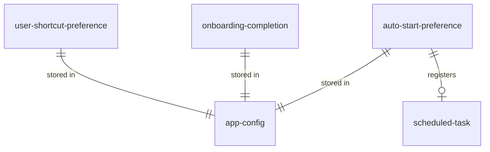
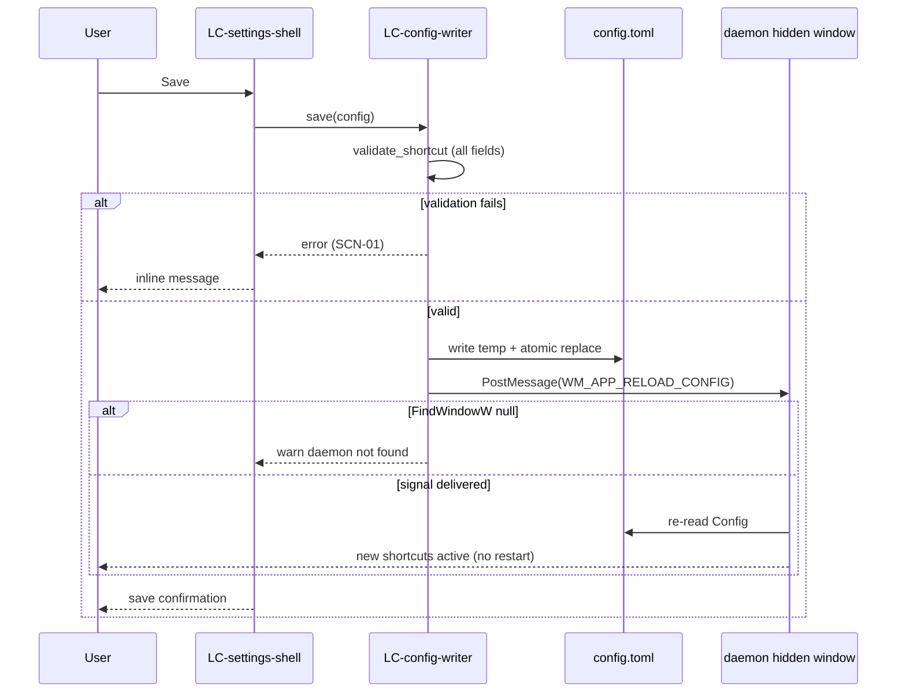

# SDD — settings

> Generated by `.constitution/method/scripts/validate.py --generate`. MUST NOT be hand-edited.


This is what the owner reads at **G4 Component** for this component.


## What is staked

`mode: deep` · `risk_accepted: medium` · `g4_passed: True`

**risk_note:** Writes local configuration, spawns elevated settings process, and signals daemon reload over IPC.

**owns:** `user-shortcut-preference`, `onboarding-completion`, `auto-start-preference` · **containers:** `settings`


## Decision Summary

The `settings` component is built as an on-demand, episodic graphical configuration binary (`wiradesk-settings.exe`) isolated from the core background service. It is structured into three logical components: `LC-settings-shell` (rendering, theme detection, and navigation), `LC-config-writer` (staged validation, atomic persistence, Task Scheduler auto-start, and daemon IPC signalling), and `LC-shortcut-capturer` (live physical key capture and accessible announcement). It delivers an instant, accessible, keyboard-navigable configuration interface with zero background RAM footprint when closed and full assistive technology support via AccessKit.

The two most expensive architectural decisions reversed from naive desktop utility designs are:
1. **Out-of-process episodic UI lifecycle over integrated in-daemon rendering (AD-1, AD-11):** Embedding a UI toolkit (e.g. `slint`, WebView2, or WinUI) directly into the background daemon permanently inflates static memory footprint (>20–50 MB RAM), links heavyweight graphics/input runtimes, and risks stalling low-level keyboard hook threads during redraws. Packaging Settings as a standalone binary launched on demand via `ShellExecute` keeps the background daemon under 2 MB static RAM and isolates UI crashes completely from window cycling.
2. **Staged validation and atomic replace-before-signal IPC over file-watcher polling (AD-5, AD-12):** File system watchers (`ReadDirectoryChangesW`) suffer from partial write races, false triggers during temporary file creation, and unnecessary background thread wake-ups. The settings binary stages user edits in memory, validates every shortcut chord against canonical grammar before disk writes, executes an atomic temporary file rename (`config.toml.tmp` → `config.toml`), and emits an explicit one-way Win32 `WM_APP_RELOAD_CONFIG` message to the daemon's hidden window. The daemon reloads only on explicit signal, eliminating read races and file-polling overhead entirely.


## Structure — Logical Components

Rendered from `components.yaml`.

| id | Name | Type | Container |
| --- | --- | --- | --- |
| `LC-config-writer` |  | `—` | `settings` |
| `LC-settings-shell` |  | `—` | `settings` |
| `LC-shortcut-capturer` |  | `—` | `settings` |


### Dependency direction and responsibilities

The three Logical Components (LCs) operate strictly within the `settings` container (`wiradesk-settings.exe`), consuming shared types and IPC constants from the `shared` crate.

| LC | type | Responsibility |
| --- | --- | --- |
| `LC-settings-shell` | ui-composite | Hosts the retained-mode `Slint` window (`ui/main_window.slint`, compiled by `slint-build`) and its pane components; manages frameless window shell (`no-frame: true`) and 5-pane routing (`General`, `Shortcuts`, `Layout & Snapping`, `VM & Exceptions`, `About`); detects OS theme (`AppsUseLightTheme`) once at startup and sets it on the `Palette` global for two-theme visuals with widened focus outlines; implements first-run onboarding wizard progression; renders save feedback and diagnostic typeface information. |
| `LC-config-writer` | service | Executes strict pre-persistence shortcut validation; performs atomic file writes (`Config::save`) to `%APPDATA%\WiraDesk\config.toml`; dispatches non-blocking `WM_APP_RELOAD_CONFIG` (0x8001) signals via `PostMessageW` to `WiraDeskDaemonHiddenWindow`. It records the auto-start *preference* only; the scheduled task itself is created and deleted by the daemon (`daemon::autostart`) when it reloads config. |
| `LC-shortcut-capturer` | control | Implements interactive key interception within the Settings window; while a field is `Listening`, the daemon's own hook report (drained from a channel by a 20ms Slint timer) is the source of truth for the chord — Slint's `key-pressed` text never arrives for a chord the Windows shell owns, so it survives only as a marked fallback for when no daemon is running (`DEC-004`); enforces modifier requirements; exposes live first-class `Listening` state and screen reader announcements via Slint's accessibility tree. |

##### Dependency & Communication Direction

```text
[User Keyboard & Mouse] ──> LC-settings-shell ──> LC-shortcut-capturer
                                 │                       │
                         (staged edits)          (canonical chord)
                                 ▼                       │
                         LC-config-writer <──────────────┘
                                 │
                 ┌───────────────┴────────────────┐
                 ▼                                ▼
       [Atomic File Write]              [Win32 PostMessageW]
    %APPDATA%\WiraDesk\config.toml    (WM_APP_RELOAD_CONFIG: 0x8001)
                 │                                │
                 │ (re-reads on signal)           ▼
                 └───────────────────> [Daemon Hidden Window]
                                    (WiraDeskDaemonHiddenWindow)

[Windows Task Scheduler] <──(schtasks.exe)── daemon::autostart  (NOT settings)
[Windows Registry]       <──(RegGetValueW)─── LC-settings-shell (Theme)
[Windows Fonts]          <──(segoeui.ttf)──── LC-settings-shell (Typography)
[Windows UI Automation]  <──(AccessKit)────── LC-settings-shell (Assistive Tech)
```

- `LC-settings-shell` owns the mutable in-memory `SettingsModel` draft. Edits never touch the disk until explicitly saved.
- `LC-shortcut-capturer` interacts with `LC-settings-shell` to capture raw key events when activated for a specific `ShortcutField`. Cancelling (Escape) or navigating panes immediately restores `CaptureState::Idle`.
- `LC-config-writer` validates all draft fields before performing an atomic temporary-file-and-rename write. Only after the file replacement succeeds does it invoke `signal_reload()`.
- IPC across the process boundary carries no memory pointers (`wParam = 0`, `lParam = 0`). The configuration payload travels exclusively through the completed TOML file on disk.


## Inherited Constraints — the spine's invariants

Rendered from `ARCHITECTURE-SPINE.md`. A row marked **yes** binds this component by `Binds:`; the rest are shown so a miss in `Binds:` is visible, not hidden.

| id | Invariant | Binds this component | Prevents | Rule |
| --- | --- | --- | --- | --- |
| `AD-1` | Design Paradigm: Actor / Message-Passing [ADOPTED] | **yes** | Shared mutable state between threads/processes causing data races or deadlocks. | Each actor (hook thread, worker thread, settings process) owns its state exclusively. Cross-actor communication uses only: lock-free ring buffer (hook→worker), Win32 Window Messages (settings→daemon, and daemon→settings for the observed-chord report a capture lease authorises — `DEC-004`), TOML file (settings→daemon config), ShellExecute (daemon→settings launch). No payload crossing the process boundary is ever a pointer: the lease carries a process id and its level, and the report carries a virtual-key code and a modifier set, all as plain integers. |
| `AD-2` | Inter-Thread Communication: Hook-Side Throttle + u8 Enum | no | Ring buffer overflow from macro spam; worker thread wasting cycles on invalid/duplicate inputs; a queued command changing meaning when the command set grows. | The Hook Thread is solely responsible for anti-macro throttle (reject inputs <50ms apart). It translates valid keypresses into a `u8` command enum (`1`=Cycle, `2`=SnapLeft, `3`=SnapRight, `4`=SnapMaximize, `5`=OverlappingStack, `6`=SnapTop, `7`=SnapBottom, `8`=MoveToNextMonitor) before writing to the ring buffer. The Worker Thread never performs input validation — it only executes commands. Wire values are **extended, never renumbered**: a value already assigned keeps its meaning permanently, because a command sitting in the ring buffer carries only the number. Any value outside the assigned set decodes to `Nop` rather than being treated as an error. |
| `AD-3` | Z-Order Traversal: Stateless Just-in-Time [ADOPTED] | no | Stale window state causing focus to jump to closed/moved windows; desynchronization with mouse interactions. | On every keypress, the Worker Thread traverses the live Z-Order via `EnumWindows`. No internal Z-Order cache is permitted. The cost of iterating through windows with non-blocking Kernel APIs is accepted. |
| `AD-4` | Same-Application Identity: Exe Name + Class Name Exclusion | no | Misidentification in multi-process architectures (Electron/Chromium apps where each window has a different PID); false grouping of unrelated Electron apps that share the same Window Class Name. | Two windows belong to the "same application" if and only if their owning executable filename matches (e.g., `chrome.exe`). PID comparison is prohibited as the primary identity mechanism. Window Class Name is used only as an exclusion filter to discard ghost windows and internal utility windows (e.g., `WS_EX_TOOLWINDOW`). |
| `AD-5` | Config Reload: Explicit IPC Signal | no | Unnecessary CPU wake-ups from file system watchers; race conditions from reading a partially-written config file. | The Settings binary writes `config.toml` to completion atomically via temp file rename, then sends a `WM_APP_RELOAD_CONFIG` Win32 message to the Daemon's hidden window. The Daemon reloads config only upon receiving this message — never via polling or file watching. |
| `AD-6` | VM/RDP Bypass: Hook Thread Evaluation | no | Wira Desk intercepting shortcuts meant for a VM/Remote Desktop guest OS; infinite loop risk from re-injecting keys via `SendInput`. | Before intercepting any shortcut, the Hook Thread calls `GetForegroundWindow()` and checks the window's class name / process name against the bypass list (loaded from config). If matched, `CallNextHookEx` is called immediately — the key passes through physically to the VM/RDP client with zero latency. |
| `AD-7` | Error Handling: 3-Tier Protocol | no | Silent failures going unnoticed (hook silently dying); notification spam annoying the user; startup errors being invisible. | - **Tier 1 (Startup Fatal):** Show exactly 1x `MessageBox`, then exit. No retry. |
| `AD-8` | Hook Health Monitoring: 10-Second Heartbeat | no | Hook dying silently with no detection mechanism; delayed user awareness of broken functionality. | The Daemon checks hook handle validity every 10 seconds. If invalid, it attempts re-registration. If re-registration fails repeatedly (`HOOK_CHECK_FAIL_THRESHOLD = 3`), Tier 3 error protocol is triggered. |
| `AD-9` | Virtual Desktop Isolation: IVirtualDesktopManager | no | Window cycling crossing virtual desktop boundaries, violating spatial layout preservation. | During Z-Order traversal, each candidate window must pass `IVirtualDesktopManager::IsWindowOnCurrentVirtualDesktop(hwnd)`. Windows not on the current virtual desktop are skipped. This is an official, documented Microsoft API (`shobjidl_core.h`, Windows 10+). |
| `AD-10` | Explorer Crash Recovery: TaskbarCreated Listener [ADOPTED] | no | Tray icon permanently disappearing after `explorer.exe` crash/restart. | The Daemon's message loop listens for the `TaskbarCreated` broadcast message and re-registers the tray icon upon receiving it. |
| `AD-11` | Settings Binary: Slint + ShellExecute Launch | no | GUI framework bloating the daemon's RAM; complex de-elevation logic adding attack surface. | `wiradesk-settings.exe` uses `Slint` for its GUI, with `ui/main_window.slint` compiled by `slint-build` in `build.rs` and rendered through `i-slint-backend-winit`. The Daemon launches it via `ShellExecute` (inheriting Administrator elevation). De-elevation is not required — the settings binary only edits `config.toml` in `%APPDATA%`. |
| `AD-12` | Cargo Workspace: Three Crates | **yes** | Duplicated type definitions (config structs, command enums) between daemon and settings, causing silent divergence. | The project is a single Cargo Workspace with three crates: `daemon` (`wiradesk.exe`), `settings` (`wiradesk-settings.exe`), and `shared` (Config TOML types, `u8` command enum, constants, `%APPDATA%` path). Both binaries depend on `shared`. |
| `AD-13` | Auto-Start: Windows Task Scheduler | no | UAC prompt on every boot (a registry `Run`-key entry cannot launch an elevated process silently); `%APPDATA%` path mismatch if the task runs as SYSTEM; DLL Hijacking via the task's working directory; a stored path outliving the executable it named. | Auto-start is registered as a Windows Scheduled Task (`schtasks`): trigger `ONLOGON`, run level `/RL HIGHEST`, run-as user `/RU "%USERNAME%"` (the specific active user, never SYSTEM — keeping `%APPDATA%` aligned between daemon and settings GUI). The task action (`/TR`) must use the absolute executable path and the `Start in` parameter must be left empty or point to the secure install directory, mitigating DLL Hijacking. The registry `Run`-key mechanism (`HKCU\...\CurrentVersion\Run`) is prohibited. Toggle (create/delete task) is exposed via the tray context menu and settings UI. |
| `AD-14` | Monitor Enumeration: Stateless Just-in-Time | no | A cached monitor list outliving the display configuration it described — placing a window onto a monitor that has been unplugged, or refusing to reach one that has just been attached. Also prevents an `HMONITOR` being treated as a durable identity, which it is not. | On every command that needs to know what monitors exist, the Worker Thread enumerates them live via `EnumDisplayMonitors` and reads each one's work area and DPI at that moment. No monitor list, work area, or `HMONITOR` may be cached, memoized, or held in a `static` between keypresses. Display-change notifications are not subscribed to, because nothing is stored for them to invalidate. This is `AD-3`'s rule applied to the display set rather than to the Z-order, and it is stated separately because the two are enumerated by different APIs and it would otherwise be read as covered by implication. |


## Failure Behaviour

Failure modes across all internal and external Win32 / OS / IPC boundaries:

| Boundary | Slow | Absent | Lying | What the user sees | What is logged |
| --- | --- | --- | --- | --- | --- |
| **Daemon Hidden Window IPC** (`FindWindowW`, `PostMessageW`) | Daemon message queue congested; message handled after brief delay. | Daemon not running (`FindWindowW` returns `0`). | `PostMessageW` returns non-zero but daemon fails to parse on-disk file. | Settings saves successfully; status label states: *"Settings saved. They apply the next time Wira Desk starts."* | `warn!` in Settings diagnostics (no unhandled panic); daemon logs warning on reload parse error. |
| **Filesystem Persistence** (`config.toml` atomic write / rename) | Disk I/O stalls during flush. | `%APPDATA%\WiraDesk` directory missing or read-only; disk full (`EACCES`/`ENOSPC`). | OS reports file renamed but disk buffer uncommitted prior to power loss. | In-line red error banner: *"Could not save settings: &lt;os_error&gt;"*. In-memory draft retained; prior file on disk left intact. | `error!` in Settings with target path and OS error string. |
| **Windows Task Scheduler** (`schtasks.exe` via `std::process`) | `schtasks.exe` process spawn delayed by OS process creation (>1 s). | `schtasks.exe` binary missing or blocked by Group Policy; access denied (`EPERM`). | Process exits with code 0 but task was deleted by external administrative policy. | Toggle switch reverts to prior state on next reload or shows inline warning; auto-start does not activate on boot. | `warn!` recording `schtasks` non-zero exit code or spawn failure. |
| **OS Theme Registry Query** (`RegGetValueW` on `AppsUseLightTheme`) | Registry key query takes >10 ms. | `Personalize` subkey or `AppsUseLightTheme` value missing (custom Windows build/Lite SKU). | Value corrupted (non-DWORD type returned). | Graceful fallback to Light theme (`ThemeMode::Light`); UI remains fully readable with high contrast. | Silent fallback to default theme mode without crash. |
| **System Typography Loader** (`%SystemRoot%\Fonts\segoeui.ttf`) | Disk read of font file takes >50 ms at startup. | `segoeui.ttf` and `tahoma.ttf` absent from disk (minimal container/Windows Server SKU). | TTF file exists but contains corrupted header or invalid glyph table bytes. | `ttf-parser` rejects corrupt bytes; system falls back to Tahoma, then to `LoadedFont::Bundled` (the renderer's own default face). About pane displays actual typeface. | `LoadedFont::Bundled` surfaced in About tab; no crash or panic during atlas generation. |
| **UI Automation** (Slint's Windows accessibility backend, AccessKit internally) | Accessibility tree generation takes several milliseconds on dense frame. | Assistive client (Narrator) not running. | Screen reader queries unmapped node ID during rapid pane switching. | Visual rendering completely unaffected; screen reader receives clean node tree updates or graceful null node responses. | Handled internally by Slint's accessibility backend. |
| **Shortcut Input Validation** (`validate_shortcut`) | User types keys with high latency. | User submits empty string or modifier-only chord. | User inputs conflicting or multiple main keys (`ctrl+a+b`). | Field rejected with precise inline explanation (e.g. *"Switch windows... needs a main key in addition to modifiers"*); draft preserved for correction. | Validation error formatted via `describe()` and rendered in `SaveFeedback::Error`. |
| **Shortcut Collision Check** (`validate_config`, at submission) | No slow path: the comparison runs over the nine in-memory shortcut fields. | Not reachable — a field the grammar check already refused never arrives here. | Two actions carry the same canonical chord, each perfectly legal on its own, so nothing upstream has grounds to refuse either. | Both actions are marked while the draft stands, each naming the other. The submit action stays available throughout; on submission, the draft is refused with a message naming both (SCN-03, LBR-ST-8, LBR-ST-9). | Refusal reason recorded with both field names, via `describe()` as `SaveFeedback::Error`. |

Chord ownership outside this process is not a boundary this table can carry a row for: nothing is
queried, so there is no call to time out, find absent, or catch lying (`DEC-002`). Windows exposes
no way to ask which application a chord will actually reach, and a trial registration would answer
wrong in both directions — refusing a chord the daemon's low-level hook still wins regardless, and
clearing one an earlier third-party hook silently consumes instead. The honest state is silence:
nothing is logged at the moment of editing, and nothing is logged at the moment of a press that an
earlier hook swallows either, since the daemon never observes a keystroke it was never delivered.
Two of the three sources of that silence have since been closed, and the boundary is now drawn where
the knowledge actually is. Chords the **Windows shell** owns are refused from a curated catalogue
carried as data in `shared` — written, reviewed, and versioned knowledge rather than a trial
registration, so it sits inside `DEC-002` rather than against it — and each entry declares whether
Windows keeps the chord regardless of any hook or whether Wira Desk could have taken it and will not
(`DEC-003`). The catalogue replaced `is_reserved_system_shortcut`'s five combinations, under which a
chord such as `Win+Shift+S` or `Win+V` was accepted and then permanently unreachable. Chords an
**external application** holds are still never predicted; what exists now is an observation after the
fact, correlating the daemon's report of what its hook saw against what this window received
(`DEC-005`). What remains genuinely silent is narrower than before and MUST NOT be described as
closed: a chord absent from the catalogue, and a chord nobody presses while the key check is on
screen.


## Robustness Analysis

The Robustness Analysis classifies the technical design for all realized use cases (`UC-4`, `UC-5`, `UC-6`) and edge-case scenarios into Boundary, Control, Entity, and Behaviour.

### 1. Boundary Objects

- **`B-SettingsUI` (Retained-Mode Graphic Surface):** Top-level `Slint` window (`ui/main_window.slint`) declaring panes, buttons, checkboxes, sliders, and feedback banners as components bound to Rust-side model properties.
- **`B-ConfigFile` (TOML Storage on Disk):** Atomic file storage endpoint at `%APPDATA%\WiraDesk\config.toml` (and `.tmp` staging file).
- **`B-DaemonWindow` (Win32 IPC Target):** Top-level message-only window `WiraDeskDaemonHiddenWindow` receiving `WM_APP_RELOAD_CONFIG` (0x8001) and `WM_APP_CAPTURE_LEASE`. The lease message carries its level in `wParam` (0 none, 1 observe, 2 record) and this process's id in `lParam` — a process id and not a window handle, because the hook's comparison is against a foreground process id and a handle would have to be converted on the daemon side (`DEC-004`, `DEF-3`). **This boundary crosses an integrity level.** The daemon is elevated; this process is elevated only when the tray launched it, and runs at medium integrity when a user starts it from Explorer. Both messages therefore depend on the daemon admitting them through UIPI with `ChangeWindowMessageFilterEx` — without that, every post from the non-elevated path is discarded by Windows and reported here as an ordinary failed post.
- **`B-ChordReport` (Win32 IPC Source):** This process's own window, receiving the daemon's report of a chord its hook observed: a virtual-key code and a modifier set, posted never sent. The first channel in this product that runs daemon→settings, which is why `AD-1` names it explicitly.
- **`B-ThemeRegistry` (Windows Personalization Key):** Win32 Registry endpoint `HKCU\Software\Microsoft\Windows\CurrentVersion\Themes\Personalize` (`AppsUseLightTheme`).
- **`B-SystemFonts` (Windows Font Subsystem):** Physical file storage at `%SystemRoot%\Fonts\segoeui.ttf` and `%SystemRoot%\Fonts\tahoma.ttf`.
- **`B-TaskScheduler` (Windows CLI Endpoint):** Windows Task Scheduler CLI interface (`schtasks.exe`).
- **`B-AccessKitAdapter` (Assistive Technology Bridge):** AccessKit Windows UIA tree publisher binding UI controls to screen readers (Windows Narrator).

### 2. Control Objects

- **`C-ShellController` (`LC-settings-shell`):** Coordinates application lifecycle, one-shot theme detection at startup, pane routing, and deterministic keyboard focus sequence. Slint's retained-mode renderer redraws on property change, so nothing here polls for a repaint the way an immediate-mode toolkit would.
- **`C-CaptureManager` (`LC-shortcut-capturer`):** Manages `CaptureState` transitions (`Idle` ↔ `Listening`), builds the candidate chord from the daemon's reported virtual-key code rather than from window-system text, filters modifier-only states, and emits screen reader announcements. Reading the raw code is what makes `Alt+Backtick` — this product's own fallback default, which yields no character at all — recordable, and it retires three heuristics that guessed at the same answer. The text-derived path survives only as a marked fallback for when no daemon is running (`DEC-004`).
- **`C-LeaseArbiter` (`LC-shortcut-capturer`):** Derives the lease level from `(pane, capture)` and posts it only when it changes, so arming and disarming have one owning place each rather than one per exit path. Fails closed: the daemon additionally requires this process to hold the foreground window, and a lease left armed against a dead process is reaped on the daemon's existing heartbeat (residual risk of process-id reuse: `OQ-17`).
- **`C-KeyCheck` (`LC-shortcut-capturer`):** Correlates the daemon's report against what this window received and renders one of four verdicts, stating only what was observed. Reports nothing about a chord nobody pressed, and declines to diagnose at all when no daemon report is available (`DEC-005`).
- **`C-PersistenceManager` (`LC-config-writer`):** Orchestrates configuration validation (`validate_config`), atomic disk serialization (`Config::save`), and IPC signal emission (`signal_reload`).
- **`C-OnboardingWizard` (`LC-settings-shell`):** Drives the 3-step first-run tutorial state machine (`Welcome` → `TrySwitching` → `Done`) and writes initial configuration on completion or skip.
- **`C-AutoStartController` (`daemon::autostart`):** Evaluates `schtasks.exe` arguments (`/Create`, `/Query`, `/Delete`) and synchronizes configuration state. It lives in the daemon, not in this component; `settings` reaches it only by writing `general.auto_start` and signalling reload.

### 3. Entity Objects

- **`E-SettingsDraft` (`SettingsModel.draft`):** Working in-memory copy of `shared::Config` holding staged user modifications prior to validation and persistence.
- **`E-SavedConfig` (`SettingsModel.saved`):** Immutable baseline copy of `shared::Config` reflecting active on-disk configuration; used for dirty-state tracking (`is_dirty()`) and revert operations.
- **`E-CaptureContext` (`CaptureState`):** First-class state machine entity tracking whether input capture is `Idle` or `Listening(ShortcutField)`.
- **`E-SaveOutcome` (`SaveOutcome` / `SaveFeedback`):** Ephemeral outcome entity representing `Saved { reload_signalled: bool }`, `Rejected(&'static str, ShortcutError)`, or `WriteFailed(String)`.
- **`E-OnboardingState` (`OnboardingStep`):** Current progression step of the first-run experience (`Welcome`, `TrySwitching`, `Done`).
- **`E-ControlSemantics` (`ControlSemantics`):** Declared accessibility metadata (accessible name, description, listening announcement) associated with each interactive widget.

### 4. Behaviour & Collaborations

#### UC-4: Change a Keyboard Shortcut in Settings
1. User navigates to the **Shortcuts** pane via mouse click or keyboard navigation (Tab / Arrow keys).
2. `C-ShellController` updates `model.pane = Pane::Shortcuts` and ensures `CaptureState::Idle`.
3. User clicks the button for a shortcut field (e.g. `ShortcutField::Switcher`) or presses Space/Enter on the focused button.
4. `C-CaptureManager` transitions `model.capture` to `CaptureState::Listening(ShortcutField::Switcher)`.
5. `B-AccessKitAdapter` announces: *"Listening for a key combination. Press Escape to cancel."*
6. User presses physical keys (e.g. `Ctrl + Shift + A`).
7. `C-CaptureManager` intercepts the input event, validates that at least one modifier and exactly one main key are present, formats the canonical string `"ctrl+shift+a"`, and updates `model.draft.switcher.shortcut`.
8. `C-CaptureManager` transitions `model.capture` back to `CaptureState::Idle`.
9. User clicks **Save** (or focuses Save and presses Enter).
10. `C-PersistenceManager` calls `validate_config(&model.draft)`:
    - If validation fails: `model.feedback` is set to `SaveFeedback::Error(...)`, displaying the specific invalid field; on-disk file remains untouched.
    - If validation passes: `Config::save()` writes to `config.toml.tmp` and renames to `config.toml`.
11. `C-PersistenceManager` calls `signal_reload()`:
    - `FindWindowW` locates `WiraDeskDaemonHiddenWindow`.
    - `PostMessageW(hwnd, WM_APP_RELOAD_CONFIG, 0, 0)` is dispatched to the daemon.
12. `C-ShellController` promotes `model.draft` to `model.saved`, resets dirty flag, and updates UI banner to *"Settings saved and applied."*

#### UC-5: Complete or Skip First-Run Tutorial
1. Daemon detects no `config.toml` on startup and launches `wiradesk-settings.exe --onboarding` via `ShellExecute`.
2. `C-ShellController` parses arguments via `resolve_launch_intent()`, detects `ONBOARDING_FLAG`, and initializes `model.onboarding = Some(OnboardingStep::Welcome)`.
3. `B-SettingsUI` renders Step 1 (Welcome heading and spatial isolation philosophy contrasting with Alt+Tab).
4. User clicks **Next**: `C-OnboardingWizard` advances to Step 2 (`TrySwitching`), displaying live same-app cycling guidance.
5. User clicks **Next**: `C-OnboardingWizard` advances to Step 3 (`Done`).
6. User clicks **Finish** (or user clicks **Skip Tutorial** at any step):
7. `C-OnboardingWizard` invokes `model.save(&config_path())`, persisting default `shared::Config` to `%APPDATA%\WiraDesk\config.toml` and signalling the daemon.
8. `model.onboarding` is cleared to `None`, transitioning the interface into the standard Settings panes.

#### UC-6: Turn Auto-Start on Boot On or Off
1. User navigates to the **General** pane and toggles the **"Start Wira Desk with Windows"** checkbox.
2. `model.draft.general.auto_start` is modified, marking `model.is_dirty() = true`.
3. User clicks **Save**.
4. `C-PersistenceManager` validates configuration and atomically commits `config.toml`.
5. `C-PersistenceManager` signals `WM_APP_RELOAD_CONFIG` to the daemon hidden window.
6. The daemon reloads config and reconciles the task: if `auto_start` was enabled, `C-AutoStartController` invokes `schtasks.exe /Create /TN WiraDesk /TR "\"<exe_path>\"" /SC ONLOGON /RL HIGHEST /RU "%USERNAME%" /F`; if disabled, `schtasks.exe /Delete /TN WiraDesk /F`.
7. The tray menu checkmark is read back from `schtasks /Query`, never from the config value.

#### SCN-01: Invalid Shortcut Combination Rejected
1. User enters listening mode on a shortcut field and presses a bare key without modifiers (e.g. `Tab` or `A`) or a multi-key chord (`Ctrl + A + B`).
2. `C-CaptureManager` attempts validation via `validate_shortcut()`:
   - Bare key returns `Err(ShortcutError::NoModifier)`.
   - Multi-key chord returns `Err(ShortcutError::MultipleMainKeys)`.
3. `C-CaptureManager` preserves `model.draft` with the prior valid shortcut, sets `model.feedback = SaveFeedback::Error(...)`, and remains in `Listening` state.
4. UI displays red inline error description; screen reader announces error reason.
5. User presses `Escape`: `C-CaptureManager` restores `CaptureState::Idle` without altering stored configuration.

#### SCN-02: Auto-Start Task Creation Fails
1. User enables Auto-Start and clicks Save, but system security policy or permissions prevent Scheduled Task creation.
2. `schtasks.exe /Create` exits with a non-zero error code.
3. `C-AutoStartController` logs a warning diagnostic; `General` pane UI reflects Task Scheduler failure.
4. Configuration file retains user preference; daemon checks task existence via authoritative `schtasks /Query` before updating context menu checkmarks.


## Evidence

Every architectural claim, constraint, and boundary behaviour is verified against source code in the repository:

| Claim | Label | Read to decide | Disposition |
| --- | --- | --- | --- |
| Atomic temp-file write before IPC reload signal | Verified | `crates/settings/src/persistence.rs` (`save_and_notify`), `crates/shared/src/config.rs` (`Config::save`) | Verified: `Config::save` writes to `.tmp` file and executes atomic rename before `signal_reload()` calls `PostMessageW`. |
| Out-of-process `ShellExecute` launch with `--onboarding` | Verified | `crates/daemon/src/main.rs`, `crates/settings/src/persistence.rs` (`resolve_launch_intent`), `crates/shared/src/constants.rs` | Verified: Daemon spawns `wiradesk-settings.exe` via `ShellExecuteW`; `--onboarding` flag shared in `shared::ONBOARDING_FLAG`. |
| Slint accessibility feature and UI Automation integration | Verified | `crates/settings/Cargo.toml`, `crates/settings/ui/**/*.slint` | Verified: `slint` is declared with `default-features = false` plus an explicit `"accessibility"` feature; interactive elements declare `accessible-role`/`accessible-label` (e.g. `ui/components/key_check.slint`, `ui/panes/layout_pane.slint`). |
| Segoe UI system font loading with TTF verification & fallback | Verified | `crates/settings/src/theme.rs` (`detect_ui_font`, `LoadedFont`), `crates/settings/Cargo.toml` (`ttf-parser`) | Verified: Checks `%SystemRoot%\Fonts\segoeui.ttf` and `tahoma.ttf` with `ttf_parser::Face::parse` before installing; falls back to `LoadedFont::Bundled`. |
| OS Theme detection & dual-theme focus outline styling | Verified | `crates/settings/src/theme.rs` (`detect_theme`), `crates/settings/src/main.rs`, `crates/settings/ui/theme.slint` | Verified: Reads `AppsUseLightTheme` DWORD via `RegGetValueW`; `main.rs` calls `main_window.global::<Palette>().set_is_dark(is_dark)` once at startup, and every component reads colors from that global. |
| Strict shortcut validation & canonicalization | Verified | `crates/settings/src/persistence.rs` (`validate_shortcut`, `classify_parse_failure`) | Verified: Rejects bare keys (`NoModifier`), multiple main keys (`MultipleMainKeys`), and unsupported tokens; returns canonical lowercase strings. |
| Deterministic focus order verification in debug builds | Verified | `crates/settings/src/app.rs` (`focus_order`, `focus_order_mismatch`) | Verified: Explicit focus stop arrays for each pane; debug assertion validates drawn UI sequence against declared contract. |
| Windows Task Scheduler `ONLOGON` elevation contract | Verified | `crates/daemon/src/autostart.rs` (`create_args`, `is_registered`), `crates/shared/src/constants.rs` | Verified: Creates task `WiraDesk` with `/SC ONLOGON /RL HIGHEST /RU "%USERNAME%" /TR "\"<exe_path>\"" /F` without console window. |
| Three-crate Cargo workspace dependency hierarchy | Verified | `Cargo.toml`, `crates/settings/Cargo.toml`, `crates/daemon/Cargo.toml`, `crates/shared/Cargo.toml` | Verified: Shared crate owns `Config`, `Shortcut`, `constants`, and migration logic; `daemon` and `settings` depend on `shared`. |


## UX — screens — `01-ux/`


### `DESIGN.md`

### Wira Desk Visual Design — Settings

#### Brand & Style

Wira Desk adheres strictly to the native Windows 11 Fluent 2 design language with Mica material styling. The UI feels indistinguishable from a modern, first-party Windows utility dialog. It prioritizes invisibility over presence: the primary cycling and snapping capabilities feature zero on-screen HUD or graphical switcher overlays.

#### Theme & Surfaces

Settings inherits the active Windows Light or Dark mode setting dynamically via the OS personalization registry (`AppsUseLightTheme`).

- **OS Adaptive Theme**: Neutral surfaces, text contrast, borders, and widget backgrounds adapt dynamically to system Light or Dark mode.
- **Layered Grounding**: Outer Canvas (`#121418`) → Mica Window Surface (`#191D23`) → Sidebar Navigation (`#15181E`) → Settings Card Surface (`#20242B`).
- **Alert Overlay Color**: `#E81123` (used exclusively for System Tray health badges — red dot for Tier 2 warnings/logs, red cross for Tier 3 hook failure).

#### Typography

Settings dialogs and onboarding surfaces utilize the documented Windows UI typeface hierarchy:
- **Primary Typeface**: `Segoe UI Variable Text` (`SegUIVar.ttf`), falling back to `Segoe UI`, `Tahoma`, or bundled font as necessary.
- **Rendering**: Crisp subpixel font rendering with strict font validation (`ttf-parser`) before GPU atlas rasterization.

#### Layout & Navigation Hierarchy

Follows Windows 11 dialog spacing with a structured 5-pane vertical sidebar within the decoupled executable (`wiradesk-settings.exe`):
- **Panes (5)**: 
  1. `General`: Startup integration (Task Scheduler), Spatial Lock, Virtual Desktop isolation, and UX Honesty controls.
  2. `Shortcuts`: **Every** editable chord, and the only pane that holds one. Nine rows in three labelled card groups — *Switching* (2), *Snap & resize* (5), *Move & arrange* (2) — which scroll, above a **pinned** Key check band that does not.
  3. `Layout`: The overlapping stack toggle and its width slider. No chord lives here.
  4. `VM & Exceptions`: Passthrough rules for virtualization guests (`mstsc.exe`, `vmconnect.exe`, `VMwareUnityWindow`).
  5. `About`: Diagnostic build metadata, version info, active font rendering details, and memory footprint.
- **Modular Grouping**: Each configuration group is rendered within a rounded Card Container (`#20242B`, radius 8px) with fine divider lines.
- **Group Heading**: Inside the Shortcuts pane, each card carries a heading above it in the caption size, uppercase, letter-spaced, in the secondary text colour — the same treatment the About pane already uses for its metadata labels. A heading names a group; it is never itself interactive and never carries a chord.
- **Scroll hint**: A 34 px veil at the bottom edge of the scroll area — `transparent` to `bg_mica` over the lower 78% — with a chevron centred in it in `accent_primary`, bobbing 3 px either side of its resting line on a 900 ms ease-in-out. It fades in and out over 200 ms and its timer does not run while it is hidden. The chevron is **drawn as a path, never a font glyph**: neither loaded font carries a chevron codepoint, so a glyph would render as a box. The veil is a gradient rather than a solid strip because a hard edge reads as "the list ends here", which is the opposite of what the hint says.
- **Pinned Key check band**: On the Shortcuts pane only, the Key check readout sits in its own band between the scroll area and the save footer, separated from the rows by a 1 px hairline in the card stroke colour. It carries **no card of its own** — no background, no border, no radius: it is the only thing in the band, so a boundary would be drawn against nothing, and its padding stacked on the band's cost roughly 30 px of height for no information. The band owns the inset; the readout owns none. It keeps its natural height and the scroll area gives up space to it, never the reverse. It is pinned because it is a *live* instrument: nine rows are taller than the window, so at the end of the pane it was below the fold exactly when a user was pressing chords to test them. The band appears on no other pane, because the daemon arms its observe lease from which pane is showing and a reading is only meaningful here.

**Why every chord sits in one pane.** An earlier draft of this document put the snapping chords under a `Layout & Snapping` pane and the switcher chords under `Shortcuts`, and the shipped build never did that — it has always drawn all of them in `Shortcuts`. The build is right and this document was wrong, for a reason outside taste: the daemon's capture lease is armed from *which pane is showing* (`DEC-004`), so shortcut fields living in two panes means two panes have to arm the observe lease. `DEC-004` and `DEC-005` are both built on the lease having one owning place, and splitting it is a regression in the key check rather than a tidier menu. The pane's third name also stops being a lie: `Layout` holds layout settings, and it holds no chords.

#### UI Components

##### 1. System Tray Icon & Context Menu
- **Asset Dimensions**: 16×16 and 32×32 pixel `.ico` formats supporting multi-DPI displays.
- **Menu Hierarchy**: Settings..., View Logs, Auto-Start (toggle), Check for Updates..., About, Exit.

##### 2. Frameless Settings Window (`wiradesk-settings.exe`)
- **Structure**: Modern frameless shell (`with_decorations(false)`) with custom caption bar (`36 px`, `#15181E`) containing draggable region, minimize (`—`), and close (`✕`) buttons.
- **Vertical Sidebar**: Fixed-width navigation column (`175 px`) with active blue indicator pill (`#4CC2FF`, `3.5 × 20 px`).
- **Pill Toggle Switch (`fluent_toggle_switch`)**: Interactive animated toggle switch widget (`40 × 20 px`) with smooth state transitions.
- **Shortcut Capturer Control**: Dedicated interactive listening widget with clear auditory/screen-reader announcements and Escape key cancellation.
- **Shortcut Row**: One row per editable action — title, one-line description, the current chord rendered as key names joined by `+`, and, when the chord collides with another action, an inline refusal naming the other action plus a Swap affordance. Nine rows exist; the row is the unit, and an action never appears as two rows.
  - The keycap is `135 px` **minimum** and grows to its own label plus `12 px` either side. It is not a fixed width: `Ctrl + Alt + Shift + Enter` does not fit in 135 px, and the label does not clip, so a fixed keycap drew its text past both rounded ends.
  - A row is as tall as its description, so the buttons are centred on the row's vertical middle rather than pinned to a fixed offset. Two-line descriptions are normal and must not push the keycap off centre.
  - The listening state's dot is **drawn**, not an emoji, for the same reason the scroll chevron is: the fonts do not carry it, and this is the state a user reaches on every rebind.
- **Save Bar**: Sticky footer (`48 px`) with Revert and Save Changes buttons, validation error summary, and instantaneous IPC status reflection.

##### 3. First-Run Onboarding Modal Dialog
- **Modal Tutorial Shell**: Frameless interactive practice arena (`580 × 380 px`, `with_decorations(false)`, `.with_transparent(true)`) with top 48 px drag area and symmetric 28 px padding.
- **Progress Bar**: 3-segment balanced indicator displaying *Welcome*, *Try Switching*, and *Done*.
- **Simulated Windows**: Dual responsive dummy window cards (50% split with 12 px gap) that alternate visual focus states when the user presses `Win + \``.
- **Navigation Flow**: Step 1 (Skip / Next), Step 2 (Back / Next), Step 3 (Back / Start Using Wira Desk), with buttons pinned at exact bottom margin 24 px.

#### Do's and Don'ts

- **Do** keep window cycling 100% invisible: zero delay, zero animation, zero visual HUD overlays.
- **Don't** embed heavyweight GUI runtimes (Electron, WPF, CEF) into the core background daemon. The UI must remain decoupled in `wiradesk-settings.exe` to enforce minimal daemon memory usage.
- **Do** respect UX Honesty: surface "Not Responding" windows during cycling rather than hiding them.
- **Do** provide high-contrast 2.0 pt keyboard focus rings across both Light and Dark themes for accessibility compliance.
- **Do** render every chord through the single display formatter, so `down` shows as `↓` in every readout including the Key check. Building a second display path is what once made the Key check print the word `down` while every row above it showed the glyph.
- **Don't** reorder rows to suit a group heading. The row order is one declared sequence that also decides which action wins a chord collision (`LBR-ST-14`); a heading may gather rows, never move them.
- **Don't** put a chord field in any pane other than `Shortcuts`. See the note under Layout & Navigation Hierarchy.
- **Don't** reach for a font glyph for an icon or a symbol. Both loaded fonts cover little beyond Latin and the arrows already in use; verify against the font's cmap, or draw a path.


## Contracts — `02-contracts/`


### `00-inventory.md`

### Contract inventory — settings

| # | Contract | Direction | Boundary | LC |
| --- | --- | --- | --- | --- |
| 1 | Config reload signal | exposed | Win32 message to daemon hidden window | LC-config-writer |

Platform IPC endpoint `ipc-reload-signal` is realized by contract 1. Settings does not expose HTTP or file-watch APIs.


### `contract-reload-config.md`

### Contract — Config reload signal

#### Source of truth

`crates/shared/src/constants.rs` — `WM_APP_RELOAD_CONFIG`, `DAEMON_WINDOW_CLASS`, `DAEMON_WINDOW_TITLE`

#### Purpose

Notify the daemon that `config.toml` was written atomically and may be re-read. Realizes UC-4 save path.

#### Operations

| Operation | Purpose | Realizes |
| --- | --- | --- |
| `PostMessageW(FindWindowW(...), WM_APP_RELOAD_CONFIG, 0, 0)` | Signal reload | UC-4 step 6 |

#### Error behaviour

| Condition | Response | Caller should |
| --- | --- | --- |
| Daemon window not found | `FindWindowW` returns null; reload not sent | Log warning; user may restart daemon |
| PostMessage fails | `signal_reload` reports `Refused`; not retried | Report it; the file is already written, so the daemon picks the change up on its next start. A retry is deliberately absent — the post is a nudge to re-read, not the delivery of the change |
| **Sender below the daemon's integrity level (UIPI)** | Windows discards the post silently; `PostMessageW` returns 0, indistinguishable at the call site from any other refusal | Report it as a **refusal**, never as "the daemon is not running". The two look identical to the sender and mean opposite things to the user, and merging them is what let this defect survive: Settings launched from Explorer saved to disk and never reached the daemon, under a status line that read like success |
| Partial write before signal | Prevented by module ordering in `persistence.rs` | N/A — signal is last |

#### Compatibility

Changing `WM_APP_RELOAD_CONFIG` value requires synchronized update in `shared` and both binaries.

#### Constraints

- Must run after atomic replace of `config.toml` completes.
- No payload in `wParam`/`lParam`; daemon reads file from known path only (AD-5).
- **The daemon MUST admit this message through UIPI** with `ChangeWindowMessageFilterEx(hwnd,
  WM_APP_RELOAD_CONFIG, MSGFLT_ALLOW, ...)` on its hidden window, and the same for
  `WM_APP_CAPTURE_LEASE`. Without it the contract holds only when the sender is itself elevated,
  which is true of Settings launched from the tray and false of Settings launched from Explorer —
  the same binary, two integrity levels, two behaviours.

  Widening the filter for these two messages grants nothing new. `WM_APP_RELOAD_CONFIG` carries no
  payload and only asks the daemon to re-read a file any standard user can already write.
  `WM_APP_CAPTURE_LEASE` is already validated against the foreground window's process id on the
  daemon side (`DEC-004`, `DEF-3`), so admitting the message does not admit the lease. The
  precedent is the `TaskbarCreated` filter already in `tray.rs`, added for this same boundary.


## Components — `04-components/`


### `LC-config-writer.md`

### LC-config-writer — Config Writer

#### Responsibility

`LC-config-writer` is the only component allowed to mutate on-disk configuration (BR-1, BR-2). It:

1. Validates shortcut chords via `shared::shortcut::validate_shortcut` before persistence (SCN-01).
2. Performs atomic write: temp file → `replace` → fsync ordering in `persistence.rs` (LBR-ST-2, AD-5).
3. Sends `PostMessageW(FindWindowW(...), WM_APP_RELOAD_CONFIG, 0, 0)` only after the file is complete.
4. Creates or deletes the logon scheduled task via `schtasks` with `/RU %USERNAME%` and `/RL HIGHEST` (AD-13, UC-6, SCN-02).
5. Records onboarding completion flags so first-run does not repeat (LBR-ST-7).

#### Depends on

- `crates/settings/src/persistence.rs` — atomic TOML write and IPC signal.
- `crates/daemon/src/autostart.rs` — shared task registration helpers (also linked from settings build).
- `shared::Config`, `shared::constants::{WM_APP_RELOAD_CONFIG, DAEMON_WINDOW_CLASS, DAEMON_WINDOW_TITLE, TASK_NAME}`.
- Win32: `FindWindowW`, `PostMessageW`.
- Windows Task Scheduler CLI: `schtasks`.

#### Interface

##### Inbound

| Method | Caller | Realizes |
| --- | --- | --- |
| `save(config: &Config)` | `LC-settings-shell` | UC-4 |
| `set_autostart(enabled: bool)` | `LC-settings-shell` | UC-6 |
| `write_onboarding_flags(...)` | Onboarding flow | UC-5 |

##### Outbound

| Action | When |
| --- | --- |
| Atomic `config.toml` write | Before any reload signal |
| `WM_APP_RELOAD_CONFIG` | After successful write |
| `schtasks /Create` or `/Delete` | Auto-start toggle |

#### Failure behaviour

| Condition | User sees | Log |
| --- | --- | --- |
| Disk permission denied | Inline save error | `error!` with path |
| Daemon window not found | Save OK, stale shortcuts until restart | `warn!` |
| `schtasks` failure | Toggle reverts (SCN-02) | `warn!` exit code |

#### Notes

- **Evidence:** [PARTIAL] `crates/settings/src/persistence.rs`, `crates/daemon/src/autostart.rs`.


### `LC-settings-shell.md`

### LC-settings-shell — Settings Shell

#### Responsibility

`LC-settings-shell` is the Slint presentation layer for `wiradesk-settings.exe`: the declared UI in `ui/*.slint` (compiled by `slint-build`) plus the Rust-side application state and model it binds to. It owns:

1. Application frameless shell (`no-frame: true`), navigation tabs (General, Shortcuts, Layout & Snapping, VM & Exceptions, About), and adaptive light/dark theming (FR-19, AD-11a).
2. Wiring shortcut fields to `LC-shortcut-capturer` listening mode (FR-18).
3. Tab order across all interactive controls (FR-20, LBR-ST-5).
4. First-run onboarding panels when launched with `--onboarding` (FR-17, UC-5).
5. Surfacing validation errors inline before save is enabled.

The shell never writes `config.toml` directly; all persistence goes through `LC-config-writer`.

#### Depends on

- `crates/settings/ui/main_window.slint` and the pane/component `.slint` files — declared window, panes, and controls.
- `crates/settings/src/app.rs` — application model state (`SettingsModel`, `CaptureState`, focus order).
- `crates/settings/src/theme.rs` — system theme detection and Segoe UI tokens.
- `LC-shortcut-capturer` — capture state for shortcut fields.
- `LC-config-writer` — save, reload signal, auto-start toggle.
- `slint` with the `accessibility` feature (AD-11a).

#### Interface

##### Inbound

| Event | Action |
| --- | --- |
| User edits field | Update in-memory `Config` draft |
| Save clicked | Delegate to `LC-config-writer::save` |
| Auto-start toggled | Delegate to `LC-config-writer::set_autostart` |

##### Outbound

| Call | Target |
| --- | --- |
| `begin_listening(field_id)` | `LC-shortcut-capturer` |
| `save(config)` | `LC-config-writer` |

#### Notes

- **Window size boundary:** The window is frameless, transparent, and laid out at a fixed size, so a frame larger than the layout leaves an invisible region that still owns its hit-test area and swallows mouse clicks. A size change imposed from outside the process is clamped at the window’s own message boundary; a size the layout itself declares legal is not (LBR-ST-13, DEC-006).
- **Accessibility:** Toggle and capture states must expose UI Automation values, not color alone (FR-21, LBR-ST-6).
- **Evidence:** [PARTIAL] `crates/settings/src/app.rs`, `crates/settings/src/theme.rs`, `crates/settings/ui/main_window.slint`.


### `LC-shortcut-capturer.md`

### LC-shortcut-capturer — Shortcut Capturer

#### Responsibility

`LC-shortcut-capturer` implements listening-mode keyboard capture for shortcut fields (FR-18). While active it:

1. Ignores typed Unicode characters; only physical key-down events with modifier state matter.
2. Requires at least one modifier (Win, Ctrl, or Alt) before accepting a chord (SCN-01).
3. Rejects reserved or unsafe combinations before they reach `LC-config-writer`.
4. Announces listening state and validation results through UI Automation accessible values (FR-21, LBR-ST-6).
5. Cancels on Escape without mutating the saved configuration.

#### State machine

See `.what/settings/03-domain/state-machines.md` — `Idle` ↔ `Listening`.

#### Depends on

- `crates/settings/src/app.rs` — field focus and capture UI.
- `shared::shortcut::{validate_shortcut, ShortcutError}`.
- `crates/settings/src/hookbridge.rs` — the daemon's hook-observed chord, drained by a 20ms `slint::Timer` on the UI thread; the source of truth while a field is `Listening` (`DEC-004`).
- Slint's `key-pressed` event on `ui/main_window.slint`'s `key_handler` (low-level key events, not a text-entry control) — kept only as the fallback path for when no daemon is running.

#### Interface

| Method | Returns |
| --- | --- |
| `begin_listening()` | Enters Listening state |
| `on_key_event(event)` | `Some(Shortcut)` or validation error |
| `cancel()` | Returns to Idle |

#### Notes

- **Evidence:** [PARTIAL] `crates/shared/src/shortcut.rs`, settings UI capture handlers in `app.rs`, `crates/settings/src/hookbridge.rs`, `crates/settings/ui/main_window.slint`.


## Data model — `05-model/`


### `data-model.md`

### Data model — settings

Persistent entities are stored in `_platform` entity `app-config` (`%APPDATA%\WiraDesk\config.toml`). This dictionary describes the settings-owned slice of that schema.

#### Entity relationship



#### user-shortcut-preference

| Column | Type | Nullable | Meaning |
| --- | --- | --- | --- |
| cycling_primary | string | no | Canonical chord, e.g. `Win+Oem3` |
| cycling_fallback | string | yes | Optional `Alt+Oem3` fallback |
| snap_left | string | no | Half-left snap binding |
| snap_right | string | no | Half-right snap binding |
| snap_top | string | no | Half-top snap binding. `[MISSING]` — planned by this pass (FR-22) |
| snap_bottom | string | no | Half-bottom snap binding. `[MISSING]` — planned by this pass (FR-22) |
| snap_maximize | string | no | Maximize binding |
| move_next_monitor | string | no | Next-monitor move binding. `[MISSING]` — planned by this pass (FR-23) |
| snap_stack | string | no | Overlapping stack binding |

##### Dictionary

- The **row order above is the declared sequence** `LBR-ST-14` names: the Shortcuts pane is drawn from it, keyboard focus follows it, and a chord collision is resolved in favour of whichever row comes first. There is no second list.
- Grouping the rows under headings in the pane is a presentation concern and belongs to `.how/settings/01-ux/DESIGN.md`. It must not reorder them relative to this sequence.
- Every value is a **canonical** chord string. Two rows holding the same canonical string is the collision condition `BR-6` governs; this component refuses to save it at all.

Schema source: `shared::Config` in `crates/shared/src/config.rs`.

#### onboarding-completion

| Column | Type | Nullable | Meaning |
| --- | --- | --- | --- |
| tutorial_completed | bool | no | User finished interactive practice |
| skipped | bool | no | User chose Skip Tutorial |

#### auto-start-preference

| Column | Type | Nullable | Meaning |
| --- | --- | --- | --- |
| enabled | bool | no | Whether logon task is registered |
| task_name | string | no | `WiraDesk` (`shared::TASK_NAME`) |

#### scheduled-task (external)

Not stored in TOML; created by `schtasks` when `enabled` is true.

| Column | Type | Meaning |
| --- | --- | --- |
| trigger | ONLOGON | Runs at user logon |
| run_level | HIGHEST | Matches daemon elevation (AD-13) |
| run_as | `%USERNAME%` | Aligns APPDATA paths (BR-4) |


## Flows — `06-flows/`


### `flow-config-save-reload.md`

### Flow — Config save and daemon reload

**Component:** settings  
**Realizes:** UC-4, BR-1, AD-5, LBR-ST-2

#### Sequence



#### Postconditions

- On success, on-disk `config.toml` matches in-memory draft.
- Daemon reloads only after file is complete; partial writes are impossible by ordering.

