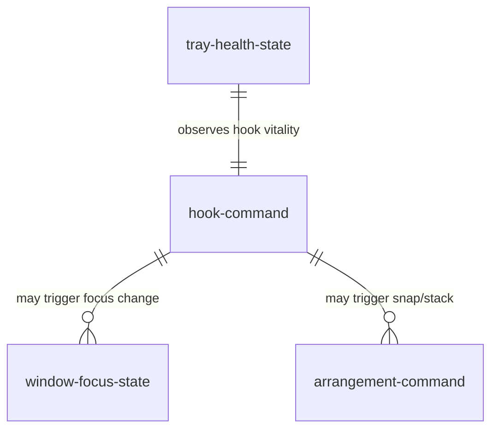
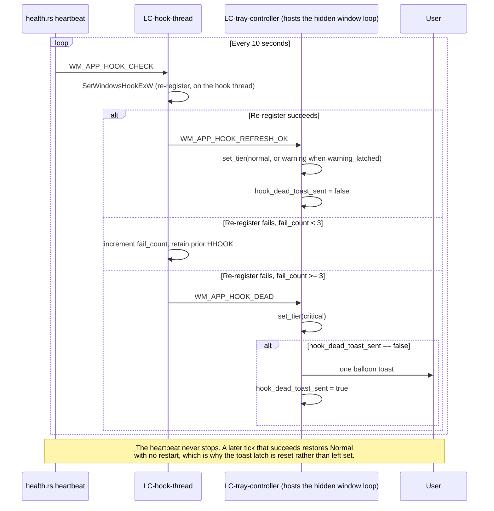

# SDD — window-management

> Generated by `.constitution/method/scripts/validate.py --generate`. MUST NOT be hand-edited.


This is what the owner reads at **G4 Component** for this component.


## What is staked

`mode: deep` · `risk_accepted: medium` · `g4_passed: True`

**risk_note:** Global low-level keyboard hook, Administrator elevation, UIPI bypass, and real-time Win32 window enumeration.

**owns:** `hook-command`, `window-focus-state`, `tray-health-state`, `arrangement-command` · **containers:** `daemon`


## Decision Summary

The `window-management` component is built as an elevated background daemon container (`wiradesk.exe`) decomposed into four isolated logical components: `LC-hook-thread` (input boundary), `LC-worker-thread` (execution and cycling control), `LC-tray-controller` (shell lifecycle and health presentation), and `LC-arrangement-engine` (DPI-aware snap geometry). It executes instant, overlay-free same-application window cycling and screen arrangement with zero cloud telemetry and a static RAM footprint under 2 MB.

The two most expensive architectural decisions reversed from naive desktop utility designs are:
1. **Stateless live Z-order traversal over cached window trees (AD-3):** Maintaining an internal window tree model desynchronizes whenever users click, switch apps via Taskbar/Alt-Tab, or close background windows. Querying live OS state just-in-time via non-blocking kernel APIs on each keypress guarantees the traversal always reflects the desktop as it is, at a cost bounded by the hook budget in NFR-2 rather than by a figure asserted here.
2. **Actor/Message-Passing split between input and execution (AD-1, AD-2):** Windows enforces a strict `LowLevelHooksTimeout` (~300 ms) on `WH_KEYBOARD_LL` callbacks. Performing window enumeration, COM calls, or focus manipulation inside the hook callback risks OS hook unhooking. Decoupling the hook into a dedicated thread communicating exclusively via a lock-free 16-slot ring buffer keeps the hook callback inside the 10 ms budget NFR-2 sets, with no allocation and no blocking call on that thread.


## Structure — Logical Components

Rendered from `components.yaml`.

| id | Name | Type | Container |
| --- | --- | --- | --- |
| `LC-arrangement-engine` |  | `—` | `daemon` |
| `LC-hook-thread` |  | `—` | `daemon` |
| `LC-tray-controller` |  | `—` | `daemon` |
| `LC-worker-thread` |  | `—` | `daemon` |


### Dependency direction and responsibilities

The four Logical Components (LCs) operate strictly within the `daemon` container (`wiradesk.exe`).

| LC | type | Responsibility |
| --- | --- | --- |
| `LC-hook-thread` | service | Installs `WH_KEYBOARD_LL`, enforces 50 ms anti-macro throttle, evaluates allocation-free VM/RDP bypass, enqueues `u8` commands to the static ring buffer, and dispatches `WM_APP_COMMAND_READY`. |
| `LC-worker-thread` | service | Drains ring-buffer commands, executes stateless `EnumWindows` traversal, filters by exe name and virtual desktop, activates target windows via `SetForegroundWindow`, suppresses lone Win key-up Start menu pops, and coordinates snap placement. |
| `LC-tray-controller` | service | Hosts the top-level hidden window message loop, owns tray icon lifecycle and context menu, handles `TaskbarCreated` shell recovery, and manages the 3-Tier error state machine (Normal / Warning / Critical) and one-shot toast notification. |
| `LC-arrangement-engine` | service | Queries monitor work areas and DPI metrics, computes half-screen snap and overlapping stack target rectangles, and applies non-blocking window geometry updates via `SetWindowPos`. |

##### Dependency & Communication Direction

```text
[OS Keyboard Input] ──> LC-hook-thread
                             │
                      (ring::push u8 + WM_APP_COMMAND_READY)
                             ▼
                        LC-worker-thread ──> LC-arrangement-engine
                             │                      │
                             │                      ▼
                             │                 [Win32 SetWindowPos]
                             ▼
                  [Win32 SetForegroundWindow]

[OS Explorer / Shell] ──(TaskbarCreated)──> LC-tray-controller
[health::heartbeat]   ──(WM_APP_HOOK_CHECK)──> LC-hook-thread
LC-hook-thread        ──(WM_APP_HOOK_DEAD)──> LC-tray-controller
[settings process]    ──(WM_APP_CAPTURE_LEASE)──> LC-tray-controller
LC-tray-controller    ──(WM_APP_HOOK_LEASE)──> LC-hook-thread
LC-hook-thread        ──(observed chord: vk + modifiers)──> [settings process]
Settings (IPC)        ──(WM_APP_RELOAD_CONFIG)──> LC-tray-controller ──(WM_APP_CONFIG_SNAPSHOT)──> LC-hook-thread
```

- `LC-hook-thread` writes only `u8` byte commands into the lock-free static ring buffer (`ring.rs`) and signals the worker. It never reads worker state and never performs window enumeration.
- `LC-worker-thread` drains the ring buffer and calls `LC-arrangement-engine` synchronously for snap and stack commands.
- `LC-tray-controller` runs on the main message loop thread, exclusively owning the Win32 tray state and hidden host window.
- Health monitoring runs via a background timer thread (`health.rs`) sending periodic heartbeat ticks (`WM_APP_HOOK_CHECK`) to `LC-hook-thread`.


## Inherited Constraints — the spine's invariants

Rendered from `ARCHITECTURE-SPINE.md`. A row marked **yes** binds this component by `Binds:`; the rest are shown so a miss in `Binds:` is visible, not hidden.

| id | Invariant | Binds this component | Prevents | Rule |
| --- | --- | --- | --- | --- |
| `AD-1` | Design Paradigm: Actor / Message-Passing [ADOPTED] | **yes** | Shared mutable state between threads/processes causing data races or deadlocks. | Each actor (hook thread, worker thread, settings process) owns its state exclusively. Cross-actor communication uses only: lock-free ring buffer (hook→worker), Win32 Window Messages (settings→daemon, and daemon→settings for the observed-chord report a capture lease authorises — `DEC-004`), TOML file (settings→daemon config), ShellExecute (daemon→settings launch). No payload crossing the process boundary is ever a pointer: the lease carries a process id and its level, and the report carries a virtual-key code and a modifier set, all as plain integers. |
| `AD-2` | Inter-Thread Communication: Hook-Side Throttle + u8 Enum | no | Ring buffer overflow from macro spam; worker thread wasting cycles on invalid/duplicate inputs; a queued command changing meaning when the command set grows. | The Hook Thread is solely responsible for anti-macro throttle (reject inputs <50ms apart). It translates valid keypresses into a `u8` command enum (`1`=Cycle, `2`=SnapLeft, `3`=SnapRight, `4`=SnapMaximize, `5`=OverlappingStack, `6`=SnapTop, `7`=SnapBottom, `8`=MoveToNextMonitor) before writing to the ring buffer. The Worker Thread never performs input validation — it only executes commands. Wire values are **extended, never renumbered**: a value already assigned keeps its meaning permanently, because a command sitting in the ring buffer carries only the number. Any value outside the assigned set decodes to `Nop` rather than being treated as an error. |
| `AD-3` | Z-Order Traversal: Stateless Just-in-Time [ADOPTED] | no | Stale window state causing focus to jump to closed/moved windows; desynchronization with mouse interactions. | On every keypress, the Worker Thread traverses the live Z-Order via `EnumWindows`. No internal Z-Order cache is permitted. The cost of iterating through windows with non-blocking Kernel APIs is accepted. |
| `AD-4` | Same-Application Identity: Exe Name + Class Name Exclusion | no | Misidentification in multi-process architectures (Electron/Chromium apps where each window has a different PID); false grouping of unrelated Electron apps that share the same Window Class Name. | Two windows belong to the "same application" if and only if their owning executable filename matches (e.g., `chrome.exe`). PID comparison is prohibited as the primary identity mechanism. Window Class Name is used only as an exclusion filter to discard ghost windows and internal utility windows (e.g., `WS_EX_TOOLWINDOW`). |
| `AD-5` | Config Reload: Explicit IPC Signal | no | Unnecessary CPU wake-ups from file system watchers; race conditions from reading a partially-written config file. | The Settings binary writes `config.toml` to completion atomically via temp file rename, then sends a `WM_APP_RELOAD_CONFIG` Win32 message to the Daemon's hidden window. The Daemon reloads config only upon receiving this message — never via polling or file watching. |
| `AD-6` | VM/RDP Bypass: Hook Thread Evaluation | no | Wira Desk intercepting shortcuts meant for a VM/Remote Desktop guest OS; infinite loop risk from re-injecting keys via `SendInput`. | Before intercepting any shortcut, the Hook Thread calls `GetForegroundWindow()` and checks the window's class name / process name against the bypass list (loaded from config). If matched, `CallNextHookEx` is called immediately — the key passes through physically to the VM/RDP client with zero latency. |
| `AD-7` | Error Handling: 3-Tier Protocol | no | Silent failures going unnoticed (hook silently dying); notification spam annoying the user; startup errors being invisible. | - **Tier 1 (Startup Fatal):** Show exactly 1x `MessageBox`, then exit. No retry. |
| `AD-8` | Hook Health Monitoring: 10-Second Heartbeat | no | Hook dying silently with no detection mechanism; delayed user awareness of broken functionality. | The Daemon checks hook handle validity every 10 seconds. If invalid, it attempts re-registration. If re-registration fails repeatedly (`HOOK_CHECK_FAIL_THRESHOLD = 3`), Tier 3 error protocol is triggered. |
| `AD-9` | Virtual Desktop Isolation: IVirtualDesktopManager | no | Window cycling crossing virtual desktop boundaries, violating spatial layout preservation. | During Z-Order traversal, each candidate window must pass `IVirtualDesktopManager::IsWindowOnCurrentVirtualDesktop(hwnd)`. Windows not on the current virtual desktop are skipped. This is an official, documented Microsoft API (`shobjidl_core.h`, Windows 10+). |
| `AD-10` | Explorer Crash Recovery: TaskbarCreated Listener [ADOPTED] | no | Tray icon permanently disappearing after `explorer.exe` crash/restart. | The Daemon's message loop listens for the `TaskbarCreated` broadcast message and re-registers the tray icon upon receiving it. |
| `AD-11` | Settings Binary: Slint + ShellExecute Launch | no | GUI framework bloating the daemon's RAM; complex de-elevation logic adding attack surface. | `wiradesk-settings.exe` uses `Slint` for its GUI, with `ui/main_window.slint` compiled by `slint-build` in `build.rs` and rendered through `i-slint-backend-winit`. The Daemon launches it via `ShellExecute` (inheriting Administrator elevation). De-elevation is not required — the settings binary only edits `config.toml` in `%APPDATA%`. |
| `AD-12` | Cargo Workspace: Three Crates | **yes** | Duplicated type definitions (config structs, command enums) between daemon and settings, causing silent divergence. | The project is a single Cargo Workspace with three crates: `daemon` (`wiradesk.exe`), `settings` (`wiradesk-settings.exe`), and `shared` (Config TOML types, `u8` command enum, constants, `%APPDATA%` path). Both binaries depend on `shared`. |
| `AD-13` | Auto-Start: Windows Task Scheduler | no | UAC prompt on every boot (a registry `Run`-key entry cannot launch an elevated process silently); `%APPDATA%` path mismatch if the task runs as SYSTEM; DLL Hijacking via the task's working directory; a stored path outliving the executable it named. | Auto-start is registered as a Windows Scheduled Task (`schtasks`): trigger `ONLOGON`, run level `/RL HIGHEST`, run-as user `/RU "%USERNAME%"` (the specific active user, never SYSTEM — keeping `%APPDATA%` aligned between daemon and settings GUI). The task action (`/TR`) must use the absolute executable path and the `Start in` parameter must be left empty or point to the secure install directory, mitigating DLL Hijacking. The registry `Run`-key mechanism (`HKCU\...\CurrentVersion\Run`) is prohibited. Toggle (create/delete task) is exposed via the tray context menu and settings UI. |
| `AD-14` | Monitor Enumeration: Stateless Just-in-Time | no | A cached monitor list outliving the display configuration it described — placing a window onto a monitor that has been unplugged, or refusing to reach one that has just been attached. Also prevents an `HMONITOR` being treated as a durable identity, which it is not. | On every command that needs to know what monitors exist, the Worker Thread enumerates them live via `EnumDisplayMonitors` and reads each one's work area and DPI at that moment. No monitor list, work area, or `HMONITOR` may be cached, memoized, or held in a `static` between keypresses. Display-change notifications are not subscribed to, because nothing is stored for them to invalidate. This is `AD-3`'s rule applied to the display set rather than to the Z-order, and it is stated separately because the two are enumerated by different APIs and it would otherwise be read as covered by implication. |


## Failure Behaviour

Failure modes across all internal and external Win32 / IPC boundaries:

| Boundary | Slow | Absent | Lying | What the user sees | What is logged |
| --- | --- | --- | --- | --- | --- |
| **Win32 Hook Subsystem** (`SetWindowsHookExW`, `UnhookWindowsHookEx`) | Hook callback takes >300 ms; OS unhooks callback silently. | Initial hook registration fails (`NULL` handle returned after 5 retries). | Returns non-null handle but OS stops delivering key events. | **Startup:** Tier-1 modal `MessageBox` once, process exits.<br/>**Runtime:** Tier-3 Red X tray icon + exactly 1x toast notification; shortcuts stop intercepting. | `error!` on startup failure; `warn!` on heartbeat refresh attempt; `error!` when escalating to Tier 3. |
| **Explorer.exe Tray & Shell** (`Shell_NotifyIconW`, `TaskbarCreated`) | Taskbar takes several seconds to redraw after explorer restart. | Explorer process crashes or terminates; taskbar window missing. | `Shell_NotifyIconW` returns `FALSE` despite valid handle. | Tray icon disappears while Explorer is down; automatically restores once Explorer restarts and broadcasts `TaskbarCreated`. | `info!` on initial tray creation and on successful re-registration after `TaskbarCreated`. |
| **Window Enumeration & Focus** (`EnumWindows`, `SetForegroundWindow`) | Hung window process takes long to respond to shell messages. | Target window closes between enumeration and activation. | Window has `WS_VISIBLE` but zero dimensions or transparent alpha (ghost window). | Focus does not shift to closed/ghost window; cycling gracefully skips to the next valid window in Z-order. | `debug!` recording skip reason (ineligible class, closed hwnd, or activation refusal). |
| **In-Process Static Ring Buffer** (`ring::push` / `ring::pop`) | Worker thread delayed by OS scheduling. | Ring buffer uninitialized (impossible by static layout). | Buffer full due to extreme key spam (>16 unread commands). | Keypress dropped silently with zero freeze or hang. System remains fully responsive. | `trace!` drop count incremented; debug metrics record drained and dropped counts. |
| **Virtual Desktop Manager COM** (`IVirtualDesktopManager`) | COM apartment query delays worker execution. | COM subsystem disabled, uninitialized, or returns `REGDB_E_CLASSNOTREG`. | Returns `S_OK` with stale membership for animating desktop transition. | Candidate window is treated as ineligible (fails closed); cycling remains strictly within proven current desktop. | `debug!` note on COM initialization failure; candidate marked `VirtualDesktopUnavailable`. |
| **Foreground Process Identity** (`OpenProcess`, `QueryFullProcessImageNameW`) | Querying protected system process takes >5 ms. | Process terminates before handle query or access denied. | Returns empty executable image name string. | Fails open: VM/RDP bypass treats unresolved window as non-bypassable or passes through safely without crash. | Atomic failure counter incremented; `debug!` diagnostic logged at worker boundary. |
| **Config Reload IPC** (`WM_APP_RELOAD_CONFIG`) | Settings process slow to write TOML file. | `config.toml` missing on disk during reload signal. | TOML file contains malformed syntax or invalid key names. | Daemon falls back safely to default in-memory configuration; cycling continues uninterrupted. | `warn!` logging parse failure and fallback to defaults; tray icon shows Tier-2 Red Dot. |
| **Monitor Enumeration** (`EnumDisplayMonitors`, `GetMonitorInfoW`, `GetDpiForMonitor`) | Enumeration callback runs long on a machine with many displays; it is off the hook thread, so the input path is unaffected. | No monitor is reported, or the foreground window resolves to no monitor (`MONITOR_DEFAULTTONULL`). | A monitor is reported and then unplugged before placement, so its work area describes a display that is gone. | **Absent:** nothing moves; the chord was consumed. **Lying:** Windows refuses or clamps the `SetWindowPos`, so the window lands on an attached monitor rather than off-screen, and the next press moves it again. Never a popup. | Tier-2 `warn!` naming the failing query. A single attached monitor is **not** logged — it is a successful no-op, not a failure. |
| **Duplicate Chord Configuration** (`load_shortcuts`, `config::validate`) | No slow path: a comparison over nine values at load. | Not applicable — a chord is present or it is not. | Two fields name the same chord, so the configuration claims two actions are reachable by one keypress. | **At startup:** the later action is unbound and unreachable; every other setting is honoured. **On reload:** the whole candidate is refused and the previous configuration stays in force. Tray icon goes to its Warning state either way; no popup. | Exactly one Tier-2 `warn!` naming **both** fields and the chord. Never one warning per field, and never silence — silence is the failure `DEC-009` exists to stop. |
| **Capture Lease IPC** (`WM_APP_CAPTURE_LEASE` → `WM_APP_HOOK_LEASE`) | No slow path: one integer comparison, forwarded off the callback thread. | Settings dies without disarming; the lease names a process id that no longer exists. | The lease names a process id Windows has since recycled onto an unrelated process. | Nothing: the lease is inert unless the named process also holds the foreground window, and a dead holder is reaped on the existing heartbeat. Under recycling the keyboard could reach Wira Desk while an unrelated process holds a lease — the residual risk `OQ-17` carries. | `debug!` trace recording the lease level and the process id as **received**, alongside what was sent, so a derived-value failure cannot be read as a silent sender (`DEF-3`). |

**One failure mode both IPC rows above missed, found on hardware 2026-08-28.** Each row asks what
happens when the message is slow, absent, or lying, and each answers as though the only reason a
post fails is that the daemon is gone. There is a second reason: **UIPI discards a `PostMessageW`
sent from a process below this daemon's integrity level**, and the sender cannot tell the two apart
— `PostMessageW` returns 0 either way.

It is reachable in normal use. `wiradesk-settings.exe` inherits the daemon's elevated token when the
tray launches it, and runs at medium integrity when a user starts it from Explorer. The same binary,
two integrity levels. In the second case the capture lease never arms — so shortcut recording misses
every key that only the daemon's hook sees — and a saved configuration never reaches the running
daemon.

The daemon admits both messages with `ChangeWindowMessageFilterEx`, the same mechanism already
applied to `TaskbarCreated` for this same boundary. See `contract-reload-config.md` for why widening
the filter for these two grants no capability that was not already available.


## Robustness Analysis

The Robustness Analysis classifies the technical design for all realized use cases (`UC-1`, `UC-2`, `UC-3`, `UC-7`) and edge-case scenarios into Boundary, Control, Entity, and Behaviour.

### 1. Boundary Objects

- **`B-KbdHook` (OS Keyboard Hook Stream):** Raw `WH_KEYBOARD_LL` input stream delivered by Windows via the low-level hook callback on `LC-hook-thread`.
- **`B-WinMgr` (Win32 Window Manager Interface):** Win32 C-API surface (`EnumWindows`, `IsWindowVisible`, `GetWindowLongPtrW`, `SetForegroundWindow`, `SetWindowPos`, `ShowWindowAsync`).
- **`B-VirtualDesktop` (COM Shell Interface):** Minimal COM vtable wrapper for `IVirtualDesktopManager::IsWindowOnCurrentVirtualDesktop`.
- **`B-IdentityQuery` (Win32 Process/Class Query):** Allocation-free UTF-16 query adapter (`GetForegroundWindow`, `GetClassNameW`, `GetWindowThreadProcessId`, `OpenProcess`, `QueryFullProcessImageNameW`).
- **`B-DisplaySet` (Win32 Display Configuration):** The attached monitor set and each monitor's work area and DPI, read through `EnumDisplayMonitors`, `GetMonitorInfoW`, and `GetDpiForMonitor`. Read-only, enumerated per invocation, never cached (AD-14). `[MISSING]` — planned by this pass.
- **`B-TrayIcon` (Windows Shell Notification Area):** Shell notification area interface (`Shell_NotifyIconW`, `TrackPopupMenuEx`, Windows Toast API).
- **`B-HiddenWindow` (Win32 IPC Endpoint):** Top-level message-only hidden window (`WiraDeskDaemonHiddenWindow`) receiving `WM_APP_RELOAD_CONFIG`, `TaskbarCreated`, and internal health messages.

### 2. Control Objects

- **`C-HookController` (`LC-hook-thread`):** Owns hook lifecycle, QPC anti-macro throttle check (50 ms), bypass classification, raw byte serialization to the ring buffer, and the capture lease. The lease is three independent decisions rather than one switch — report the chord to Settings, withhold Wira Desk's own action, withhold the keystroke from Windows — and two named combinations of them: **observe** (`yes / yes / no`) while the Shortcuts pane is visible, **record** (`yes / yes / yes`) while a field is listening. Both require the settings process to hold the foreground window, both fire only on a non-modifier key-down carrying at least one modifier, and the comparison sits above `match_shortcut` so it is reached by a chord that is not yet configured. Withholding the keystroke exists only to record; no chord is ever claimed for a Wira Desk action on the strength of a lease (`DEC-004`, LBR-ST-11).
- **`C-WorkerDispatcher` (`LC-worker-thread`):** Dispatches ring-buffer command opcodes on thread wake-up, orchestrates candidate collection, filters candidates, and applies activation or geometry updates.
- **`C-CyclingSelector` (`daemon::cycling`):** Evaluates same-app candidate eligibility (exe name match, style filters), spatial alignment (monitor matching, virtual desktop isolation), and selects the next Z-order target.
- **`C-ArrangementPlanner` (`LC-arrangement-engine`):** Resolves monitor work-area bounds and DPI scale factors to plan coordinate rectangles for half-screen snaps on either axis (left, right, top, bottom), full maximize, overlapping cascade stacks, and a move to the next monitor. The monitor-move plan is the only one that reads two work areas: it expresses the window's rectangle as a share of the source and maps that share onto the destination, so an arrangement survives a difference in size or scaling (LBR-WM-7). It holds no state between invocations, including no monitor list (AD-14). `Win32WindowMover::apply` clamps the frame-inset-compensated rect against the monitor containing the *planned* (destination) rect, not the monitor the window is still on when `apply` runs — resolving from the window would aim the clamp at the monitor being left, and a compensated rect touching a different-DPI monitor is what Windows uses as its own cue to relocate and rescale the window (`DEC-010`).
- **`C-TrayHealthStateMachine` (`LC-tray-controller`):** Manages the 3-Tier error state transitions, updates icon overlays, latches warning states, and throttles toast notifications to exactly one dispatch per critical failure.

### 3. Entity Objects

- **`E-HookCommand` (`hook-command`):** Ephemeral command transfer entity represented as a `u8` byte (`0`=Nop, `1`=Cycle, `2`=SnapLeft, `3`=SnapRight, `4`=SnapMaximize, `5`=OverlappingStack, `6`=SnapTop, `7`=SnapBottom, `8`=MoveToNextMonitor). Values 6-8 are `[MISSING]` — planned by this pass. Any byte outside the assigned set decodes to `Nop`.
- **`E-ActiveContext` (`window-focus-state`):** In-memory capture of the origin window state prior to cycling (`HWND`, executable basename, `HMONITOR`, virtual desktop membership).
- **`E-TrayHealthState` (`tray-health-state`):** Current status of the tray icon (`Normal`, `Warning`, `Critical`), `warning_latched` boolean, and `hook_dead_toast_sent` single-shot guard.
- **`E-PlacementPlan` (`arrangement-command`):** Calculated target window bounds (`RECT`), DPI scale, target `HWND`, and placement flags for `SetWindowPos`. An **empty** plan is a successful no-op rather than a failure — a disabled stack and a single-monitor move both land there.
- **`E-MonitorSet`:** The live list of attached monitors with each one's work area and DPI, valid only for the duration of the command that enumerated it. It is deliberately not an entity that persists: an `HMONITOR` is a handle, not an identity (AD-14). `[MISSING]` — planned by this pass.

### 4. Behaviour & Collaborations

#### UC-1: Cycle to Next Same-App Window
1. User presses `Win + \``.
2. `B-KbdHook` invokes `C-HookController`.
3. `C-HookController` checks anti-macro throttle (<50 ms) and calls `B-IdentityQuery`.
4. If foreground window is not bypassed, `C-HookController` enqueues `Command::Cycle` (`1`) to `ring.rs`, posts `WM_APP_COMMAND_READY` to `B-HiddenWindow`, and returns `1` (swallowing keystroke).
5. `C-WorkerDispatcher` wakes up and queries `B-WinMgr` via `EnumWindows`.
6. `C-CyclingSelector` filters candidates by matching executable basename (AD-4), excludes toolwindows and ghost windows, checks `B-VirtualDesktop` membership (AD-9), and verifies monitor bounds.
7. `C-CyclingSelector` identifies the next window in Z-order.
8. `C-WorkerDispatcher` activates the target window via `B-WinMgr` (`SetForegroundWindow`).
9. `C-WorkerDispatcher` invokes `suppress_start_menu()`, injecting unassigned `VK_NONAME` to prevent the Windows Start Menu from popping upon releasing the `Win` key.

#### UC-2: Snap Active Window to Screen Region
1. User presses `Ctrl + Alt + Left` (or `Right` / `Up` / `Down` / `Enter`).
2. `C-HookController` translates the chord to `Command::SnapLeft` (`2`), `SnapRight` (`3`), `SnapMaximize` (`4`), `SnapTop` (`6`), or `SnapBottom` (`7`), pushes to `ring.rs`, and wakes `C-WorkerDispatcher`.
3. `C-WorkerDispatcher` captures the active foreground `HWND` and current monitor work area via `B-WinMgr`.
4. `C-ArrangementPlanner` computes the DPI-scaled target coordinates (`E-PlacementPlan`).
5. `C-WorkerDispatcher` applies geometry via `B-WinMgr` (`SetWindowPos` with `SWP_NOACTIVATE | SWP_NOZORDER`).
6. `C-WorkerDispatcher` invokes `suppress_start_menu()`.

`SnapTop` and `SnapBottom` divide the work area horizontally at one boundary computed the same way `SnapLeft`/`SnapRight` divide it vertically, so all four halves inherit one tiling guarantee rather than two implementations of it (LBR-WM-8).

#### UC-7: Move Active Window to the Next Monitor
1. User presses `Ctrl + Alt + Shift + Enter`.
2. `C-HookController` translates the chord to `Command::MoveToNextMonitor` (`8`), pushes to `ring.rs`, and wakes `C-WorkerDispatcher`.
3. `C-WorkerDispatcher` captures the active foreground `HWND`, and resolves its monitor via `B-WinMgr`.
4. `C-WorkerDispatcher` enumerates `B-DisplaySet` and hands `C-ArrangementPlanner` the source monitor, the destination monitor, and the window's current rectangle.
5. `C-ArrangementPlanner` returns an **empty** `E-PlacementPlan` when only one monitor is attached — the command ends here as a successful no-op, with nothing logged.
6. Otherwise `C-ArrangementPlanner` expresses the rectangle as a share of the source work area, maps it onto the destination work area, and returns `E-PlacementPlan`.
7. `C-WorkerDispatcher` applies geometry via `B-WinMgr` (`SetWindowPos` with `SWP_NOACTIVATE | SWP_NOZORDER`), which does not change virtual desktop membership.
8. `C-WorkerDispatcher` invokes `suppress_start_menu()`.

Step 4 is where this use case differs from every other arrangement command: it is the only one whose destination work area is not the one the foreground window sits on, and the only one that reads the display set at all.

#### SCN-03: Duplicate Chord in Configuration
1. `load_shortcuts` parses every configured chord at daemon start and finds two fields resolving to the same one.
2. The field earlier in the fixed precedence order keeps the chord; the later one is left unbound, so `C-HookController` never matches it and no substitute action fires.
3. Exactly one Tier-2 `warn!` names both fields and the chord; `C-TrayHealthStateMachine` latches the Warning state.
4. On the reload path instead, `config::validate` returns `RejectReason::DuplicateShortcut`, no actor receives a snapshot, and every actor stays on its last-known-good configuration (BR-6, DEC-009).

#### UC-3: Tray Recovery After Explorer Restart
1. Windows Explorer process restarts following a crash.
2. Windows Shell broadcasts the registered message string `"TaskbarCreated"` to all top-level windows.
3. `B-HiddenWindow` receives `TaskbarCreated` and routes to `C-TrayHealthStateMachine`.
4. `C-TrayHealthStateMachine` recreates `NOTIFYICONDATAW` with the active icon handle (`Normal`, `Warning`, or `Critical`) and calls `B-TrayIcon` (`Shell_NotifyIconW(NIM_ADD)`).
5. Tray icon is immediately restored to the taskbar notification area.

#### SCN-01: VM / Remote Desktop Passthrough
1. Foreground window is a virtual machine or remote desktop client (e.g. `mstsc.exe` or `VMwareUnityWindow`).
2. User presses `Win + \`` inside the VM session.
3. `C-HookController` calls `B-IdentityQuery` using pre-allocated UTF-16 stack buffers.
4. `B-IdentityQuery` matches the process or window class name against the active `BypassPolicy`.
5. `C-HookController` calls `CallNextHookEx` immediately without enqueuing any command.
6. The key chord passes through physically to the guest operating system with zero latency.

#### SCN-02: Hook Heartbeat Failure & Tier-3 Escalation
1. `health::heartbeat` thread ticks every 10 seconds, posting `WM_APP_HOOK_CHECK` to `C-HookController`.
2. `C-HookController` checks hook validity. If the OS unhooked the callback, it attempts re-registration via `SetWindowsHookExW`.
3. If re-registration fails for `HOOK_CHECK_FAIL_THRESHOLD = 3` consecutive checks (30 s), `C-HookController` posts `WM_APP_HOOK_DEAD` to `B-HiddenWindow`.
4. `C-TrayHealthStateMachine` transitions `E-TrayHealthState` to `Critical`.
5. `C-TrayHealthStateMachine` updates `B-TrayIcon` to show the Red X overlay icon.
6. If `hook_dead_toast_sent` is `false`, `C-TrayHealthStateMachine` triggers exactly 1x Windows Toast Notification and sets `hook_dead_toast_sent = true`.


## Evidence

Every architectural claim and boundary behaviour is verified against source code in the repository:

| Claim | Label | Read to decide | Disposition |
| --- | --- | --- | --- |
| Lock-free 16-slot ring buffer command transfer | Verified | `crates/daemon/src/ring.rs`, `crates/shared/src/commands.rs` | Verified: Static 16-slot atomic ring buffer carrying `u8` commands without heap allocation. |
| 50 ms anti-macro throttle on Hook Thread | Verified | `crates/daemon/src/hook.rs` (`ANTI_MACRO_THROTTLE_MS`) | Verified: `ANTI_MACRO_THROTTLE_MS = 50` enforced via QPC timestamps in `hook_callback`. |
| Live stateless `EnumWindows` Z-order traversal | Verified | `crates/daemon/src/worker.rs`, `crates/daemon/src/cycling/source.rs` | Verified: Stateless traversal on every cycle; no internal Z-order caching. |
| Same-application grouping by executable basename | Verified | `crates/daemon/src/cycling/eligibility.rs` | Verified: Compares normalized process image basename from `QueryFullProcessImageNameW`; ignores PID. |
| Allocation-free VM/RDP bypass evaluation | Verified | `crates/daemon/src/context/vm_bypass.rs` | Verified: Uses reusable `[u16; 256]` and `[u16; 260]` stack buffers with zero heap allocation in hook path. |
| `IVirtualDesktopManager` COM isolation on worker | Verified | `crates/daemon/src/context/virtual_desktop.rs` | Verified: Custom vtable layout with `!Send`/`!Sync` adapter bound exclusively to Worker thread. |
| 10 s hook health heartbeat and retry threshold | Verified | `crates/daemon/src/health.rs`, `crates/daemon/src/hook.rs` | Verified: `HOOK_HEARTBEAT_SECS = 10`, `HOOK_CHECK_FAIL_THRESHOLD = 3`, `HOOK_RETRY_MAX = 5`. |
| Explorer crash recovery via `TaskbarCreated` | Verified | `crates/daemon/src/tray.rs` | Verified: Handles `RegisterWindowMessageW("TaskbarCreated")` and invokes `Shell_NotifyIconW(NIM_ADD)`. |
| 3-Tier error protocol & single-shot toast guard | Verified | `crates/daemon/src/tray.rs`, `crates/daemon/src/error.rs` | Verified: Tier 1 `MessageBoxW`, Tier 2 Red Dot tray overlay, Tier 3 Red X + `hook_dead_toast_sent` single-shot toast. |
| Start Menu lone Win key-up suppression | Verified | `crates/daemon/src/worker.rs` (`suppress_start_menu`) | Verified: Injects unassigned `VK_NONAME` on worker thread while Win key is held. |
| UIPI elevation check & DLL search path sterilization | Verified | `crates/daemon/src/main.rs` | Verified: Checks `TokenElevation` at startup and sets `SetDllDirectoryW(L"")`. |


## Contracts — `02-contracts/`


### `00-inventory.md`

### Contract inventory — window-management

| # | Contract | Direction | Boundary | LC |
| --- | --- | --- | --- | --- |
| 1 | *(In-process Ring Buffer)* | internal | `ring::push(u8)` / `ring::pop()` atomic queue + `WM_APP_COMMAND_READY` wake-up | `LC-hook-thread` → `LC-worker-thread` |
| 2 | `contract-reload-config.md` | consumed (caller: settings) | `WM_APP_RELOAD_CONFIG` → daemon hidden window (`WiraDeskDaemonHiddenWindow`) | `LC-tray-controller` |
| 3 | `contract-hook-heartbeat.md` | internal | `WM_APP_HOOK_CHECK` / `WM_APP_HOOK_DEAD` / `WM_APP_HOOK_REFRESH_OK` / `WM_APP_HOOK_SHUTDOWN` | `health::heartbeat` ↔ `LC-hook-thread` ↔ `LC-tray-controller` |

This component exposes no external network or cross-process IPC endpoints directly. It consumes the platform IPC message `WM_APP_RELOAD_CONFIG` (`shared::constants::WM_APP_RELOAD_CONFIG = 0x8001`) from `settings` via the hidden host window, and communicates internally via a static 16-slot lock-free ring buffer and thread message queues.


### `contract-hook-heartbeat.md`

### Contract — Hook health heartbeat

#### Source of truth

`crates/shared/src/constants.rs` — `HOOK_HEARTBEAT_SECS`, `HOOK_CHECK_FAIL_THRESHOLD`, `HOOK_RETRY_MAX`,
`WM_APP_HOOK_CHECK`, `WM_APP_HOOK_REFRESH_OK`, `WM_APP_HOOK_DEAD`, `WM_APP_HOOK_SHUTDOWN`.
Behaviour: `crates/daemon/src/health.rs`, `crates/daemon/src/hook.rs`, `crates/daemon/src/tray.rs`.

#### Purpose

Detect a hook that the OS, an endpoint protection product, or a `LowLevelHooksTimeout` violation has
silently removed, and recover it without user action. A dead `WH_KEYBOARD_LL` hook is indistinguishable
from an idle one — nothing fails, no key arrives — so liveness has to be asked for rather than waited for.

#### Operations

| Operation | Direction | Purpose | Realizes |
| --- | --- | --- | --- |
| `PostThreadMessageW(hook_tid, WM_APP_HOOK_CHECK, 0, 0)` | `health::heartbeat` → Hook Thread | Ask the hook thread to verify and, if needed, renew its registration. Every `HOOK_HEARTBEAT_SECS` (10 s) | AD-8 |
| `PostMessageW(worker_hwnd, WM_APP_HOOK_REFRESH_OK, 0, 0)` | Hook Thread → Worker | Registration is healthy again; clear Tier 3 and reset the toast latch | AD-7, AD-8 |
| `PostMessageW(worker_hwnd, WM_APP_HOOK_DEAD, 0, 0)` | Hook Thread → Worker | `HOOK_CHECK_FAIL_THRESHOLD` (3) consecutive renewals failed; escalate to Tier 3 | AD-7, AD-8 |
| `PostThreadMessageW(hook_tid, WM_APP_HOOK_SHUTDOWN, 0, 0)` | Main Thread → Hook Thread | Unhook and leave the message loop so the thread can be joined | AD-1 |

The renewal call itself (`SetWindowsHookExW`) MUST run **on the hook thread**. A hook is owned by the
thread that installed it, so re-registering it from the heartbeat thread would install a hook nobody
drains — the failure this contract is least likely to detect, because everything would still look alive.

#### Error behaviour

| Condition | Response | Caller should |
| --- | --- | --- |
| Renewal fails, `fail_count < 3` | Increment `hook_check_fail_count`, **retain the prior `HHOOK`** | Nothing. The old handle may still be delivering; discarding it early converts a transient refusal into an outage |
| Renewal fails, `fail_count >= 3` | Post `WM_APP_HOOK_DEAD`; tray goes `Critical`; exactly one toast if `!hook_dead_toast_sent` | Nothing. The heartbeat continues — this is not a terminal state |
| Renewal later succeeds | Unhook the stale handle, reset `hook_check_fail_count = 0`, post `WM_APP_HOOK_REFRESH_OK` | Restore `Normal`, or `Warning` when `warning_latched`; reset `hook_dead_toast_sent = false` |
| Install fails at startup, all `HOOK_RETRY_MAX` (5) attempts | Post `WM_APP_HOOK_INIT_FAILED`; Tier 1 modal; process exits | Nothing — startup failure is fatal by AD-7, and distinct from runtime death |
| Hook thread id not yet known | No heartbeat runs; the thread is started only after `WM_APP_HOOK_READY` carries the id | Nothing |

#### Compatibility

`HOOK_CHECK_FAIL_THRESHOLD` sets the worst-case detection latency at
`HOOK_HEARTBEAT_SECS × HOOK_CHECK_FAIL_THRESHOLD` = 30 s. Lowering the threshold to 1 would report
every transient refusal as a dead hook; raising the interval widens the window in which shortcuts are
silently dead. Either change moves a number the user feels, so both belong in the spine (AD-8), not here.

#### Constraints

- Tier 3 fires **at most one toast per death**, latched by `hook_dead_toast_sent` and cleared only by a
  successful refresh (LBR-WM-5).
- The heartbeat MUST NOT terminate on reaching Tier 3. Recovery is restart-free precisely because the
  loop outlives the escalation.
- The hook callback itself does no work here: heartbeat handling happens in the hook thread's message
  loop, never inside the `HOOKPROC` (NFR-2, NFR-3).


## Components — `04-components/`


### `LC-arrangement-engine.md`

### LC-arrangement-engine — Arrangement Engine

#### Responsibility

`LC-arrangement-engine` plans DPI-aware window geometry for keyboard-driven snapping, overlapping stacks, and deliberate movement between monitors. It is invoked synchronously from `LC-worker-thread` after an arrangement command is dequeued. Responsibilities:

1. Refusing a target that belongs to Wira Desk itself, before any geometry is resolved (LBR-WM-6, DEC-006).
2. Resolving the active monitor work area in physical pixels, accounting for per-monitor DPI (FR-14).
3. Computing half-screen placements for all four halves — left, right, top, bottom — and maximize, without activating the window during geometry application (`SWP_NOACTIVATE`). Both halves of an axis derive from one boundary computed once, so they tile the work area exactly (LBR-WM-8, FR-14, FR-22).
4. Enumerating the live monitor set and planning a move to the next monitor by mapping the window's share of its source work area onto the destination work area (LBR-WM-7, FR-23, AD-14).
5. Planning overlapping stack layouts for up to three half-width windows with visible leading edges on small monitors (FR-15).
6. Returning `PlacementPlan` structs consumed by `Win32WindowMover` (`SetWindowPos`).

The engine never installs hooks, never writes configuration, and never calls blocking enumeration beyond what the worker already collected.

#### Depends on

- `crates/daemon/src/arrangement/mod.rs` — public planning API.
- `crates/daemon/src/arrangement/snap.rs` — half-screen and maximize math, both axes.
- `crates/daemon/src/arrangement/monitor.rs` — next-monitor selection and proportional remapping. `[MISSING]` — not yet written; planned by this pass. It is deliberately a separate module because every function in `snap.rs` takes exactly one `WorkArea`, and this operation needs two plus a monitor list (DEC-007).
- `crates/daemon/src/arrangement/stack.rs` — three-window cascade geometry.
- `crates/daemon/src/arrangement/win32.rs` — `SetWindowPos` application.
- `crates/daemon/src/context/spatial.rs` — monitor work area, DPI, and the live monitor set. `[PARTIAL]` — today it resolves only `MonitorFromWindow`; enumeration via `EnumDisplayMonitors` is `[MISSING]`.
- `shared::Command` — `SnapLeft`, `SnapRight`, `SnapMaximize`, `OverlappingStack` opcodes, plus `SnapTop`, `SnapBottom`, `MoveToNextMonitor` at wire values 6, 7, and 8. `[MISSING]` — the three new variants are planned, not present (AD-2).

#### Interface

##### Inbound

| Method | Caller | Input |
| --- | --- | --- |
| `plan_snap_left(hwnd)` | `LC-worker-thread` | Foreground window |
| `plan_snap_right(hwnd)` | `LC-worker-thread` | Foreground window |
| `plan_snap_top(hwnd)` | `LC-worker-thread` | Foreground window |
| `plan_snap_bottom(hwnd)` | `LC-worker-thread` | Foreground window |
| `plan_snap_maximize(hwnd)` | `LC-worker-thread` | Foreground window |
| `plan_move_next_monitor(hwnd)` | `LC-worker-thread` | Foreground window, plus the live monitor set |
| `plan_stack(windows[])` | `LC-worker-thread` | Up to 3 eligible HWNDs |

##### Outbound

| Result | Consumer |
| --- | --- |
| `PlacementPlan { x, y, cx, cy }` | `Win32WindowMover::apply` |

#### Notes

- **Target eligibility:** Ownership is decided from the target process’s image basename and from the daemon’s own process id. Identity that cannot be read degrades to “not ours”, so a process the daemon cannot open does not silently lose snapping; the complementary guard in the `settings` container (LBR-ST-13) covers the residual case.
- **DPI:** Plans use monitor DPI at plan time. Coordinates arrive already in physical pixels from a Per-Monitor-V2-aware process, so no planner scales by DPI — doing so would scale twice.
- **Cross-monitor DPI, known limitation:** frame-inset compensation is measured on the source monitor before the move, so on a move between monitors of different scaling the visible frame lands a few pixels off. `DEC-007` accepts this rather than specifying a two-pass placement, and states why. That small inset — rather than Windows relocating the window outright — depends on `Win32WindowMover::apply` clamping against the *destination* monitor (the planned rect's monitor), not the monitor the window is still on when `apply` runs (`DEC-010`).
- **Monitor set:** never cached. Enumerated fresh per invocation, because an `HMONITOR` is a handle rather than an identity and a cached list survives an unplug the handle does not (AD-14).
- **Single monitor:** `plan_move_next_monitor` returns an empty plan, which is a successful no-op rather than a failure — the same convention the stack planner already uses when it is disabled.
- **Evidence:** [PARTIAL] `crates/daemon/src/arrangement/`, `crates/daemon/src/context/spatial.rs`.


### `LC-hook-thread.md`

### LC-hook-thread — Hook Thread

#### Responsibility

`LC-hook-thread` runs on a dedicated OS thread elevated to `THREAD_PRIORITY_TIME_CRITICAL` and is the sole component that installs and manages the global Win32 `WH_KEYBOARD_LL` input hook (`crates/daemon/src/hook.rs`). It is responsible for:
1. Intercepting raw low-level keyboard messages (`WM_KEYDOWN`, `WM_SYSKEYDOWN`, `WM_KEYUP`, `WM_SYSKEYUP`) delivered by Windows.
2. Tracking modifier key states (`Win`, `Ctrl`, `Alt`, `Shift`) without calling `GetAsyncKeyState`.
3. Enforcing the 50 ms anti-macro throttle window (`ANTI_MACRO_THROTTLE_MS`) using high-resolution QPC timestamps to discard noisy repeated inputs.
4. Performing bounded, allocation-free VM/RDP bypass queries against the active foreground window (`crates/daemon/src/context/vm_bypass.rs`). If matched, key chords pass through untouched with zero latency.
5. Translating valid, non-bypassed shortcut matches into atomic `u8` wire command bytes (`shared::Command`).
6. Enqueuing command bytes to the lock-free static 16-slot ring buffer (`ring::push(u8)`) and posting an asynchronous wake-up message (`WM_APP_COMMAND_READY`) to the worker thread.
7. Responding to periodic heartbeat checks (`WM_APP_HOOK_CHECK`) from `health::heartbeat` and managing hook re-registration and failure escalation.

`LC-hook-thread` never performs heap allocations during keypress processing, never invokes blocking kernel or COM APIs, never executes window enumeration, and never waits for worker thread execution.

#### Depends on

- `crates/daemon/src/ring.rs` — static lock-free ring buffer for pushing `u8` commands.
- `crates/daemon/src/context/vm_bypass.rs` — allocation-free foreground identity matching using reusable stack buffers.
- `shared::constants` and `shared::Command` — message constants and wire protocol definitions.
- Windows Subsystems: User32 (`SetWindowsHookExW`, `UnhookWindowsHookEx`, `CallNextHookEx`, `PeekMessageW`, `GetMessageW`, `PostMessageW`, `TranslateMessage`, `DispatchMessageW`), Kernel32 (`QueryPerformanceCounter`, `QueryPerformanceFrequency`, `GetTickCount64`).

#### Interface

##### Inbound Messages (Thread Message Loop)
- `WM_APP_HOOK_CHECK` (from `health::heartbeat`): Triggers `refresh_hook_on_hook_thread()`.
- `WM_APP_CONFIG_SNAPSHOT` (from `LC-tray-controller`): Atomically collects a staged `HookSnapshot` (`PENDING_SNAPSHOT`) updating shortcut definitions and VM/RDP bypass policies.
- `WM_APP_HOOK_SHUTDOWN` (from `LC-tray-controller`): Unhooks `WH_KEYBOARD_LL` and posts `WM_QUIT` to terminate the thread loop.

##### Outbound Signals
- `ring::push(u8)`: Pushes `Command` opcode (`Cycle = 1`, `SnapLeft = 2`, `SnapRight = 3`, `SnapMaximize = 4`, `OverlappingStack = 5`) into the lock-free ring buffer.
- `PostMessageW(worker_hwnd, WM_APP_COMMAND_READY, 0, 0)`: Signals the worker thread that commands are ready for draining.
- `PostMessageW(worker_hwnd, WM_APP_HOOK_READY, thread_id, 0)`: Notifies startup readiness with the hook thread ID.
- `PostMessageW(worker_hwnd, WM_APP_HOOK_INIT_FAILED, 0, 0)`: Signals fatal hook installation failure.
- `PostMessageW(worker_hwnd, WM_APP_HOOK_REFRESH_OK, 0, 0)`: Signals successful hook refresh after heartbeat verification.
- `PostMessageW(worker_hwnd, WM_APP_HOOK_DEAD, 0, 0)`: Signals 3 consecutive hook refresh failures to trigger Tier-3 Critical error escalation.

#### Notes

- **Sticky Modifier Prevention:** Swallowing `Win` key releases causes Windows to believe `Win` is permanently pressed, corrupting subsequent input. `LC-hook-thread` specifically passes all modifier `key_up` events (`VK_LWIN`, `VK_RWIN`, `VK_LCONTROL`, `VK_LMENU`, `VK_LSHIFT`) to `CallNextHookEx`, while swallowing only the main chord key down/up events (`VK_BACKTICK` or configured key).
- **Pointer Provenance & Soundness:** The Hook thread's runtime address is published to a static `AtomicPtr<HookRuntime>` using `&raw mut` without creating mutable aliases. Windows guarantees callback delivery on the hook thread during message retrieval, preventing concurrent access and data races.
- **Evidence:** Verified against `crates/daemon/src/hook.rs`, `crates/daemon/src/ring.rs`, and `crates/daemon/src/context/vm_bypass.rs`.


### `LC-tray-controller.md`

### LC-tray-controller — Tray Controller

#### Responsibility

`LC-tray-controller` owns every user-visible health signal outside the settings window. It runs on the daemon message loop thread and is responsible for:

1. Registering and maintaining the notification area icon (`Shell_NotifyIconW` with `NIM_ADD` / `NIM_MODIFY` / `NIM_DELETE`).
2. Rendering the three-tier visual health protocol (AD-7): normal icon, warning dot overlay (Tier 2), and critical X overlay (Tier 3).
3. Building and displaying the tray context menu in the order mandated by FR-16: Settings, View Logs, Auto-Start, Check for Updates, About, Exit.
4. Listening for the shell broadcast `TaskbarCreated` and re-registering the icon without user action (AD-10, UC-3).
5. Showing exactly one balloon toast when hook death escalates to Tier 3; latching `toast_sent` so repeats are suppressed.
6. Launching `wiradesk-settings.exe` via `ShellExecute` and opening the log directory for View Logs (BR-5).

`LC-tray-controller` never blocks on configuration I/O, never installs hooks, and never performs window enumeration.

#### Depends on

- `crates/daemon/src/tray.rs` — icon lifecycle, overlay states, `TaskbarCreated` handler.
- `crates/daemon/src/menu.rs` — menu item construction and command routing.
- `crates/daemon/src/health.rs` — Tier-2/Tier-3 escalation signals from hook heartbeat failures.
- `shared::constants` — window class/title for settings launch coordination.
- Windows Shell APIs: `Shell_NotifyIconW`, `TrackPopupMenu`, `ShellExecuteW`.

#### Interface

##### Inbound

| Signal | Source | Action |
| --- | --- | --- |
| `WM_APP_TRAY_ICON` | Shell | Route menu commands |
| `WM_TASKBARCREATED` | Explorer restart | Re-register icon (UC-3) |
| `set_tray_tier(Tier)` | `health.rs` / worker | Update overlay + optional toast |
| Startup | `main.rs` | Initial `NIM_ADD` |

##### Outbound

| Action | Target | Realizes |
| --- | --- | --- |
| `ShellExecuteW(settings.exe)` | User | FR-16 Settings item |
| `ShellExecuteW(explorer.exe, log_dir)` | User | FR-12 View Logs |
| `PostQuitMessage` | Process | Exit menu item |
| Balloon notification | User | AD-7 Tier 3 |

#### Notes

- **Explorer death:** When `explorer.exe` restarts, the tray handle is invalid until `TaskbarCreated` arrives; the daemon must not crash—UC-3 covers recovery.
- **Evidence:** [PARTIAL] `crates/daemon/src/tray.rs`, `crates/daemon/src/menu.rs`, `crates/daemon/src/health.rs`.


### `LC-worker-thread.md`

### LC-worker-thread — Worker Thread

#### Responsibility

`LC-worker-thread` is the core execution actor running on the daemon's main thread. It is responsible for:
1. Draining atomic `u8` wire command bytes (`shared::Command`: `Cycle`, `SnapLeft`, `SnapRight`, `SnapMaximize`, `OverlappingStack`) from the static 16-slot lock-free ring buffer (`ring::pop()`) upon receiving `WM_APP_COMMAND_READY` wake-up messages.
2. Executing stateless live Z-order window enumeration via Win32 `EnumWindows` (`crates/daemon/src/cycling/source.rs`, AD-3) without maintaining internal window caches or trees.
3. Evaluating candidate window eligibility against frozen rules (`crates/daemon/src/cycling/eligibility.rs`): excluding hidden windows, shell surfaces (`Shell_TrayWnd`, `Shell_SecondaryTrayWnd`, `Progman`, `WorkerW`), cloaked compositor windows (`DwmGetWindowAttribute`), iconic/minimized windows, `WS_EX_TOOLWINDOW`, ghost windows (`Ghost`), and processes not matching the active application's executable basename (`QueryFullProcessImageNameW`, AD-4).
4. Enforcing multi-monitor and virtual desktop spatial containment (`crates/daemon/src/context/`): querying `IVirtualDesktopManager::IsWindowOnCurrentVirtualDesktop` (AD-9) and restricting candidates to the active foreground monitor, failing closed when COM is unavailable.
5. Selecting target windows using least-recently-used (LRU) reversal order (`cycle_order`) across the live Z-order, preventing 2-window oscillation loops on 3+ window stacks.
6. Activating chosen windows via `SetForegroundWindow` (`Win32Activator`) with confirmation polling.
7. Injecting unassigned `VK_NONAME` (`suppress_start_menu()`) while the `Win` key is held, preventing the Windows Start Menu from popping upon key release without swallowing modifier key-ups (preventing sticky-modifier bugs).
8. Dispatching snap and stack layout commands to `LC-arrangement-engine` (`snap::plan_snap_*`, `stack::plan_stack`), applying computed placements via `Win32WindowMover` (`SetWindowPos` with `SWP_NOACTIVATE | SWP_NOZORDER`).
9. Managing Worker configuration snapshots (`WorkerSnapshot`) installed via `WM_APP_RELOAD_CONFIG`.

#### Depends on

- `LC-arrangement-engine` — geometry planning for half-screen snaps and overlapping cascade stacks.
- `crates/daemon/src/ring.rs` — lock-free static 16-slot ring buffer for polling command bytes.
- `crates/daemon/src/cycling/` (`source.rs`, `eligibility.rs`, `selection.rs`, `activation.rs`) — window candidate enumeration, filtering, LRU ordering, and foreground activation.
- `crates/daemon/src/context/` (`virtual_desktop.rs`, `spatial.rs`) — `IVirtualDesktopManager` COM isolation and monitor work area resolution.
- `shared::Command`, `shared::Config`, `shared::config::LayoutConfig` — shared command opcodes and configuration structures.
- Windows Subsystems: User32 (`EnumWindows`, `GetForegroundWindow`, `SetForegroundWindow`, `GetWindowLongPtrW`, `IsWindowVisible`, `GetWindowPlacement`, `SendInput`, `GetAsyncKeyState`), Shell32 (`IVirtualDesktopManager`), DWM (`DwmGetWindowAttribute`), Kernel32 (`OpenProcess`, `QueryFullProcessImageNameW`, `CloseHandle`).

#### Interface

##### Inbound Signals & Message Triggers
- `WM_APP_COMMAND_READY`: Signals `drain_commands()` to drain and process all pending commands in the ring buffer.
- `install_config_snapshot(snapshot: WorkerSnapshot)`: Updates thread-local `WORKER_CONFIG` upon configuration reload (`WM_APP_RELOAD_CONFIG`).

##### Execution Methods
- `drain_commands()`: Drains the static ring buffer and dispatches to `execute_cycle()`, `execute_snap()`, or `execute_stack()`.
- `execute_cycle()`: Captures active context & spatial bounds, drives `run_context_safe_cycle()`, activates target, and suppresses Start menu.
- `execute_snap(command)`: Resolves monitor context and applies single-window snap geometry (`PlacementPlan`).
- `execute_stack()`: Plans and applies overlapping cascade stack for up to 3 live same-app windows on the origin monitor.

##### Outbound Win32 Calls
- `SetForegroundWindow(hwnd)`: Transitions focus to target window.
- `SetWindowPos(hwnd, 0, x, y, cx, cy, SWP_NOACTIVATE | SWP_NOZORDER)`: Updates window geometry without focus disruption.
- `SendInput(...)` with `VK_NONAME`: Injects neutral keystroke to prevent Start menu activation.

#### Notes

- **LRU Z-Order Traversal:** Naive "next in Z-order" (first candidate below foreground) causes a ping-pong bug between top 2 windows in a 3+ window stack because raising a window puts it at top. Reversing the rotated slice (`cycle_order`) ensures deterministic full-cycle rotation.
- **Worker-Thread COM Apartment:** `VirtualDesktopManager` is wrapped in `thread_local!` to guarantee COM apartment ownership and single-threaded initialization once per worker lifecycle, avoiding ~19 ms overhead per keystroke.
- **Evidence:** Verified against `crates/daemon/src/worker.rs`, `crates/daemon/src/cycling/`, `crates/daemon/src/context/`, and `crates/daemon/src/arrangement/win32.rs`.


## Data model — `05-model/`


### `data-model.md`

### Data model — window-management

Runtime entities owned by this component. Persistent preferences live in `_platform` entity `app-config`.

#### Entity relationship (runtime)



#### hook-command

Ephemeral command issued by `LC-hook-thread` and consumed by `LC-worker-thread`.

| Column | Type | Nullable | Meaning |
| --- | --- | --- | --- |
| code | u8 | no | `shared::Command` discriminant. `0`=Nop, `1`=Cycle, `2`=SnapLeft, `3`=SnapRight, `4`=SnapMaximize, `5`=OverlappingStack, `6`=SnapTop, `7`=SnapBottom, `8`=MoveToNextMonitor. Extended, never renumbered; anything outside the set decodes to `Nop` (AD-2) |
| issued_at | QPC tick | no | Used only for 50 ms throttle; not persisted |

#### window-focus-state

Snapshot taken at cycle execution time; recomputed every keypress (AD-3).

| Column | Type | Nullable | Meaning |
| --- | --- | --- | --- |
| foreground_hwnd | HWND | no | Window that initiated the cycle |
| exe_basename | string | no | Same-app identity filter (AD-4) |
| monitor | HMONITOR | no | Spatial containment boundary |
| on_current_desktop | bool | no | `IVirtualDesktopManager` result (AD-9) |

#### tray-health-state

Owned by `LC-tray-controller`; drives AD-7 visuals.

| Column | Type | Nullable | Meaning |
| --- | --- | --- | --- |
| tier | enum | no | `normal` · `warning` · `critical` |
| warning_latched | bool | no | Tier-2 occurred since last `normal` |
| toast_sent | bool | no | Tier-3 one-shot guard |

#### arrangement-command

Planning input for `LC-arrangement-engine`.

| Column | Type | Nullable | Meaning |
| --- | --- | --- | --- |
| target_hwnd | HWND | no | Window to move |
| region | enum | no | `left` · `right` · `top` · `bottom` · `full` · `stack_slot_n` · `next_monitor` |
| dpi | u32 | no | Monitor DPI at plan time. Carried for traceability only — coordinates arrive already in physical pixels, so no planner scales by it |
| destination_monitor | HMONITOR | yes | Set only for `next_monitor`; null for every region planned inside the window's own work area |

##### Dictionary

- **`region`** names *what* is planned, not how. `next_monitor` is the one value whose plan reads two work areas; every other value reads one.
- **`destination_monitor`** is valid only for the duration of the command that enumerated it. It is a handle, not an identity, and it MUST NOT be stored beyond that (AD-14).
- An `arrangement-command` that yields an **empty** plan has succeeded, not failed. A disabled overlapping stack and a `next_monitor` on a single-monitor desktop both land there.

#### monitor-set

The attached display set, valid only within the command that enumerated it. It is listed here because `arrangement-command` references it, not because anything persists it — `AD-14` forbids caching it at all.

| Column | Type | Nullable | Meaning |
| --- | --- | --- | --- |
| handle | HMONITOR | no | Enumeration handle. Not an identity: it does not survive an unplug |
| work_area | RECT | no | Usable region, taskbar and reserved appbars already excluded |
| dpi | u32 | no | Effective DPI of this monitor at enumeration time |
| order | usize | no | Position in the order `EnumDisplayMonitors` reported. The sequence "next monitor" walks, wrapping from last to first (LBR-WM-7) |


## Flows — `06-flows/`


### `flow-hook-death-tier3.md`

### Flow — Hook death Tier 3

**Component:** window-management  
**Realizes:** UC-3 (error path), AD-7, AD-8, SCN-02

#### Sequence



#### Postconditions

- User sees critical tray overlay (X) and at most one toast.
- Daemon process remains alive; user may open Settings or View Logs from tray.
- No repeated toast spam on subsequent heartbeat failures.
- Recovery needs no restart: the next successful heartbeat re-registers the hook, resets `hook_dead_toast_sent`, and returns the icon to `Normal` (or `Warning` when `warning_latched`). See SCN-02 steps 8-11 and `state-machines.md` `Dead -> Active`.


### `flow-monitor-move.md`

### Flow — Move the active window to the next monitor

**Component:** window-management
**Realizes:** UC-7, FR-23, LBR-WM-7, AD-2, AD-9, AD-14, DEC-007

#### Sequence

```mermaid
sequenceDiagram
    participant User
    participant Hook as LC-hook-thread
    participant Ring as ring.rs
    participant Worker as LC-worker-thread
    participant Spatial as context/spatial.rs
    participant Plan as LC-arrangement-engine
    participant Win as Win32 (SetWindowPos)

    User->>Hook: Ctrl + Alt + Shift + Enter
    Hook->>Hook: throttle (>=50 ms) and bypass check
    Hook->>Ring: push(Command::MoveToNextMonitor = 8)
    Hook-->>User: return 1 (keystroke swallowed)
    Hook->>Worker: WM_APP_COMMAND_READY

    Worker->>Ring: pop() -> 8
    Worker->>Spatial: resolve_context() (foreground HWND, its monitor)
    alt Foreground window belongs to Wira Desk
        Spatial-->>Worker: None
        Worker->>Worker: Tier-2 diagnostic, nothing moves (LBR-WM-6)
    else Target is eligible
        Worker->>Spatial: enumerate live monitor set (EnumDisplayMonitors)
        alt Exactly one monitor
            Spatial-->>Worker: one entry
            Worker->>Worker: empty plan, successful no-op, nothing logged
        else Two or more monitors
            Spatial-->>Worker: ordered monitor set with work area and DPI
            opt Window is maximized
                Worker->>Win: restore to normal state first
            end
            Worker->>Plan: source work area, destination work area, window rect
            Plan->>Plan: express rect as a share of source, map onto destination
            Plan-->>Worker: PlacementPlan
            Worker->>Win: SetWindowPos (SWP_NOACTIVATE | SWP_NOZORDER)
            Win-->>Worker: ok, or refused
            alt Refused
                Worker->>Worker: Tier-2 diagnostic; window left as-is
            end
        end
        Worker->>Worker: suppress_start_menu()
    end
```

#### Why the enumeration sits on the worker, not the hook

The hook callback is budgeted under 10 ms and must not allocate (`NFR-2`, `NFR-3`, `AD-2`). `EnumDisplayMonitors` is a callback-driven sweep whose cost grows with the number of attached displays, and its result is only needed once a command has already been accepted. The hook's whole job here is to recognise the chord and push one byte; every question about *where* the window goes is the worker's.

This mirrors the reasoning `DEC-006` used to put the target-eligibility gate on the worker rather than beside the VM bypass: the hook answers *whose chord is this*, the worker answers *what is a legal target and where does it go*.

#### Where the destination comes from

| Step | What is read | What is not |
| --- | --- | --- |
| Resolve source | `MonitorFromWindow` on the foreground window, `MONITOR_DEFAULTTONULL` | A cached monitor from a previous command |
| Enumerate | `EnumDisplayMonitors`, then `GetMonitorInfoW` and `GetDpiForMonitor` per entry | A stored list, a display-change subscription, anything in a `static` |
| Select | The entry after the source in enumeration order, wrapping | Coordinate order, which is undefined for stacked or L-shaped arrangements |
| Map | The window rect as a share of the source **work area**, applied to the destination **work area** | The rect's absolute width and height; full monitor bounds |

#### Why a maximized window is restored first

The maximized state is bound to the monitor the window was maximized on. `SetWindowPos` on a window Windows still considers maximized is unreliable — the window springs back rather than landing where it was told. So the sequence is restore, then place to fill the destination work area, which produces the outcome the user expected by a route that actually works. This is the same instinct `UC-2` already applies before a half-screen snap; `UC-7` inherits it rather than inventing a second answer.

#### Virtual desktop

`SetWindowPos` does not change virtual desktop membership, so the window stays on the desktop it was on with no extra work. `AD-9` is not weakened by this command — it is the *monitor* half of the spatial boundary that is crossed deliberately, never the desktop half. Verified by reading what `SetWindowPos` affects rather than assumed.

#### Known limitation

Frame-inset compensation (`frame_insets`, `compensate_for_frame_insets` in `arrangement/win32.rs`) measures the gap between `GetWindowRect` and the extended frame bounds *before* the move, at the source monitor's scaling. On a move between monitors of different scaling the visible frame lands a few pixels off the planned rectangle. `DEC-007` accepts this and states why a two-pass placement was declined: the second pass would have to wait on Windows' own asynchronous DPI-change reflow, which nothing in this codebase currently waits on.

That "a few pixels off" outcome depends on the border clamp in `Win32WindowMover::apply` resolving its monitor from the *planned* (destination) rect rather than from the window, which is still on the source monitor when `apply` runs. Resolving from the window would clamp the compensated rect against the wrong monitor's bounds; a compensated rect that touches a different-DPI monitor is what Windows itself uses as the cue to relocate and rescale the window — turning the small edge inset into the window landing somewhere nobody planned. `DEC-010` records the correction and why it is measured, not argued.

#### Evidence

`[MISSING]` — no part of this flow exists in code yet. `arrangement/monitor.rs` and the `EnumDisplayMonitors` path in `context/spatial.rs` are both planned by this pass. The hook, ring buffer, worker dispatch, and `SetWindowPos` application steps are `[PARTIAL]`: those mechanisms exist and are exercised by the four current arrangement commands (`crates/daemon/src/hook.rs`, `ring.rs`, `worker.rs`, `arrangement/win32.rs`), and only the new command's arms are absent.

