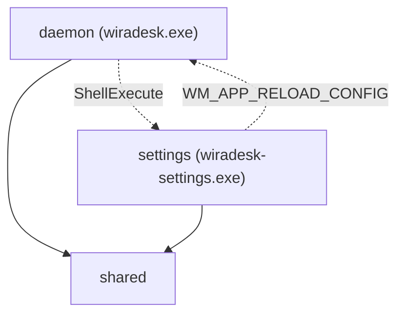
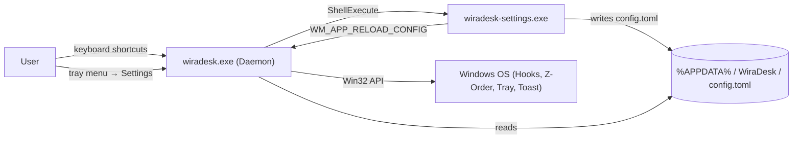
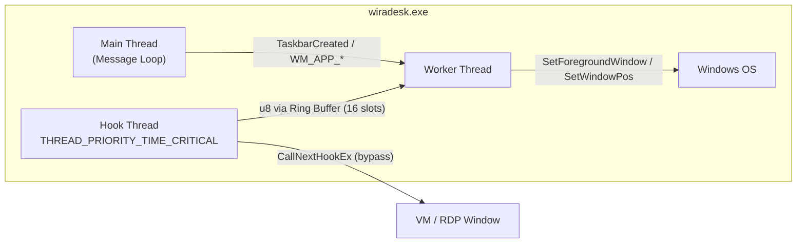

# Architecture Spine — Wira Desk

## Design Paradigm

**Actor / Message-Passing.** Every execution unit (thread, process) owns its state exclusively and communicates via one-way messages. No shared mutable state exists anywhere in the system.

The paradigm maps to the execution units:

| Actor | Owns | Communicates via |
| --- | --- | --- |
| **Hook Thread** (daemon) | Keyboard interception state, throttle timer, bypass list | `u8` commands → Ring Buffer |
| **Worker Thread** (daemon) | Window enumeration, focus logic, tray icon state, arrangement | Win32 Window Messages ← Settings / Main loop |
| **Settings Process** | GUI state, config editing, onboarding | TOML file write + `WM_APP_RELOAD_CONFIG` → Daemon |

## Invariants & Rules

### AD-1 — Design Paradigm: Actor / Message-Passing [ADOPTED]

- **Binds:** all
- **Prevents:** Shared mutable state between threads/processes causing data races or deadlocks.
- **Rule:** Each actor (hook thread, worker thread, settings process) owns its state exclusively. Cross-actor communication uses only: lock-free ring buffer (hook→worker), Win32 Window Messages (settings→daemon), TOML file (settings→daemon config), ShellExecute (daemon→settings launch).

### AD-2 — Inter-Thread Communication: Hook-Side Throttle + u8 Enum

- **Binds:** CAP-1, CAP-2
- **Prevents:** Ring buffer overflow from macro spam; worker thread wasting cycles on invalid/duplicate inputs.
- **Rule:** The Hook Thread is solely responsible for anti-macro throttle (reject inputs <50ms apart). It translates valid keypresses into a `u8` command enum (e.g., `1`=Cycle, `2`=SnapLeft, `3`=SnapRight, `4`=SnapMaximize, `5`=OverlappingStack) before writing to the ring buffer. The Worker Thread never performs input validation — it only executes commands.

### AD-3 — Z-Order Traversal: Stateless Just-in-Time [ADOPTED]

- **Binds:** CAP-1, CAP-7
- **Prevents:** Stale window state causing focus to jump to closed/moved windows; desynchronization with mouse interactions.
- **Rule:** On every keypress, the Worker Thread traverses the live Z-Order via `EnumWindows`. No internal Z-Order cache is permitted. The cost of iterating through windows with non-blocking Kernel APIs is accepted.

### AD-4 — Same-Application Identity: Exe Name + Class Name Exclusion

- **Binds:** CAP-1
- **Prevents:** Misidentification in multi-process architectures (Electron/Chromium apps where each window has a different PID); false grouping of unrelated Electron apps that share the same Window Class Name.
- **Rule:** Two windows belong to the "same application" if and only if their owning executable filename matches (e.g., `chrome.exe`). PID comparison is prohibited as the primary identity mechanism. Window Class Name is used only as an exclusion filter to discard ghost windows and internal utility windows (e.g., `WS_EX_TOOLWINDOW`).

### AD-5 — Config Reload: Explicit IPC Signal

- **Binds:** CAP-3, CAP-5
- **Prevents:** Unnecessary CPU wake-ups from file system watchers; race conditions from reading a partially-written config file.
- **Rule:** The Settings binary writes `config.toml` to completion atomically via temp file rename, then sends a `WM_APP_RELOAD_CONFIG` Win32 message to the Daemon's hidden window. The Daemon reloads config only upon receiving this message — never via polling or file watching.

### AD-6 — VM/RDP Bypass: Hook Thread Evaluation

- **Binds:** CAP-8
- **Prevents:** Wira Desk intercepting shortcuts meant for a VM/Remote Desktop guest OS; infinite loop risk from re-injecting keys via `SendInput`.
- **Rule:** Before intercepting any shortcut, the Hook Thread calls `GetForegroundWindow()` and checks the window's class name / process name against the bypass list (loaded from config). If matched, `CallNextHookEx` is called immediately — the key passes through physically to the VM/RDP client with zero latency.

### AD-7 — Error Handling: 3-Tier Protocol

- **Binds:** CAP-6, CAP-9, CAP-11
- **Prevents:** Silent failures going unnoticed (hook silently dying); notification spam annoying the user; startup errors being invisible.
- **Rule:**
  - **Tier 1 (Startup Fatal):** Show exactly 1x `MessageBox`, then exit. No retry.
  - **Tier 2 (Runtime Warning):** Write to log file silently. Update tray icon to "unread log" state (red dot overlay).
  - **Tier 3 (Runtime Critical — hook dead, fatal but process alive):** Update tray icon to "stopped" state (red X overlay) + fire exactly 1x Windows Toast Notification. Toast is reserved exclusively for this tier.

### AD-8 — Hook Health Monitoring: 10-Second Heartbeat

- **Binds:** CAP-6
- **Prevents:** Hook dying silently with no detection mechanism; delayed user awareness of broken functionality.
- **Rule:** The Daemon checks hook handle validity every 10 seconds. If invalid, it attempts re-registration. If re-registration fails repeatedly (`HOOK_CHECK_FAIL_THRESHOLD = 3`), Tier 3 error protocol is triggered.

### AD-9 — Virtual Desktop Isolation: IVirtualDesktopManager

- **Binds:** CAP-7
- **Prevents:** Window cycling crossing virtual desktop boundaries, violating spatial layout preservation.
- **Rule:** During Z-Order traversal, each candidate window must pass `IVirtualDesktopManager::IsWindowOnCurrentVirtualDesktop(hwnd)`. Windows not on the current virtual desktop are skipped. This is an official, documented Microsoft API (`shobjidl_core.h`, Windows 10+).

### AD-10 — Explorer Crash Recovery: TaskbarCreated Listener [ADOPTED]

- **Binds:** CAP-9
- **Prevents:** Tray icon permanently disappearing after `explorer.exe` crash/restart.
- **Rule:** The Daemon's message loop listens for the `TaskbarCreated` broadcast message and re-registers the tray icon upon receiving it.

### AD-11 — Settings Binary: egui + ShellExecute Launch

- **Binds:** CAP-5
- **Prevents:** GUI framework bloating the daemon's RAM; complex de-elevation logic adding attack surface.
- **Rule:** `wiradesk-settings.exe` uses `egui` for its GUI. The Daemon launches it via `ShellExecute` (inheriting Administrator elevation). De-elevation is not required — the settings binary only edits `config.toml` in `%APPDATA%`.
- **First run:** when no `config.toml` exists, the Daemon launches the same binary with the frozen `--onboarding` flag (`shared::ONBOARDING_FLAG`). The flag lives in `shared` because both sides use it — a typo must be a compile error, not an onboarding screen that silently never appears.

### AD-11a — Settings Accessibility Mechanism: AccessKit

- **Binds:** FR-20, FR-21, CAP-5
- **Prevents:** A Settings window that looks correct but exposes nothing to a screen reader. `accesskit` is not an eframe default feature; without it the UI Automation tree is never published and every accessibility criterion fails silently.
- **Rule:** `wiradesk-settings.exe` depends on `eframe` with `accesskit` enabled and `egui`. The AccessKit-backed Windows adapter is the accepted accessibility mechanism.
- **Version coupling:** `eframe` and `egui` MUST be raised together and MUST end on the same minor version. Raising one alone leaves two `egui` versions in the graph, and `eframe::egui::Context` and `egui::Context` then stop being the same type — a compile error, not a subtle bug.
- **Evidence does not travel:** the UI Automation surface — role, name, value, and listening state — was confirmed against one adapter version, and no automated test stands behind FR-20 or FR-21. A version change therefore obliges re-verifying that surface before the release carrying it.
- **Typography:** Segoe UI is loaded from system fonts (`C:\Windows\Fonts\segoeui.ttf`), falling back to Tahoma, then to egui's bundled face.
- **Theme:** Focus treatment is applied to both light and dark styles via `all_styles_mut` so the focus indicator remains consistent across OS theme switches.

### AD-12 — Cargo Workspace: Three Crates

- **Binds:** all
- **Prevents:** Duplicated type definitions (config structs, command enums) between daemon and settings, causing silent divergence.
- **Rule:** The project is a single Cargo Workspace with three crates: `daemon` (`wiradesk.exe`), `settings` (`wiradesk-settings.exe`), and `shared` (Config TOML types, `u8` command enum, constants, `%APPDATA%` path). Both binaries depend on `shared`.

### AD-13 — Auto-Start: Windows Task Scheduler

- **Binds:** CAP-10
- **Prevents:** UAC prompt on every boot (a registry `Run`-key entry cannot launch an elevated process silently); `%APPDATA%` path mismatch if the task runs as SYSTEM; DLL Hijacking via the task's working directory.
- **Rule:** Auto-start is registered as a Windows Scheduled Task (`schtasks`): trigger `ONLOGON`, run level `/RL HIGHEST`, run-as user `/RU "%USERNAME%"` (the specific active user, never SYSTEM — keeping `%APPDATA%` aligned between daemon and settings GUI). The task action (`/TR`) must use the absolute executable path and the `Start in` parameter must be left empty or point to the secure install directory, mitigating DLL Hijacking. The registry `Run`-key mechanism (`HKCU\...\CurrentVersion\Run`) is prohibited. Toggle (create/delete task) is exposed via the tray context menu and settings UI.

## Dependency Direction

## Consistency Conventions

| Concern | Convention |
| --- | --- |
| **Naming (files)** | Snake_case for Rust modules. Binary names: `wiradesk.exe`, `wiradesk-settings.exe`. |
| **Naming (config keys)** | Snake_case in TOML (e.g., `snap_half_left`, `bypass_processes`). |
| **Data format (config)** | TOML via `serde` + `toml` crate. Schema defined in `shared` crate as Rust structs with `#[derive(Deserialize)]`. |
| **Data format (IPC commands)** | `u8` enum in `shared` crate. Ring buffer carries only `u8` — no heap allocation. |
| **Data format (IPC reload)** | Custom Win32 message `WM_APP_RELOAD_CONFIG = WM_APP + 1` (0x8001). |
| **Error handling** | 3-Tier protocol (AD-7). Never show more than 1 popup at startup. Never show runtime popups. |
| **Logging** | Append-only text log file in `%APPDATA%\WiraDesk\wiradesk.log`. |
| **Config path** | `%APPDATA%\WiraDesk\config.toml`. |
| **Win32 API crate** | `windows-sys` only for core Win32. Avoid COM abstraction bloat. Exception: `IVirtualDesktopManager` minimal COM interface. |
| **Kernel-API sterilization** | `EnumWindows` callbacks use only non-blocking Kernel APIs: `IsWindowVisible`, `GetWindowLongPtrW`, `GetWindowThreadProcessId`, `QueryFullProcessImageNameW`, `GetClassNameW`. Never blocking `SendMessage` or `GetWindowText`. |

## Stack

| Name | Version / Specification |
| --- | --- |
| Rust (stable) | 2021 edition |
| `windows-sys` | 0.52.x |
| `egui` + `eframe` (settings only) | 0.36.x (with AccessKit) |
| `toml` + `serde` (shared) | 1.1.x / 1.0.x |
| Target platform | Windows 10+ (x86_64-pc-windows-msvc) |
| Build profile (release) | `lto = true`, `opt-level = "z"`, `strip = true`, `panic = "abort"` |

## Structural Seed

### System Context

### Daemon Internal Threading

## Capability → Architecture Map

| Capability | Lives in | Governed by |
| --- | --- | --- |
| CAP-1 Window Cycling | `daemon/hook.rs`, `daemon/worker.rs`, `daemon/cycling/*` | AD-1, AD-2, AD-3, AD-4 |
| CAP-2 Window Snapping | `daemon/hook.rs`, `daemon/worker.rs`, `daemon/arrangement/*` | AD-1, AD-2 |
| CAP-3 TOML Config | `shared/config.rs`, `daemon/config.rs`, `settings/persistence.rs` | AD-5, AD-12 |
| CAP-4 Admin/UIPI | `daemon/main.rs` (manifest), `daemon/build.rs` | AD-1 |
| CAP-5 Settings Binary | `settings/*` | AD-11, AD-11a, AD-12 |
| CAP-6 Silent Failure Alert | `daemon/health.rs`, `daemon/tray.rs` | AD-7, AD-8 |
| CAP-7 Spatial Isolation | `daemon/worker.rs`, `daemon/context/*` | AD-3, AD-9 |
| CAP-8 VM/RDP Bypass | `daemon/hook.rs`, `daemon/context/vm_bypass.rs` | AD-6 |
| CAP-9 Explorer Recovery | `daemon/tray.rs`, `daemon/main.rs` | AD-10 |
| CAP-10 Auto-Start | `daemon/autostart.rs`, `settings/app.rs` | AD-13 (Task Scheduler: ONLOGON, RL HIGHEST, RU %USERNAME%) |
| CAP-11 View Logs | `daemon/tray.rs`, `daemon/log.rs` | AD-7 |

## RAM Budget

| Component | Target | Hard Limit |
| --- | --- | --- |
| `wiradesk.exe` (daemon, runtime) | < 2MB | < 10MB |
| `wiradesk.exe` (binary size on disk) | 250KB–400KB | < 500KB |
| `wiradesk-settings.exe` (runtime) | Unconstrained | Reasonable (~20-50MB with egui) |
