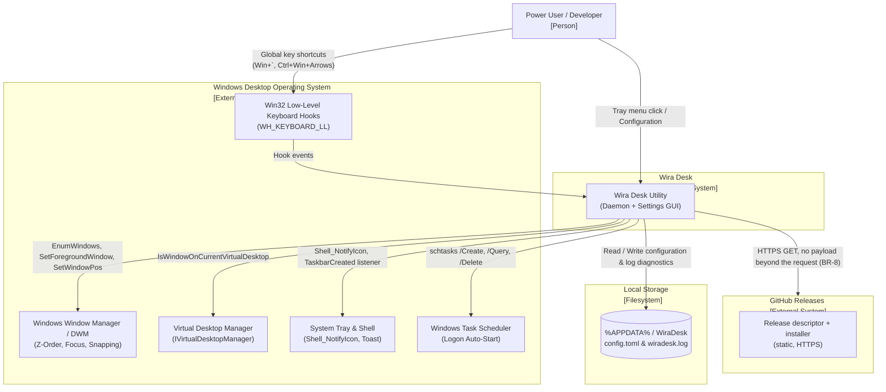

# C4 L1 — System Context

### System Boundaries & Description

- **Wira Desk**: Lightweight, local Windows utility that delivers instant macOS-style same-application window cycling and DPI-aware snapping.
- **External Systems**:
  - **Windows Low-Level Hooks**: Intercepts physical key combinations globally before target applications receive them.
  - **Windows Window Manager / DWM**: Live Z-order enumeration, active window focus transitions, DPI-aware bounds retrieval, and window positioning.
  - **Virtual Desktop Manager**: Official COM interface (`IVirtualDesktopManager`) isolating cycling within the active virtual desktop.
  - **System Tray & Toast**: Native Win32 notification icon, context menu, and critical error toast notifications.
  - **Windows Task Scheduler**: Elevation-preserving logon trigger executing silently without repetitive UAC prompts.
  - **Local Filesystem**: Non-volatile storage for user configuration (`%APPDATA%\WiraDesk\config.toml`) and append-only diagnostic log (`%APPDATA%\WiraDesk\wiradesk.log`).
  - **GitHub Releases**: Hosts the release descriptor the daemon polls and the installer settings can download on confirmation (CAP-13). The only external system Wira Desk ever talks to.
- **Network Boundaries**: One outbound path — the update check (`BR-8`). An HTTPS `GET` to GitHub Releases, host- and path-pinned, carrying no payload beyond the request itself and no identifying data; toggleable from Settings. Nothing else in the product makes a network connection.
