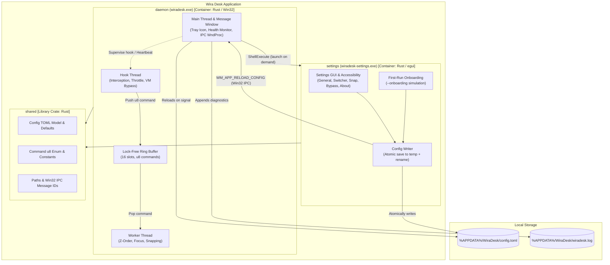

# C4 L2 — Containers

| Container | Binary | Product Components Served | Technology | Responsibilities |
| --- | --- | --- | --- | --- |
| **daemon** | `wiradesk.exe` | `window-management` | Rust, `windows-sys`, Win32 API | Installs global `WH_KEYBOARD_LL` hook, maintains lock-free command ring buffer, executes stateless Z-order window cycling and DPI-aware snapping, manages tray icon / context menu, monitors hook health (10s heartbeat). Runs elevated (`requireAdministrator`). |
| **settings** | `wiradesk-settings.exe` | `settings` | Rust, `egui`, `eframe` + `accesskit` | Provides accessible GUI for editing shortcut bindings, VM bypass list, snapping preferences, and auto-start. Hosts first-run onboarding tutorial. Writes `config.toml` atomically and dispatches `WM_APP_RELOAD_CONFIG` to daemon. |
| **shared** | (library crate) | `_platform` | Rust, `serde`, `toml` | Single source of truth for config schema, default bindings, `u8` command enum, IPC message IDs, APPDATA paths, and legacy WinTick migration logic. |

## Container Interaction Matrix

| Initiator | Target | Channel / Protocol | Purpose |
| --- | --- | --- | --- |
| `daemon` (tray menu) | `settings` | `ShellExecute` (`wiradesk-settings.exe`) | Open Settings GUI (or onboarding via `--onboarding` on first run). Inherits Administrator elevation. |
| `settings` | `daemon` | `WM_APP_RELOAD_CONFIG` (Win32 `PostMessageW` / `SendMessageW` to hidden window) | Notify daemon that `config.toml` was atomically written to disk and needs immediate reload. |
| `Hook Thread` | `Worker Thread` | In-process lock-free static ring buffer (`16` slots of `u8`) | Pass validated, throttled shortcut commands with zero heap allocation. |
| `health.rs` | `Hook Thread` / Main | `WM_APP_HOOK_CHECK`, `WM_APP_HOOK_DEAD` | 10-second heartbeat check and Tier-3 critical escalation. |
| `daemon` | Filesystem | Direct I/O (`%APPDATA%\WiraDesk\config.toml`, `wiradesk.log`) | Read config on boot/signal; append diagnostic warnings/errors. |
| `settings` | Filesystem | Direct I/O (`config.toml.tmp` -> `config.toml`) | Atomically persist user changes without partial-read races. |
