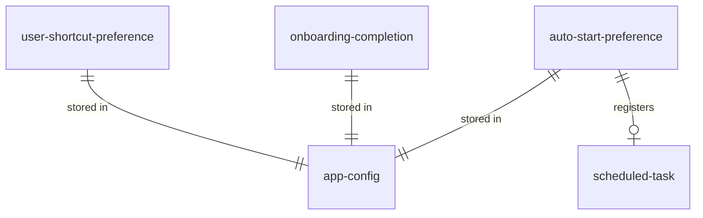

# Data model — settings

Persistent entities are stored in `_platform` entity `app-config` (`%APPDATA%\WiraDesk\config.toml`). This dictionary describes the settings-owned slice of that schema.

## Entity relationship

## user-shortcut-preference

| Column | Type | Nullable | Meaning |
| --- | --- | --- | --- |
| cycling_primary | string | no | Canonical chord, e.g. `Win+Oem3` |
| cycling_fallback | string | yes | Optional `Alt+Oem3` fallback |
| snap_left | string | no | Half-left snap binding |
| snap_right | string | no | Half-right snap binding |
| snap_top | string | no | Half-top snap binding. `[MISSING]` — planned by this pass (FR-22) |
| snap_bottom | string | no | Half-bottom snap binding. `[MISSING]` — planned by this pass (FR-22) |
| snap_maximize | string | no | Maximize binding |
| move_next_monitor | string | no | Next-monitor move binding. `[MISSING]` — planned by this pass (FR-23) |
| snap_stack | string | no | Overlapping stack binding |

### Dictionary

- The **row order above is the declared sequence** `LBR-ST-14` names: the Shortcuts pane is drawn from it, keyboard focus follows it, and a chord collision is resolved in favour of whichever row comes first. There is no second list.
- Grouping the rows under headings in the pane is a presentation concern and belongs to `.how/settings/01-ux/DESIGN.md`. It must not reorder them relative to this sequence.
- Every value is a **canonical** chord string. Two rows holding the same canonical string is the collision condition `BR-6` governs; this component refuses to save it at all.

Schema source: `shared::Config` in `crates/shared/src/config.rs`.

## onboarding-completion

| Column | Type | Nullable | Meaning |
| --- | --- | --- | --- |
| tutorial_completed | bool | no | User finished interactive practice |
| skipped | bool | no | User chose Skip Tutorial |

## auto-start-preference

| Column | Type | Nullable | Meaning |
| --- | --- | --- | --- |
| enabled | bool | no | Whether logon task is registered |
| task_name | string | no | `WiraDesk` (`shared::TASK_NAME`) |

## scheduled-task (external)

Not stored in TOML; created by `schtasks` when `enabled` is true.

| Column | Type | Meaning |
| --- | --- | --- |
| trigger | ONLOGON | Runs at user logon |
| run_level | HIGHEST | Matches daemon elevation (AD-13) |
| run_as | `%USERNAME%` | Aligns APPDATA paths (BR-4) |
