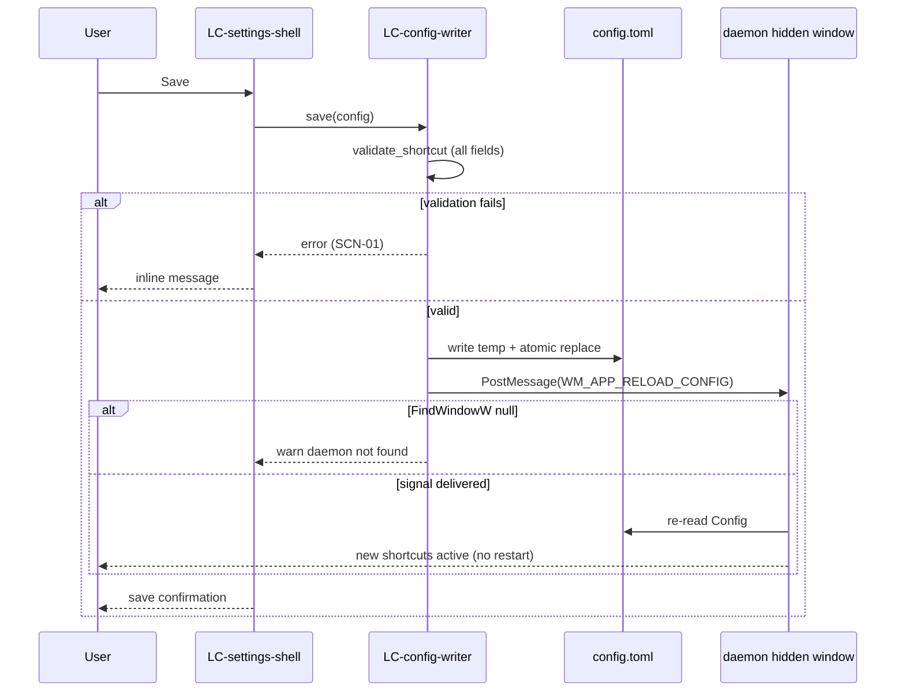

# Flow — Config save and daemon reload

**Component:** settings  
**Realizes:** UC-4, BR-1, AD-5, LBR-ST-2

## Sequence

## Postconditions

- On success, on-disk `config.toml` matches in-memory draft.
- Daemon reloads only after file is complete; partial writes are impossible by ordering.
