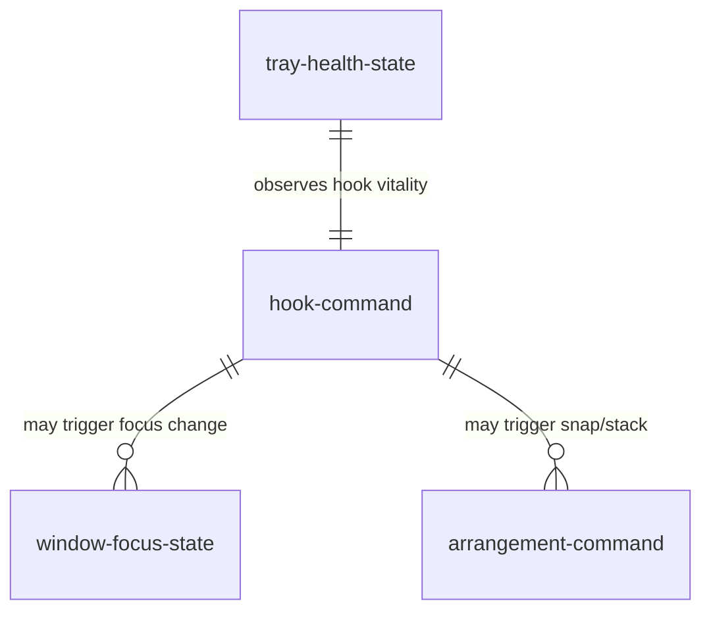

# Data model — window-management

Runtime entities owned by this component. Persistent preferences live in `_platform` entity `app-config`.

## Entity relationship (runtime)

## hook-command

Ephemeral command issued by `LC-hook-thread` and consumed by `LC-worker-thread`.

| Column | Type | Nullable | Meaning |
| --- | --- | --- | --- |
| code | u8 | no | `shared::Command` discriminant. `0`=Nop, `1`=Cycle, `2`=SnapLeft, `3`=SnapRight, `4`=SnapMaximize, `5`=OverlappingStack, `6`=SnapTop, `7`=SnapBottom, `8`=MoveToNextMonitor. Extended, never renumbered; anything outside the set decodes to `Nop` (AD-2) |
| issued_at | QPC tick | no | Used only for 50 ms throttle; not persisted |

## window-focus-state

Snapshot taken at cycle execution time; recomputed every keypress (AD-3).

| Column | Type | Nullable | Meaning |
| --- | --- | --- | --- |
| foreground_hwnd | HWND | no | Window that initiated the cycle |
| exe_basename | string | no | Same-app identity filter (AD-4) |
| monitor | HMONITOR | no | Spatial containment boundary |
| on_current_desktop | bool | no | `IVirtualDesktopManager` result (AD-9) |

## tray-health-state

Owned by `LC-tray-controller`; drives AD-7 visuals.

| Column | Type | Nullable | Meaning |
| --- | --- | --- | --- |
| tier | enum | no | `normal` · `warning` · `critical` |
| warning_latched | bool | no | Tier-2 occurred since last `normal` |
| toast_sent | bool | no | Tier-3 one-shot guard |

## arrangement-command

Planning input for `LC-arrangement-engine`.

| Column | Type | Nullable | Meaning |
| --- | --- | --- | --- |
| target_hwnd | HWND | no | Window to move |
| region | enum | no | `left` · `right` · `top` · `bottom` · `full` · `stack_slot_n` · `next_monitor` |
| dpi | u32 | no | Monitor DPI at plan time. Carried for traceability only — coordinates arrive already in physical pixels, so no planner scales by it |
| destination_monitor | HMONITOR | yes | Set only for `next_monitor`; null for every region planned inside the window's own work area |

### Dictionary

- **`region`** names *what* is planned, not how. `next_monitor` is the one value whose plan reads two work areas; every other value reads one.
- **`destination_monitor`** is valid only for the duration of the command that enumerated it. It is a handle, not an identity, and it MUST NOT be stored beyond that (AD-14).
- An `arrangement-command` that yields an **empty** plan has succeeded, not failed. A disabled overlapping stack and a `next_monitor` on a single-monitor desktop both land there.

## monitor-set

The attached display set, valid only within the command that enumerated it. It is listed here because `arrangement-command` references it, not because anything persists it — `AD-14` forbids caching it at all.

| Column | Type | Nullable | Meaning |
| --- | --- | --- | --- |
| handle | HMONITOR | no | Enumeration handle. Not an identity: it does not survive an unplug |
| work_area | RECT | no | Usable region, taskbar and reserved appbars already excluded |
| dpi | u32 | no | Effective DPI of this monitor at enumeration time |
| order | usize | no | Position in the order `EnumDisplayMonitors` reported. The sequence "next monitor" walks, wrapping from last to first (LBR-WM-7) |
