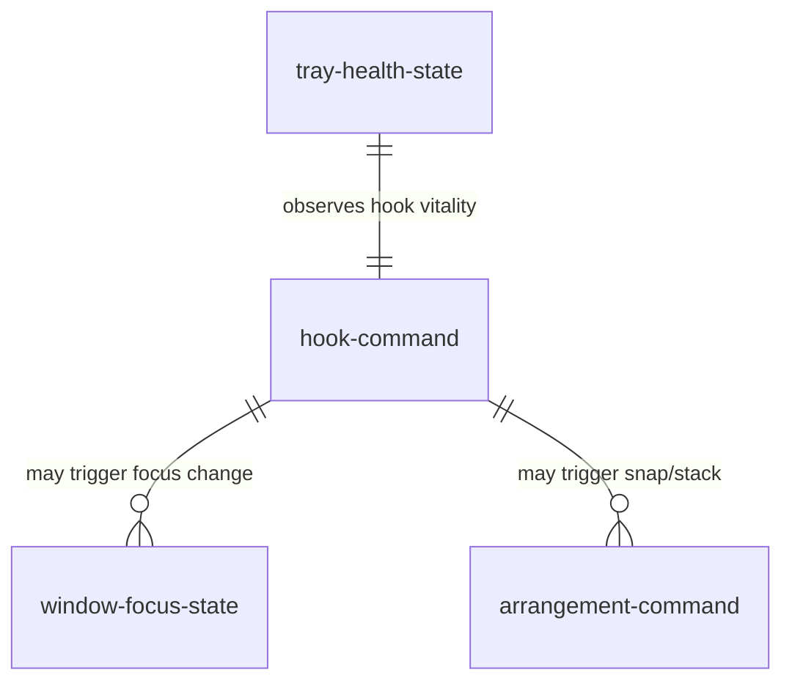

# Data model — window-management

Runtime entities owned by this component. Persistent preferences live in `_platform` entity `app-config`.

## Entity relationship (runtime)

## hook-command

Ephemeral command issued by `LC-hook-thread` and consumed by `LC-worker-thread`.

| Column | Type | Nullable | Meaning |
| --- | --- | --- | --- |
| code | u8 | no | `shared::Command` discriminant (`Cycle`, snap variants, stack) |
| issued_at | QPC tick | no | Used only for 50 ms throttle; not persisted |

## window-focus-state

Snapshot taken at cycle execution time; recomputed every keypress (AD-3).

| Column | Type | Nullable | Meaning |
| --- | --- | --- | --- |
| foreground_hwnd | HWND | no | Window that initiated the cycle |
| exe_basename | string | no | Same-app identity filter (AD-4) |
| monitor | HMONITOR | no | Spatial containment boundary |
| on_current_desktop | bool | no | `IVirtualDesktopManager` result (AD-9) |

## tray-health-state

Owned by `LC-tray-controller`; drives AD-7 visuals.

| Column | Type | Nullable | Meaning |
| --- | --- | --- | --- |
| tier | enum | no | `normal` · `warning` · `critical` |
| warning_latched | bool | no | Tier-2 occurred since last `normal` |
| toast_sent | bool | no | Tier-3 one-shot guard |

## arrangement-command

Planning input for `LC-arrangement-engine`.

| Column | Type | Nullable | Meaning |
| --- | --- | --- | --- |
| target_hwnd | HWND | no | Window to move |
| region | enum | no | `left` · `right` · `full` · `stack_slot_n` |
| dpi | u32 | no | Monitor DPI at plan time |
