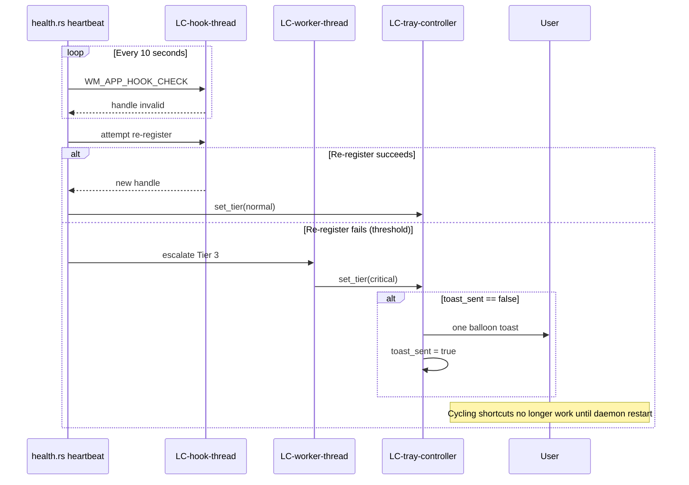

# Flow — Hook death Tier 3

**Component:** window-management  
**Realizes:** UC-3 (error path), AD-7, AD-8, SCN-02

## Sequence

## Postconditions

- User sees critical tray overlay (X) and at most one toast.
- Daemon process remains alive; user may open Settings or View Logs from tray.
- No repeated toast spam on subsequent heartbeat failures.
