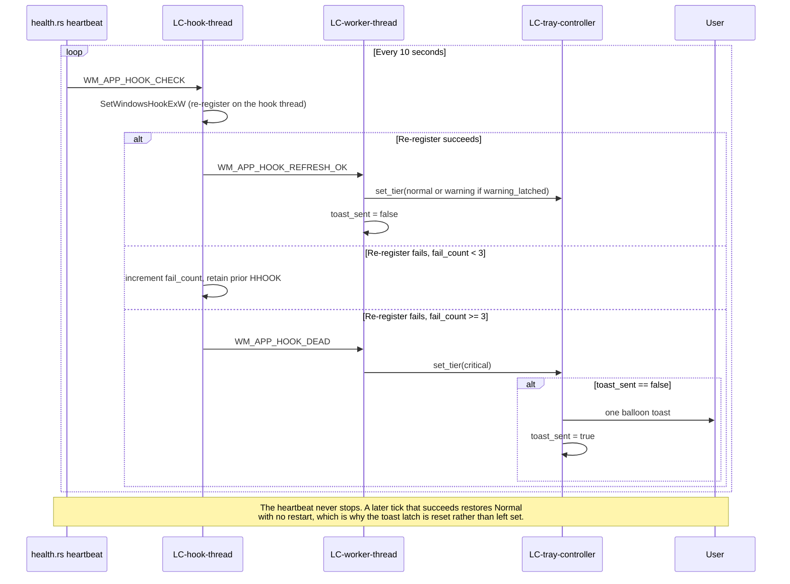

# Flow — Hook death Tier 3

**Component:** window-management  
**Realizes:** UC-3 (error path), AD-7, AD-8, SCN-02

## Sequence

## Postconditions

- User sees critical tray overlay (X) and at most one toast.
- Daemon process remains alive; user may open Settings or View Logs from tray.
- No repeated toast spam on subsequent heartbeat failures.
- Recovery needs no restart: the next successful heartbeat re-registers the hook, resets `hook_dead_toast_sent`, and returns the icon to `Normal` (or `Warning` when `warning_latched`). See SCN-02 steps 8-11 and `state-machines.md` `Dead -> Active`.
