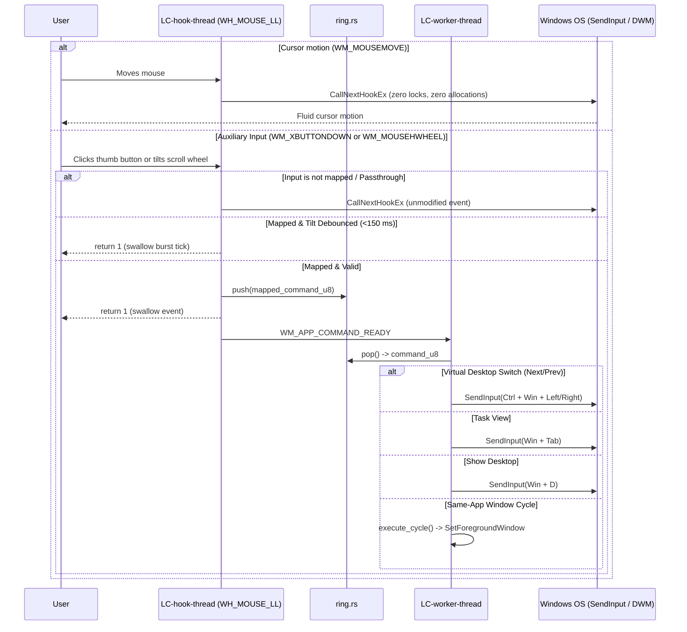

# Flow — Navigate virtual desktops or tasks via mouse

**Component:** window-management
**Realizes:** UC-13, FR-30, FR-31, BR-10, LBR-WM-11, AD-15

## Sequence

## Why motion passthrough has zero locks

Optical and laser mice send cursor movements at polling rates between 125 Hz and 1000 Hz. The `WH_MOUSE_LL` hook callback executes on the dedicated hook thread's message loop. Entering mutex locks, allocating heap memory, or performing string formatting on `WM_MOUSEMOVE` would introduce micro-stutters to mouse tracking and risk hook eviction by Windows under `LowLevelHooksTimeout` (~300 ms). 

`LC-hook-thread` checks `msg == WM_MOUSEMOVE` at the very entry of the callback and immediately returns `CallNextHookEx` within 1–2 CPU instructions, preserving native cursor fluidness.

## Tilt-Wheel Debounce Mechanism

Mechanical tilt switches deliver burst sequences of multiple `WM_MOUSEHWHEEL` delta events during a single physical flick. To ensure reliable single-step navigation, a 150–200 ms debounce timer tracks the timestamp of the last accepted tilt event. Any subsequent tilt tick arriving within the window is swallowed without queuing duplicate commands.
