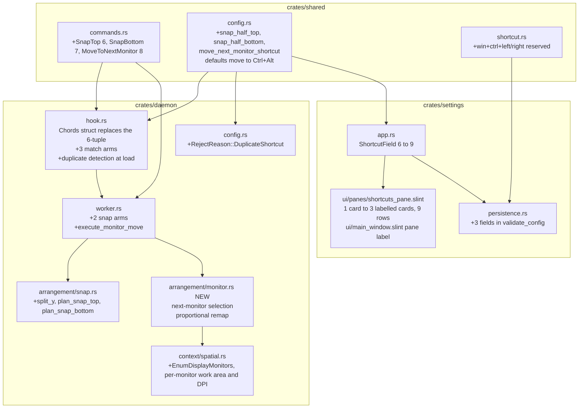
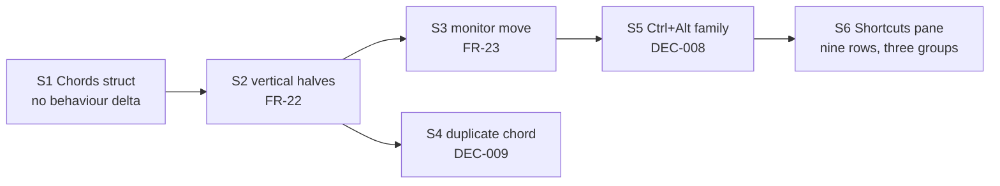
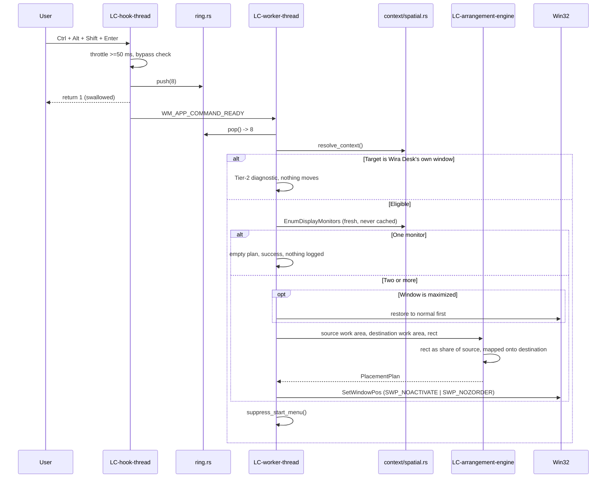
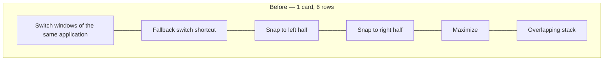
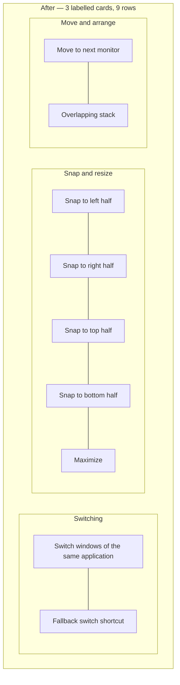

# Architecture diagrams — W4

Projected from `.how/window-management/06-flows/flow-monitor-move.md` and the spine. Diagrams live
here because the SPEC kernel holds prose only.

## Where each piece of W4 lands

## Story order and why it is serial

Five of the six stories touch `daemon/src/hook.rs`, the one file every arrangement command passes
through. Parallel worktrees would collide there, so the wave runs serial. S1 goes alone first
because its shape decision — chord configuration travelling as one struct instead of a six-tuple
and six positional parameters — is what keeps the five behaviour diffs readable. At nine chords,
`clippy::too_many_arguments` fires in a build that runs `-D warnings`, so the refactor is a
prerequisite rather than a courtesy.

## The monitor-move sequence

Enumeration sits on the worker, never in the callback: the callback is budgeted under 10 ms and must
not allocate, and the display set is only needed once a command has been accepted. The hook answers
*whose chord is this*; the worker answers *what is a legal target and where does it go* — the same
split `DEC-006` drew.

## The Shortcuts pane, before and after

The three groups are the three configuration sections already on disk — `[switcher]`, `[snapping]`,
`[layout]` — so what a user sees and what the product stores stop telling different stories. A
fourth pane was refused: the capture lease is armed from which pane is showing, so chord fields in
two panes means two panes arming the observe lease, which regresses the key check.
