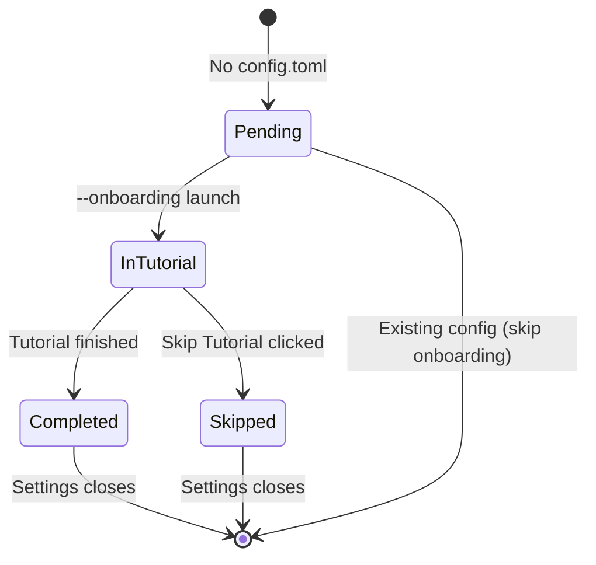
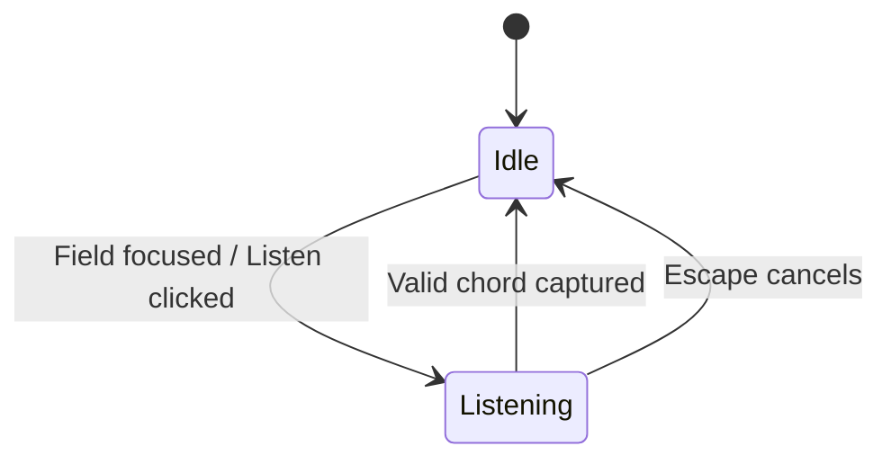

# SRS — settings

> Generated by `.constitution/method/scripts/validate.py --generate`. MUST NOT be hand-edited.

`mode: deep` · `risk_accepted: medium` — from `components.yaml`.

## Decision Summary

The `settings` component provides the standalone on-demand graphical configuration shell and interactive first-run onboarding tutorial (`wiradesk-settings.exe`). It manages shortcut customization via live physical key listening, toggles silent elevated logon auto-start via Windows Task Scheduler, adapts dynamically to Windows light/dark system themes, and guarantees full keyboard navigation and screen reader accessibility through Windows UI Automation.

## Why

Configuration customization and user onboarding are episodic, UI-intensive tasks that require rich graphical controls, accessibility tree support, and theme synchronization. Isolating these capabilities into a distinct executable spawned on-demand keeps the background daemon lean (<2 MB RAM), eliminates UI runtime memory bloat from the background service, and ensures rendering operations never stall input hooks.

## Actor Register

| Actor | Who they are | What they may do |
| --- | --- | --- |
| Power User | Desktop user wanting customized shortcut chords, auto-start management, or diagnostic preferences. | Customize primary/fallback shortcuts, toggle auto-start on boot, modify passthrough lists. |
| New User | First-time user encountering Wira Desk upon installation or initial launch. | Step through interactive mock window cycling simulation or dismiss onboarding via Skip Tutorial. |

## UC Catalogue

Rendered from `usecases.yaml`.

| id | Use case | Component | Satisfies | critical |
| --- | --- | --- | --- | --- |
| `UC-4` | Change a keyboard shortcut in Settings | `settings` | `FR-7`, `FR-18` | no |
| `UC-5` | Complete or skip the first-run tutorial | `settings` | `FR-17` | no |
| `UC-6` | Turn auto-start on boot on or off | `settings` | `FR-13` | no |
| `UC-8` | Check for updates from the About pane | `settings` | `FR-25` | no |

## Constraints

- Must adhere strictly to Architecture Spine invariants AD-1, AD-5, AD-11, AD-11a, AD-12, and AD-13.
- Must persist configuration changes atomically to `%APPDATA%\WiraDesk\config.toml` before dispatching `WM_APP_RELOAD_CONFIG` to the daemon (BR-1, BR-2, AD-5).
- Must record the auto-start preference and hand task registration to the daemon, which creates the task with `/RL HIGHEST` for `%USERNAME%` and an empty/secure Start In directory to prevent DLL hijacking (BR-4, AD-13). This component never invokes `schtasks` itself.
- Must refuse to save a configuration in which two actions carry the same chord, naming both fields; the daemon's answer to the same condition is different by design and is not this component's to apply (BR-6, DEC-009).
- Must draw the Shortcuts pane, order keyboard focus within it, and resolve collision precedence from **one** declared sequence of editable actions, never from a second independent list (LBR-ST-14, LBR-ST-5).
- Must provide complete keyboard navigation (Tab/Shift+Tab, arrow keys, Escape/Enter) across all interactive dialogs (FR-20).
- Must expose full UI Automation properties (names, roles, states, shortcut values) to assistive technologies via AccessKit (FR-21, AD-11a).
- Must render UI in pure native Rust (`Slint`) without webview wrappers or heavy runtime frameworks (AD-11).

## Non-Goals

- Executing window cycling, snapping, or low-level keyboard interception (delegated to `window-management`).
- Maintaining persistent tray icon lifecycle or handling Explorer restart broadcasts (owned by `window-management`).
- Cloud account synchronization or remote profile backups.

## Prerequisite

- Writable user directory at `%APPDATA%\WiraDesk\`.
- Platform configuration schema and IPC reload contracts available (`app-config`, `ipc-reload-signal`).
- Background daemon running or available for elevated onboarding invocation.

## Success Signal

A user customizes a shortcut combination in Settings, saves preferences, and immediately triggers window cycling with the new combination on the very next keystroke without requiring a daemon restart or system reboot.

## Design Reference

Paired SDD: `.how/settings/SDD-settings.md`. UX Design: `.how/settings/01-ux/DESIGN.md`. Binds invariants AD-1, AD-5, AD-11, AD-11a, AD-12, AD-13.

---

## Business rules — local — `02-rules/`

### `rules-settings.md`

### Business Rules — settings

Local component business rules binding the `settings` Product Component. Global cross-component rules (`BR-1` through `BR-8`) live in `.what/business-rules.md`.

#### Rules

| id | Rule | Binds | Source | Status |
| --- | --- | --- | --- | --- |
| LBR-ST-1 | Shortcut fields accept listening-mode physical key combinations only, capturing modifiers and a single main key directly, and must not accept arbitrary typed text. | `settings` | FR-18, AD-11 | active |
| LBR-ST-2 | Configuration persistence must complete an atomic temporary-file write and replacement before an explicit `WM_APP_RELOAD_CONFIG` IPC reload signal is dispatched to the daemon. | `settings` | FR-7, BR-1, AD-5 | active |
| LBR-ST-3 | The "Skip Tutorial" action must remain accessible and clearly visible on every step of the first-run onboarding flow. | `settings` | FR-17 | active |
| LBR-ST-4 | Auto-start scheduled tasks must always be created with `/RU %USERNAME%` and `/RL HIGHEST`, and must never run under the `SYSTEM` account. | `settings` | FR-13, BR-4, AD-13 | active |
| LBR-ST-5 | All interactive settings controls must follow a deterministic Tab navigation order that starts with navigation tabs and terminates with action buttons. | `settings` | FR-20, AD-11a | active |
| LBR-ST-6 | Shortcut capture listening state and validation feedback must be announced via UI Automation accessible values, never communicated through visual styling alone. | `settings` | FR-21, AD-11a | active |
| LBR-ST-7 | Completing or skipping the first-run tutorial must write a valid configuration to disk so that onboarding does not re-trigger on subsequent launches. | `settings` | FR-17, BR-3 | active |
| LBR-ST-8 | A refused shortcut must be reported on the field carrying it; when the refusal is a collision with another action, the report must name both actions. | `settings` | FR-18, DEC-001 | active |
| LBR-ST-9 | The submit action must never be disabled to express a shortcut refusal; a draft holding a collision must be refused when it is submitted. | `settings` | FR-18, DEC-001 | active |
| LBR-ST-10 | A chord the Windows shell already owns must be refused and never claimed for a Wira Desk action, and the refusal must name the Windows function the user would have lost. Where the chord is one Wira Desk could technically have taken, the refusal must also offer a way through; where Windows keeps it regardless of any hook, it must not, because no alternative would be true. | `settings` | FR-18, DEC-003 | active |
| LBR-ST-11 | The daemon may withhold a chord from Windows on the settings process's behalf only while a shortcut field is recording. While the Shortcuts pane is merely visible, the daemon must report the chord and withhold only its own action, never the keystroke. | `settings`, `window-management` | FR-18, DEC-004, AD-1 | active |
| LBR-ST-12 | The key check must state only what was observed, correlating the daemon's report against what the settings window received, and must never predict whether a chord nobody has pressed is available. With no daemon report available it must say so and stop diagnosing. | `settings` | FR-18, DEC-002, DEC-005 | active |
| LBR-ST-13 | The settings window’s painted size is its Win32 size: a size change imposed from outside the process must be clamped at the window’s own message boundary before the toolkit sees it, while position changes pass through untouched. A size the window itself currently declares legal — the onboarding modal growing into the settings shell — must still be honoured. | `settings` | DEC-006 | active |
| LBR-ST-14 | Every action whose chord a user may edit appears as exactly **one** row in the Shortcuts pane, and one declared sequence is the single source of the pane's draw order, its keyboard focus order, and the precedence order that resolves a chord collision. A second, independently maintained list of the same actions must not exist. Grouping the rows under headings must not reorder them relative to that sequence. | `settings`, `window-management` | FR-18, LBR-ST-5, BR-6, DEC-009 | active |
| LBR-ST-15 | Settings must not open without a running daemon — everything it does changes something only the daemon acts on — and must close itself, once, the moment the daemon it opened against goes away. A daemon that starts later does not reopen a window that already refused or closed. | `settings` | FR-25, DEC-004 | active |
| LBR-ST-16 | A chord tested against the reserved-catalogue refusal must, when refused, be offered a deterministic alternative — the same modifier ladder tried in the same order every time — or no alternative at all when none of the ladder clears the catalogue and the current draft. | `settings` | FR-18, DEC-003, DEC-008 | active |

#### Rationale — LBR-ST-14

The list of editable actions grew from six to nine in one pass, and it will grow again. The failure this rule prevents is not hypothetical in this codebase: the source already carries comments explaining that the draw order and the declared order must not become two lists, because they had been, and that a field added to the field-to-key table but not to its reverse lookup breaks the round trip silently rather than at compile time.

The rule also makes the collision precedence order (`BR-6`, `DEC-009`) inspectable. Precedence is arbitrary by nature; what makes it defensible is that a reader can verify it against one declared sequence in a few seconds, and that the pane they are looking at is drawn from that same sequence.

Grouping is explicitly permitted and explicitly constrained. Nine undifferentiated rows are hard to scan, so headings earn their place — but a heading that reorders rows relative to the declared sequence would put the visible order and the precedence order back into disagreement, which is the whole thing this rule exists to stop.

#### Rationale — LBR-ST-15

Everything Settings does is a change to something only the daemon acts on — shortcuts, arrangement, auto-start, the live key check. Without the daemon, every one of those is either inert or actively misleading: the Shortcuts pane would show fields that record nothing, and the key check would report "not running" for every chord no matter what was pressed. A Settings window left behind after the daemon exits is not a degraded window — it is a lying one, so the rule is refuse-to-open plus auto-close rather than a degraded read-only mode. Firing once, rather than reopening if the daemon comes back, keeps the rule simple: the window that closed already told the user what to do about it.

#### Retired

*(No retired local rules)*

## Domain — `03-domain/`

### `domain-model.md`

### Model — settings

Conceptual domain model for the `settings` component. Represents domain entities, relationships, state transitions, and invariants governing user preferences, first-run onboarding, and auto-start configuration. Physical file layouts, TOML serialization models, and window message structs belong in `.how/settings/05-model/data-model.md`.

#### Entities

| Entity | What it is | Identified by |
| --- | --- | --- |
| `user-shortcut-preference` | The user's customized physical key combinations for primary cycling, fallback cycling, window snapping, and application passthrough lists. | Shortcut action identifier (e.g. `cycle_primary`, `cycle_fallback`, `snap_left`) |
| `onboarding-completion` | The status record indicating whether the initial interactive simulation tutorial has been completed, skipped, or is still pending. | User profile configuration identity and completion timestamp |
| `auto-start-preference` | The persistent configuration controlling whether Wira Desk launches silently at user logon via Windows Task Scheduler with elevated privileges. | Scheduled task identifier (`WiraDesk`, frozen as `shared::constants::TASK_NAME`) and target user profile |

#### Relationships

- `user-shortcut-preference` is **persisted within** the shared platform configuration schema (`app-config`).
- `onboarding-completion` **gates** the presentation of the interactive tutorial dialog on application startup.
- `auto-start-preference` **governs** the registration and removal of the Windows Scheduled Task, which the daemon performs when it reloads configuration; this component only records the preference.
- Saving `user-shortcut-preference` **triggers** an atomic write to `app-config` followed by an explicit `ipc-reload-signal` dispatch.

#### State Lifecycle

##### onboarding-completion Lifecycle

| From | To | Trigger | Who may |
| --- | --- | --- | --- |
| `Pending` | `Completed` | User finishes interactive cycling simulation through mock windows | New User |
| `Pending` | `Skipped` | User clicks or activates "Skip Tutorial" button | New User |
| `Completed` / `Skipped` | `Pending` | User manually resets tutorial state from Settings advanced options | Power User |

##### Shortcut Listening State

| From | To | Trigger | Who may |
| --- | --- | --- | --- |
| `Idle` | `Listening` | User focuses or clicks into a shortcut capture field | Power User |
| `Listening` | `Captured` | User presses a valid modifier + non-modifier key combination | Power User |
| `Listening` | `Cancelled` | User presses Escape or clicks away without entering a valid chord | Power User |
| `Captured` | `Idle` | Captured shortcut validated, stored in memory, and field unfocused | Power User |

#### Invariants

- **Atomic Persistence Invariant:** Configuration changes must be completely and safely committed to `%APPDATA%\WiraDesk\config.toml` before the `WM_APP_RELOAD_CONFIG` IPC message is dispatched to the daemon (BR-1, BR-2, AD-5).
- **Physical Key Listening Invariant:** Shortcut input fields must capture raw physical keystroke combinations directly and must not accept arbitrary typed text strings (FR-18).
- **Skip Tutorial Availability Invariant:** The "Skip Tutorial" action must remain accessible and clearly visible on every step of the first-run onboarding flow (FR-17).
- **Per-User Task Alignment Invariant:** Auto-start scheduled tasks must always be created with `/RU %USERNAME%` and `/RL HIGHEST`, never under the `SYSTEM` account (BR-4, AD-13).
- **Full Accessibility Invariant:** All interactive settings controls, toggles, and modal dialogs must be fully navigable via keyboard and expose name, role, and state to screen readers via Windows UI Automation (FR-20, FR-21, AD-11a).

### `state-machines.md`

### State Machines — settings

#### Onboarding state (`onboarding-completion`)

| State | Next launch behaviour |
| --- | --- |
| Pending | Daemon launches settings with `--onboarding` |
| InTutorial | User must complete or skip |
| Completed / Skipped | Tray-only daemon; Settings opens to main dialog |

#### Shortcut capture state (`LC-shortcut-capturer`)

Listening mode ignores typed characters; only physical key combinations are accepted (FR-18).

## Use cases — `04-usecases/`

### `EXPERIENCE.md`

### Wira Desk Experience

#### Foundation

Wira Desk is an ultra-lightweight Windows desktop utility running silently in the background. To preserve strict resource efficiency, the application is split across two decoupled binaries:
- `wiradesk.exe`: Ultra-lightweight background daemon with no GUI interface (<2MB RAM).
- `wiradesk-settings.exe`: Native-themed interactive UI window for First-Run Onboarding and on-demand Settings configuration running modern Fluent 2 Mica styling.

#### Information Architecture

Primary interaction is exclusively driven through global keyboard shortcuts.
Secondary interaction is accessed via right-clicking the System Tray icon to summon the Context Menu:
- Settings...
- View Logs
- Auto-Start *(toggle)*
- Check for Updates...
- About
- Exit

Structure of the Settings Window (`wiradesk-settings.exe`):
- **General**: Auto-start on boot toggle (Task Scheduler integration), Spatial Lock, Virtual Desktop isolation, and UX Honesty controls.
- **Shortcuts**: Every editable chord, and the only pane that holds any. Nine rows in three labelled groups that scroll, above a Key check readout pinned in place:

  | Group | Rows | Reads as |
  | --- | --- | --- |
  | Switching | Switch windows of the same application · Fallback switch shortcut | Which window has focus |
  | Snap & resize | Snap to left half · right half · top half · bottom half · Maximize | One window, one monitor, a fraction of it |
  | Move & arrange | Move to next monitor · Overlapping stack | More than one window, or more than one screen |

  The groups are the three configuration sections the product already keeps on disk, so what a user sees and what the product stores stop telling different stories. The Key check readout stays put while they scroll: it reports what the keyboard just did, so it has to be readable at the moment a chord is pressed rather than wherever the list happens to end. Inside *Snap & resize* the rows follow the arrow keys — left, right, top, bottom — with Maximize last as the "all of it" case; the order is the declared sequence, not the enum's numbering, and grouping never reorders it.
- **Layout**: The overlapping stack toggle and its width slider. No chord lives here — the pane was called *Layout & Snapping* while holding no snapping control at all.
- **VM & Exceptions**: Virtualization and Remote Desktop passthrough rules (`mstsc.exe`, `vmconnect.exe`, `VMwareUnityWindow`).
- **About**: Version information, project links, active typeface loader status, and diagnostic build metadata.

#### Voice and Tone

- **Neutral & Direct**: As a pure system utility, microcopy across the Settings UI is concise, functional, and devoid of unnecessary casual jargon.
- **Solutive Microcopy**: Warning and error messages (such as keyboard hook detachment or elevation issues) directly present actionable remedies (e.g. "Run with Administrator privileges to interact with elevated windows").

#### Accessibility Floor

- **Keyboard Navigation**: Every interactive element within the Settings dialog and onboarding flow supports complete keyboard navigation via Tab, Shift+Tab, Space, and Enter keys.
- **Screen Reader Support**: Toggle switches and shortcut input capturers announce their active/inactive and listening states explicitly to screen readers via Windows UI Automation (AccessKit).
- **Theme-Resilient Focus Rings**: Active widget focus strokes maintain high-contrast 2.0 pt outlines across both Light and Dark themes.

#### Component Patterns

- **Frameless Window Shell**: The settings and onboarding windows feature a modern frameless custom titlebar (`with_decorations(false)`) with in-app minimize (`—`) and close (`✕`) caption controls and native window drag handling.
- **Fluent 2 Animated Toggle**: Interactive animated pill switches (`fluent_toggle_switch`) providing immediate tactile and visual state confirmation.
- **Scroll hint**: When a pane holds more than fits, a chevron appears at the bottom edge of the scroll area and bobs gently. It shows only while **both** are true — the area is genuinely scrollable, and the reader has not scrolled yet — and fades out the moment either stops holding. Both halves earn their place: without the first it invites a scroll that does nothing, and without the second it keeps nagging after the reader has already complied, which is what makes the same pattern irritating on a landing page. It is an addition to the scrollbar, not a replacement: Fluent's auto-hiding scrollbar is easy to miss, and the Shortcuts pane's nine rows are where that was first noticed.
- **Shortcut Capturer**: When a user focuses or activates a shortcut field, the UI does not accept regular text entry. Instead, it enters an active "Listening" state to intercept the physical key chord pressed next. Pressing Escape cancels listening without overwriting previous bindings.
- **Decoupled Architecture**: Activating "Settings..." from the tray spawns an isolated process (`wiradesk-settings.exe`). The core background daemon is never blocked by GUI rendering threads, guaranteeing uncompromised low-level keyboard hook responsiveness.

#### State Patterns

The primary visual indicator is the System Tray icon, communicating runtime operational health:
- **Normal**: Clean default icon. Wira Desk daemon is active and responsive.
- **Warning / Logged (Tier 2)**: Icon with small red alert dot overlay (`#E81123`). Non-fatal errors or fallback events logged silently.
- **Critical / Dead (Tier 3)**: Icon with red cross overlay (`#E81123`). Initialization failure or keyboard hook silently detached by OS timeout. **Accompanied by a Windows Toast Notification** (since Windows 11 hides tray icons in the overflow menu by default, ensuring immediate user awareness when the utility is halted).

States a shortcut row can be in:

| State | What the user sees | What they can do |
| --- | --- | --- |
| Resting | The current chord, rendered as key names — `Ctrl + Alt + ↓` | Activate the row to rebind it |
| Listening | The row says it is listening instead of showing a chord, and announces that state to a screen reader rather than relying on the visual change | Press a chord, or Escape to cancel and keep the old one |
| Refused — grammar | An inline message on **this** row saying what is wrong: a missing modifier, an unknown key, more than one main key | Press a different chord. Save stays available |
| Refused — reserved | An inline message naming what Windows uses the chord for, and — where the chord is merely policy-refused rather than impossible — suggesting adding Ctrl | Press a different chord |
| Collides | Inline messages on **both** rows, each naming the other action, plus a Swap affordance on the row that was just changed | Swap the two, change one, or submit and be refused with both names |
| Empty | No shortcut row is ever empty. A chord field always holds a value; an action with no reachable chord is the **unbound** case below, which is a daemon-side condition and not something this pane can currently show | — |

An **unbound** action — one the daemon has left unreachable because another action ahead of it holds the same chord (`BR-6`) — has no representation in this pane today. The user sees the tray Warning dot and, if they open the log, a line naming both fields. `DEC-009` records this silence as a cost and names showing it here as the route out; it is deliberately not designed in this pass.

#### Interaction Primitives

- **Same-App Window Cycling**: Pressing `Win + \`` instantly cycles focus to the next top-level window belonging exclusively to the active foreground application. Replicates native macOS behavior — zero animations, zero HUD overlays, zero visual transitions.
- **Spatial Boundary Locking**: Cycling is strictly confined to the active physical monitor and current virtual desktop. Peripheral monitors remain completely undisturbed.
- **Half-Screen Snapping**: `Ctrl + Alt` with an arrow key puts the active window in that half of the current monitor's work area — left, right, top, or bottom. Pressing the same chord twice changes nothing, because the division is recomputed from the work area rather than from where the window currently sits.
- **Deliberate Monitor Movement**: `Ctrl + Alt + Shift + Enter` moves the active window to the next monitor and it keeps the same *share* of the screen, not the same pixel size. This is the one command that crosses the monitor boundary on purpose; the virtual desktop boundary is never crossed. With one monitor attached it does nothing at all — no movement, no message.

#### Key Flows

##### Flow 1: First-Run Onboarding Simulation
1. User launches Wira Desk for the first time without an existing configuration.
2. Instead of staying hidden in the system tray, `wiradesk-settings.exe` launches automatically with `--onboarding`.
3. The interactive simulation presents a compact frameless modal dialog (`520 × 400 px`) guiding the user to practice the same-application cycling shortcut (`Win + \``).
4. Simulated dummy windows within the UI shift focus visually to build muscle memory.
5. A prominent "Skip Tutorial" action is available for power users (also bound to Escape).
6. Upon completion or skipping, onboarding state is persisted, the UI process exits, and Wira Desk operates invisibly in the tray.

##### Flow 2: Settings Configuration and Dynamic Reload
1. User right-clicks the System Tray icon and selects "Settings...".
2. `wiradesk-settings.exe` launches on demand as a frameless 5-pane settings shell.
3. User alters window snapping shortcuts or adjusts the "Overlapping Stack" width ratio slider.
4. User clicks "Save Changes". Settings validates inputs, writes `config.toml` atomically, and signals the daemon via a `WM_APP_RELOAD_CONFIG` Win32 message.
5. The background daemon reloads configuration immediately without restarting.
6. User closes the Settings window. The UI process terminates and system memory is reclaimed.

##### Flow 3: Pure Window Cycling (Rian's Multi-Monitor Scenario)
1. User (Rian) presses `Cmd + \`` on an external Mac keyboard (mapped as `Win + \``).
2. Wira Desk captures the keystroke at low-level without input lag.
3. Operating system focus shifts instantly to the adjacent application window on the current physical display.
4. No animations, thumbnails, or task switcher HUDs appear.

##### Flow 4: Unresponsive Application Confrontation (Maya's UX Honesty Scenario)
1. User (Maya) presses `Win + \`` to cycle to the next window of a heavy application.
2. The next target window is in a "Not Responding" state.
3. Applying the *UX Honesty* principle, Wira Desk brings the frozen window to the foreground rather than silently skipping it.
4. Maya observes the "(Not Responding)" title bar and can take appropriate action (e.g. terminating the hung task or pressing `Win + \`` again to advance to the next window).

##### Flow 5: Elevated UIPI Focus Transfer (Budi's SysAdmin Scenario)
1. User (Budi) is actively working in Task Manager or an Administrator Command Prompt.
2. Budi presses `Win + \``.
3. Because the Wira Desk background daemon runs with Administrator privileges (`requireAdministrator`), it successfully captures the shortcut and transfers focus across UIPI privilege boundaries without operating system blocks.

##### Flow 6: Building a Two-Screen Review Layout (Sari's Docked Scenario — UJ-4)
1. User (Sari) is on a 14-inch laptop with a larger external monitor to its right, the two running at different display scaling. A specification and a terminal are both on the laptop screen; a browser is on the external monitor.
2. Sari presses `Ctrl + Alt + Up` on the specification. It takes the top half of the laptop's work area — the useful division on a screen too short for left and right halves to help.
3. She focuses the terminal and presses `Ctrl + Alt + Down`. It takes the bottom half. The two halves meet exactly, with no gap and no overlap.
4. She decides the specification belongs on the larger display and presses `Ctrl + Alt + Shift + Enter`.
5. **Climax:** the specification arrives on the external monitor still occupying the top half — the same *share* of the work area, not the same pixel height — so the layout she just built survives the move. The browser and the terminal have not moved.
6. Sari works across both screens with a layout assembled from the keyboard in seconds, and rebuilds it the same way each time she docks.
7. Undocked, with only the laptop screen attached, step 4 does nothing at all: no window jump, no message, no error. The snap chords keep working.

### `UC-4-change-shortcut.md`

### UC-4 — Change a keyboard shortcut in Settings

#### Trigger

User selects a shortcut field in Settings to customize its key combination.

#### Precondition

- Settings application (`wiradesk-settings.exe`) is running and displaying the Shortcuts pane, which lists every editable action as exactly one row (LBR-ST-14).
- Background daemon is active or configuration file exists in `%APPDATA%\WiraDesk\config.toml`.

#### Main Flow

1. User focuses a shortcut input field to change its key binding.
2. System transitions the field into listening mode and announces the capture state to assistive technologies.
3. User presses the new physical key combination containing at least one modifier.
4. System validates chord syntax, displays the canonical combination, and marks the draft configuration dirty.
5. User selects the Save action to commit changes.
6. System writes the validated configuration atomically to disk and posts `WM_APP_RELOAD_CONFIG` to the daemon.
7. System displays confirmation feedback and updates the saved baseline state.
8. User closes Settings and immediately uses the new shortcut for the action whose row they edited.

#### Alternate Flows

| From step | Condition | What happens |
| --- | --- | --- |
| Step 2 | User presses Escape while in listening mode | System cancels capture mode, restores the previous shortcut value, and leaves the draft unchanged. |
| Step 4 | User selects Revert instead of Save | System discards draft modifications, restores previously saved values, and clears dirty status. |
| Step 6 | Daemon is not running | System saves configuration atomically to disk without IPC reload; daemon will load updated settings on next startup. |
| Step 2 | The Shortcuts pane is visible and Settings holds the foreground window | The daemon withholds its own shortcut actions and reports each observed chord to Settings, so a chord pressed to test it neither switches windows nor is taken from Windows (LBR-ST-11). |
| Step 3 | Field is listening and Settings holds the foreground window | The daemon additionally withholds the chord from Windows for the duration of the recording, so the shell cannot act on it and steal the foreground before the capture completes (LBR-ST-11). |
| Step 3 | The captured chord is `Win + Ctrl + Left` or `Win + Ctrl + Right` | System refuses it and names what Windows uses it for — switching between virtual desktops. These two entered the reserved catalogue with `DEC-008`; before that they were accepted, and were the shipped snap defaults. |
| Step 3, when the just-captured chord displaces another field's existing chord | User offers Swap on the displaced field | System gives the displaced field back the chord the capture just took from it, restoring both fields to what they held before the capture collided them. Only the field the capture actually displaced can be swapped this way — offered on any other field it is a no-op — and the draft is not re-checked for a new collision after the swap; the pane re-evaluates on the next frame regardless. |

#### Failure Flows

| From step | Failure | What the system does | What the user is left with |
| --- | --- | --- | --- |
| Step 3 | User presses a bare key without modifier keys | System rejects the combination, retains listening mode, and displays an inline validation message (SCN-01) | Field remains in listening mode with previous valid shortcut intact in draft |
| Step 3 | User presses an unrecognized or unsupported key token | System rejects the input with an unsupported token notice and continues listening | Draft and disk configuration remain unchanged; user can re-strike a valid chord |
| Step 3 | User presses a chord the Windows shell already owns (`Win+1`, `Win+E`, `Win+D`, `Win+V`, `Win+Shift+S`, …) | System refuses the chord, names the Windows function it belongs to, and — where the chord is one Wira Desk could technically have taken — offers a way through; listening continues (SCN-01, LBR-ST-10) | Draft unchanged; the user knows which Windows function the chord serves and what to press instead |
| Step 3 | The daemon reports a chord the canonical grammar cannot name (a virtual-key code with no shared name, e.g. `Win+Semicolon`) | System refuses the chord explicitly rather than silently ignoring it, and continues listening | Draft unchanged; the field does not appear unresponsive |
| Step 4 | The captured chord is already held by another configurable action | System keeps the chord in the draft, marks both actions — each naming the other — and refuses the draft on submission (SCN-03) | Both offending actions are identified and the submit action stays available; nothing is written until the collision is resolved |
| Step 6 | Atomic file write fails due to filesystem permission error | System displays save failure error message and skips IPC reload | Draft remains in memory for correction; existing configuration on disk remains intact |

#### Outcome

The new shortcut binding is persisted atomically to disk and immediately active in the running daemon without requiring a daemon restart or system reboot.

#### Business Rules

- `BR-1`
- `BR-2`
- `LBR-ST-1`
- `LBR-ST-2`
- `LBR-ST-5`
- `LBR-ST-6`
- `LBR-ST-8`
- `LBR-ST-9`
- `LBR-ST-10`
- `LBR-ST-11`
- `LBR-ST-12`

### `UC-5-first-run-tutorial.md`

### UC-5 — Complete or skip the first-run tutorial

#### Trigger

User launches Wira Desk for the first time without an existing configuration file, or launches Settings with the `--onboarding` flag.

#### Precondition

- Wira Desk is launched on Windows desktop.
- No existing `%APPDATA%\WiraDesk\config.toml` file exists, or the executable is invoked with `--onboarding`.

#### Main Flow

1. User starts Wira Desk or triggers onboarding.
2. System detects first-run intent and presents the interactive onboarding window at the Welcome step.
3. User reads the spatial cycling explanation and advances to the interactive practice step.
4. System presents the practice exercise explaining same-application cycling on the current monitor.
5. User presses the demonstrated cycling shortcut to complete the practice step.
6. System displays the completion step confirming setup is complete.
7. User selects the finish action to conclude onboarding.
8. System writes the baseline configuration to disk and transitions to normal background tray operation.

#### Alternate Flows

| From step | Condition | What happens |
| --- | --- | --- |
| Step 2 | User selects Skip Tutorial on the welcome step | System skips remaining tutorial steps, writes initial default configuration to disk, and transitions to tray operation. |
| Step 4 | User selects Skip Tutorial during practice step | System bypasses remainder of tutorial, writes valid default configuration to disk, and transitions to tray operation. |

#### Failure Flows

| From step | Failure | What the system does | What the user is left with |
| --- | --- | --- | --- |
| Step 8 | Configuration persistence fails due to disk write error | System displays an error message and keeps onboarding open | User is alerted to filesystem issue; onboarding will re-prompt on next launch until saved |

#### Outcome

User understands same-application spatial cycling concepts, a valid configuration file is persisted to disk, and first-run onboarding will not appear on subsequent launches.

#### Business Rules

- `BR-2`
- `BR-3`
- `LBR-ST-3`
- `LBR-ST-7`

### `UC-6-toggle-auto-start.md`

### UC-6 — Turn auto-start on boot on or off

#### Trigger

User toggles the Auto-Start setting in Settings or selects Auto-Start from the system tray context menu.

#### Precondition

- Wira Desk is installed and running under the active Windows user account.
- User has permissions to configure scheduled tasks for their user session.

#### Main Flow

1. User toggles the Auto-Start option in Settings or the tray context menu.
2. System creates an `ONLOGON` Windows Scheduled Task for the current user with highest privileges and absolute daemon path.
3. User saves settings or confirms the toggle state change.
4. System persists the updated `auto_start` boolean preference in `config.toml`.
5. User restarts Windows or signs out and logs back in.
6. System launches the background daemon automatically at logon elevated with highest privileges without a UAC prompt.
7. User toggles the Auto-Start option off at a later time.
8. System deletes the scheduled task from Windows Task Scheduler and updates the persisted configuration.

#### Alternate Flows

| From step | Condition | What happens |
| --- | --- | --- |
| Step 1 | User toggles Auto-Start directly from the tray context menu | System creates or deletes the scheduled task immediately and persists the new setting to `config.toml`. |
| Step 2 | The executable sits where a non-administrator could replace it — a build output folder, `Downloads`, or any directory granting a write right to a non-administrative principal | System registers the task anyway, then raises a Tier-2 warning naming the path and what to do about it: one line in `wiradesk.log` plus the latched tray dot, no modal. Registration is never refused and the toggle never reverts (BR-7) |
| Step 2 | The location's permissions cannot be read | System registers the task and stays silent to the user, recording the failure only on the developer diagnostic path. An unreadable permission is not reported as either safe or unsafe |
| Step 6 | The executable has moved since the task was registered — typically because the user installed it properly after first running it from a download | On its next start the daemon re-registers the task from its own path, so the logon action follows the binary instead of continuing to launch whatever is at the old location (BR-7) |

#### Failure Flows

| From step | Failure | What the system does | What the user is left with |
| --- | --- | --- | --- |
| Step 2 | Task Scheduler creation fails due to Group Policy or permissions | System reverts the toggle to off, logs a Tier-2 entry, and updates tray warning state without a modal popup (SCN-02) | Toggle remains off and current task configuration is unchanged |
| Step 8 | Task deletion fails because task was already removed externally | System logs warning, updates persisted preference to disabled, and clears toggle state | Auto-start remains disabled without raising modal errors |

#### Outcome

Windows Task Scheduler is configured to launch Wira Desk silently at user logon with highest privileges, or the scheduled task is removed when auto-start is disabled.

#### Business Rules

- `BR-1`
- `BR-4`
- `BR-7`
- `LBR-ST-4`

### `UC-8-check-for-updates.md`

### UC-8 — Check for updates from the About pane

#### Trigger

User clicks "Check for updates" in the About pane.

#### Precondition

- Settings is open and the daemon is running (`daemon_watch`).
- The "Check for updates automatically" toggle governs only the periodic background check (CAP-13); the manual button in this use case is always available regardless of the toggle's state.

#### Main Flow

1. User opens the About pane and clicks "Check for updates". The button shows "Checking…" and disables itself.
2. System requests the release descriptor over HTTPS, carrying no payload beyond the request itself (BR-8).
3. System compares the descriptor's version against the running version and validates the descriptor (checksum shape, release URL pinned to this product's own channel).
4. A newer, valid release exists: the About pane shows the new version and an "Install" action.
5. User clicks "Install". System downloads the installer to a fresh, unpredictable temporary directory.
6. System verifies the download's SHA-256 checksum against the one the descriptor published.
7. On a match, system launches the verified installer elevated and Settings exits — the installer stops the daemon and replaces `wiradesk-settings.exe`, which cannot happen while it is running.

#### Alternate Flows

| From step | Condition | What happens |
| --- | --- | --- |
| Step 3 | No newer release exists | About pane shows the product is up to date; no further action offered. |

#### Failure Flows

| From step | Failure | What the system does | What the user is left with |
| --- | --- | --- | --- |
| Step 2 | Request fails (network, non-HTTPS target, oversized or unreadable response) | System shows a specific, worded reason (not a generic "update failed") | Button re-enables; user may try again |
| Step 3 | The descriptor names an unusable version, a malformed checksum, or a download URL not pinned to this product's own release channel | System refuses the release and reports why, offering nothing to install | No install offered; the descriptor is treated as untrustworthy, not as "no update" |
| Step 6 | Downloaded file's checksum does not match the published hash | System deletes the file and never launches it | Nothing is installed; user is told the verification failed |

#### Outcome

The user learns whether a newer release exists and, on confirmation, ends up running it — with every step verified before anything installed runs, and nothing sent over the network but the request itself.

#### Business Rules

- `BR-8`

## Scenarios — `05-scenarios/`

### `SCN-01-invalid-shortcut-rejected.md`

### SCN-01 — Invalid shortcut rejected before save

#### Where it branches

Leaves from **UC-4 (Change a keyboard shortcut in Settings)** at **Step 7** (chord validation), before anything is written to the draft.

#### Condition

The captured chord carries no modifier (a bare key such as `A` or `Tab`), or more than one main key (`Ctrl + A + B`), or a token the canonical grammar does not recognise, or it is a chord the Windows shell already owns (`DEC-003`), or it is a virtual-key code the shared vocabulary has no canonical name for.

#### Flow

1. User activates a shortcut field on the Shortcuts pane; `LC-shortcut-capturer` enters `Listening`.
2. User presses a single letter key with no `Win`, `Ctrl`, or `Alt` held.
3. `validate_shortcut` returns `Err(ShortcutError::NoModifier)`; a multi-key chord would return `MultipleMainKeys`.
4. The draft chord is left at its previous valid value — a rejected capture never becomes the draft.
5. Capture state **stays in `Listening`**, so the user can press a valid chord without reactivating the field. Only `Escape` returns it to `Idle`.
6. The inline error renders next to the field, and the reason is exposed to assistive technology as an accessible value rather than by colour alone (LBR-ST-6).
7. User presses a valid chord, or presses `Escape` to abandon the change.

A reserved-chord refusal follows the same path with one difference: while the field is listening the
daemon withholds the chord from Windows (LBR-ST-11), so the shell cannot act on it and take the
foreground before step 6 renders. Without that, `Win+E` opens Explorer, Settings loses focus, and the
refusal never reaches the screen — which is what this scenario used to do.

#### Outcome

Nothing is written. The on-disk `config.toml` is untouched, no `WM_APP_RELOAD_CONFIG` is sent, and the daemon keeps the shortcuts it already has.

#### Failure envelope

| Condition | User sees | Log |
| --- | --- | --- |
| Chord has no modifier | Inline error naming the field and what it needs | `debug!` validation reason |
| Chord has several main keys | Inline error naming the field and what it needs | `debug!` validation reason |
| Chord is one the Windows shell owns and Wira Desk could have taken | Inline refusal naming the Windows function, plus a chord that is free | `debug!` catalogue entry matched |
| Chord is one Windows keeps regardless of any hook (`Ctrl+Alt+Del`, `Win+L`) | Inline refusal naming the Windows function, with no alternative offered — none would be true | `debug!` catalogue entry matched |
| Reported virtual-key code has no canonical name | Inline refusal saying the key cannot be used in a shortcut | `debug!` unnameable vk |

#### Why it is not in the UC

Keeps the rejection grammar and the listening-state rules out of the success path, which is a straight line from activate to save.

#### Notes

Save is not gated on validity: the button is always live (`crates/settings/src/main.rs`), and an invalid draft is refused at save time by `validate_config`, surfacing as `SaveFeedback::Error`. A design that disabled Save would have to explain which field disabled it, which is why rejection is reported per field instead.

A chord the shell owns is refused here, never overridden: an override would make one keypress do two
different things depending on whether a background process happens to be alive, and neither state is
visible at the moment it is pressed (`DEC-003`). A chord an *external* application holds is a
different matter again — nothing is refused, because nothing is predicted (`DEC-002`), and what the
user gets instead is an observation after the fact (`DEC-005`).

A legal chord already held by another action is not this scenario's condition — it enters the draft rather than being held back, and is refused only at submission. That case is **SCN-03**.

### `SCN-02-autostart-task-create-fails.md`

### SCN-02 — Auto-start task creation fails

#### Where it branches

Leaves from **UC-6 (Turn auto-start on boot on or off)** after the preference is saved and the daemon has been signalled — the task is registered by the daemon, so the failure surfaces on its side of the boundary, not in Settings.

#### Condition

Group Policy, an endpoint protection product, or a restricted account prevents Task Scheduler from creating an `ONLOGON` task, and `schtasks /Create` exits non-zero.

#### Flow

1. User turns Auto-start on in the General pane and clicks Save.
2. `LC-config-writer` validates the draft, writes `config.toml` atomically, and posts `WM_APP_RELOAD_CONFIG`.
3. The daemon reloads configuration, sees `general.auto_start` set, and calls `daemon::autostart::enable`.
4. `schtasks /Create` exits non-zero (access denied, or policy block).
5. The daemon logs a warning carrying the exit code. It does not raise a modal: this is a Tier-2 condition, so the tray icon takes the Red Dot overlay and the reason is in `wiradesk.log` (AD-7).
6. `general.auto_start` stays `true` in `config.toml` — the user's *preference* was recorded, and it is the *task* that failed.
7. The tray menu's Auto-start checkmark reads back from `schtasks /Query`, which still reports no task, so the menu shows auto-start off.

#### Outcome

No orphaned task exists. The preference and the observable system state disagree, and the tray menu tells the truth about the system rather than about the preference. The user can retry after the policy or permission changes; nothing has to be undone first.

#### Failure envelope

| Condition | User sees | Log |
| --- | --- | --- |
| `schtasks /Create` non-zero | Tier-2 Red Dot on the tray icon; Auto-start unchecked in the tray menu despite the saved preference | `warn!` with the `schtasks` exit code |
| `schtasks.exe` absent or blocked | As above | `warn!` on spawn failure |

#### Why it is not in the UC

The success path never crosses the process boundary twice. This scenario is where the split matters: `settings` owns the preference, the daemon owns the task, and only the daemon can see the failure.

#### Notes

Settings cannot revert the toggle on this failure, and MUST NOT be specified as doing so — it has already exited, or is at best unaware, by the time `schtasks` runs. `schtasks /Query` is the authoritative source for the checkmark for exactly this reason (`crates/daemon/src/autostart.rs`).

### `SCN-03-shortcut-collision-refused-at-save.md`

### SCN-03 — Two actions left holding the same chord

#### Where it branches

Leaves from **UC-4 (Change a keyboard shortcut in Settings)** at **Step 4**, after the captured chord
has become the draft value and before the draft is submitted.

#### Condition

The chord just accepted for one action is already held by another of the configurable actions.
Nothing about the chord itself is wrong: it carries a modifier, it carries one main key, and the
grammar recognises every token.

#### Flow

1. User activates a shortcut field and presses a chord that is legal in isolation.
2. The chord becomes the draft value for that action.
3. Settings marks that action and the action already holding the chord, each naming the other, so
   the pair can be identified without searching the pane. The submit action stays available
   throughout.
4. User either resolves the collision — by giving one of the two a different chord, or by
   exchanging the two actions' chords — or submits the draft as it stands.
5. If resolved, the main flow is rejoined at UC-4 Step 5. The remaining steps describe what happens
   instead if the user submits without resolving it.
6. Settings refuses the draft, names both actions in the refusal, and writes nothing.
7. Settings signals no reload; the configuration already on disk keeps the pair it had. User
   resolves the collision and submits again, rejoining the main flow at UC-4 Step 5.

#### Outcome

The user resolves the collision and the draft commits by the main flow, rejoining at UC-4 Step 5 —
or Settings refuses it at submission, leaving the draft intact with both offending actions named;
the user remains free to resolve it and try again.

#### Failure envelope

| Condition | User sees | Log |
| --- | --- | --- |
| Collision standing in the draft | Both actions marked, each naming the other | — |
| Collision submitted unresolved | Refusal naming both actions; nothing written and no reload signalled | The refusal reason and the two actions |

#### Why it is not in the UC

It is the only rejection that survives capture and reaches submission, so it carries a second
decision point — resolve or submit anyway — that the use case's straight line from activate to save
has no room for.

#### Notes

Separate from SCN-01 because the two refuse at different moments. SCN-01's classes never enter the
draft and hold the field in listening; a collision is legal in isolation, enters the draft, and is
refused only on submission. Folding them into one scenario would have made SCN-01's title —
*rejected before save* — untrue of half its own content.

The submit action is never disabled to express this collision. `DEC-001` governs, and states the
reason: a disabled submit has to explain which field disabled it — something a user facing nine
shortcut fields cannot work out.

