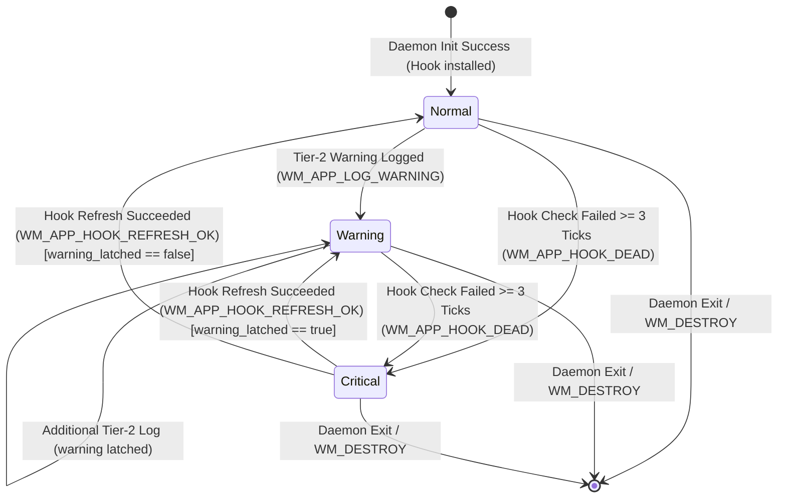

# SRS — window-management

> Generated by `.constitution/method/scripts/validate.py --generate`. MUST NOT be hand-edited.


`mode: deep` · `risk_accepted: medium` — from `components.yaml`.


## Decision Summary

The `window-management` component delivers instant, overlay-free same-application window cycling and DPI-aware window arrangement on Windows 10 and 11. Running as an elevated background system tray utility (`wiradesk.exe`), it intercepts global keyboard shortcuts, snaps a window to any of the four halves of its screen, moves it deliberately to the next monitor while keeping its share of the work area, strictly enforces monitor and virtual desktop boundaries, brings unresponsive windows honestly to the foreground, and recovers the system tray icon automatically after shell restarts without cloud dependencies or background CPU bloat.


## Why

Users manage multiple windows within the same application (multiple browser sessions, code editors, document drafts) and expect immediate, muscle-memory cycling without the cognitive noise of full task switchers or multi-monitor focus jumps. Isolating core window cycling and snapping inside a dedicated, headless daemon container protects input latency (<10 ms hook duration) and guarantees a static RAM footprint under 2 MB.


## Actor Register

| Actor | Who they are | What they may do |
| --- | --- | --- |
| Power User | Desktop user managing multiple windows of the same application across multi-monitor or virtual desktop workspaces. | Trigger same-app cycling, snap active windows to any half or to full screen, to a custom percentage of a screen edge, or to a left/middle/right third, move the active window to the next monitor, navigate virtual desktops or trigger tasks via mouse thumb buttons and tilt wheel, turn off any shortcut action so Windows and other applications receive its chord instead, access tray menu, open diagnostic logs. |
| New User | First-time user running Wira Desk on Windows. | Experience default cycling and snapping shortcuts without opening configuration. |
| Sysadmin | System administrator operating standard and elevated command shells or administrative tools. | Cycle seamlessly between standard and elevated administrator windows without UIPI refusal. |


## UC Catalogue

Rendered from `usecases.yaml`.

| id | Use case | Component | Satisfies | critical |
| --- | --- | --- | --- | --- |
| `UC-1` | Cycle to the next window of the same app on this monitor | `window-management` | `FR-1`, `FR-2`, `FR-3`, `FR-4`, `FR-5`, `FR-6` | no |
| `UC-2` | Snap the active window to half the screen | `window-management` | `FR-14`, `FR-22` | no |
| `UC-3` | See the tray icon return after Windows Explorer restarts | `window-management` | `FR-10`, `FR-11`, `FR-12` | no |
| `UC-7` | Move the active window to the next monitor | `window-management` | `FR-23` | no |
| `UC-9` | Snap the active window to a screen edge at a custom percentage | `window-management` | `FR-26` | no |
| `UC-10` | Snap the active window to a third of the screen | `window-management` | `FR-27` | no |
| `UC-12` | A disabled shortcut action's chord is not claimed at the hook | `window-management` | `FR-29` | no |
| `UC-13` | Navigate virtual desktops or tasks via mouse thumb buttons and tilt wheel | `window-management` | `FR-30`, `FR-31` | no |


## Constraints

- Must adhere strictly to Architecture Spine invariants AD-1 through AD-10, AD-12, and AD-14.
- Must execute live, stateless Z-order window enumeration via `EnumWindows` on every keypress without caching Z-order (AD-3).
- Must restrict window enumeration to the non-blocking kernel APIs named in the spine's sterilization convention (`IsWindowVisible`, `GetWindowLongPtrW`, `GetWindowThreadProcessId`, `QueryFullProcessImageNameW`, `GetClassNameW`) and never a blocking `SendMessage` or `GetWindowText`, executing off the hook thread on the worker thread (NFR-4, AD-2).
- Must run with elevated Administrator privileges via application manifest (`requireAdministrator`) to guarantee UIPI focus control (FR-8).
- Must maintain a static RAM footprint under 2 MB idle (NFR-1) and release binary size under 500 KB (NFR-5).
- Must not watch configuration files on disk; configuration reload occurs exclusively via explicit `WM_APP_RELOAD_CONFIG` IPC message (BR-1, AD-5).
- Must bypass shortcut interception when foreground window is a known virtual machine or remote desktop client (FR-3, AD-6).
- Must never resolve an arrangement target that belongs to Wira Desk itself; the chord is consumed and nothing moves, rather than being passed back to Windows or retargeted at another window (FR-14, LBR-WM-6, DEC-006).
- Must enumerate the attached monitor set live on every command that needs it, caching no monitor list, work area, or `HMONITOR` between keypresses (FR-23, AD-14).
- Must place a window moved between monitors by its share of the destination work area, never by copying its pixel width and height (FR-23, LBR-WM-7, DEC-007).
- Must never change which virtual desktop shows a window as a side effect of moving it between monitors (FR-23, AD-9).
- Must leave the later of two actions configured to one chord unbound at startup, and refuse the whole candidate configuration on an explicit reload, emitting exactly one Tier-2 warning in either case (BR-6, DEC-009).


## Non-Goals

- Providing visual switcher HUDs, thumbnail previews, or overlay window task bars (explicitly invisible switching).
- Modifying keyboard shortcuts or configuring onboarding tutorial settings (delegated to `settings` component).
- Automated tiling window management (e.g. auto-tiling tree layouts like i3 or Komorebi).
- Cross-machine cloud synchronization or remote telemetry collection.


## Prerequisite

- Supported 64-bit Windows 10 (1809+) or Windows 11 operating system environment.
- Platform runtime data structures and entities available (`app-config`, `ipc-reload-signal`, `runtime-paths`).
- Process elevated with Administrator privileges.


## Success Signal

Pressing `Win + \`` immediately shifts keyboard focus to the next visible, same-application window on the active physical monitor and virtual desktop, with the hook callback returning in under 10 ms (NFR-2, NFR-3), zero visual flicker, zero cross-monitor jump, and full support for elevated console windows.


## Design Reference

Paired SDD: `.how/window-management/SDD-window-management.md`. Binds invariants AD-1 through AD-10, AD-12, and AD-14.

---


## Business rules — local — `02-rules/`


### `rules-window-management.md`

### Business Rules — window-management

Local component business rules binding the `window-management` Product Component. Global cross-component rules (`BR-1` through `BR-7`) live in `.what/business-rules.md`.

#### Rules

| id | Rule | Binds | Source | Status |
| --- | --- | --- | --- | --- |
| LBR-WM-1 | A modifier superset or an extra key chord beyond what is configured (e.g. `Win+Ctrl+\`` when only `Win+\`` is configured) must not trigger cycling or snapping, and the keystroke must reach the rest of the system unaffected. | `window-management` | FR-6 | active |
| LBR-WM-2 | A minimized, cloaked, tool, shell-surface, or ghost window is excluded from cycling candidates; an unresponsive ("Not Responding") normal window remains eligible. | `window-management` | FR-4, FR-5 | active |
| LBR-WM-3 | Window enumeration and candidate inspection must use only non-blocking queries; a blocking cross-process call must never be used on the path that serves a keypress. | `window-management` | NFR-4, AD-2 | active |
| LBR-WM-4 | When the hook-to-worker command channel is full, a newly intercepted command is dropped immediately rather than blocking the input stream. | `window-management` | NFR-3, AD-2 | active |
| LBR-WM-5 | When hook failure reaches the escalation threshold, exactly one toast notification is dispatched per failure episode; further notifications stay suppressed until hook health is restored. | `window-management` | AD-7 | active |
| LBR-WM-6 | A window belonging to Wira Desk itself must never be an arrangement target; the chord is consumed and nothing moves, is retargeted, or raises a popup. | `window-management` | DEC-006 | active |
| LBR-WM-7 | A monitor-move command visits monitors in one fixed order, sampled fresh per invocation, wrapping from the last back to the first; the destination is derived from the window's share of its source work area, never from copying pixel dimensions; a maximized window is restored before being placed; with one monitor attached the command is a successful no-op; the virtual desktop never changes as a side effect. | `window-management` | FR-23, DEC-007, AD-14 | active |
| LBR-WM-8 | A half-screen snap divides the work area at one boundary computed fresh on every press, so the two halves exactly tile the work area with neither a gap nor an overlap; an odd extent gives the floor to the first half; a half that would be empty is refused rather than emitted as a zero-extent placement. | `window-management` | FR-14, FR-22 | active |
| LBR-WM-9 | A custom-percentage edge snap resizes the active window to the percentage configured for that edge — of the work area's width for left/right, of its height for top/bottom — computed fresh on every press and independent of every other edge's configured percentage; a percentage that would produce a zero or negative extent is refused rather than emitted as a degenerate placement. | `window-management` | FR-26 | active |
| LBR-WM-10 | A thirds snap divides the work area's width into three columns computed fresh on every press, so the three columns exactly tile the work area with neither a gap nor an overlap; a width not evenly divisible by three gives the remainder to the middle column; a column that would be empty is refused rather than emitted as a zero-extent placement. | `window-management` | FR-27 | active |
| LBR-WM-11 | When mouse navigation is active, all `WM_MOUSEMOVE` events are forwarded immediately via `CallNextHookEx` with zero locks, allocations, or logging; mapped auxiliary mouse inputs (`WM_XBUTTONDOWN`, `WM_MOUSEHWHEEL`) are swallowed and dispatched to the worker actor via the ring buffer; unmapped inputs pass through; horizontal tilt-wheel signals apply a 150–200 ms debounce window. | `window-management` | FR-30, FR-31, AD-15 | active |

#### Rationale — LBR-WM-6

The settings window is frameless, transparent, and fixed-size, so an external resize can leave an invisible region that still owns its hit-test area and would otherwise swallow mouse clicks. Passing the chord back to Windows instead of consuming it would fire its own virtual-desktop action, which `DEC-006` refuses.

#### Rationale — LBR-WM-7

Coordinate ordering is undefined for vertically stacked or L-shaped arrangements, and a named monitor needs an identity Windows does not offer cheaply (`DEC-007`). Proportional mapping is what makes an arrangement survive a move between monitors of different size or scaling. Where the destination placement's clamp resolves against belongs to `DEC-010`, not to this rule — this rule states only the promise the user sees.

#### Rationale — LBR-WM-8

Both halves being derived from one boundary makes "the halves exactly tile the work area" true by construction rather than by an off-by-one convention every reader has to remember, and it holds for both axes so the vertical division added at FR-22 inherits the same guarantee rather than reinventing it.

#### Rationale — LBR-WM-9

Each edge's percentage is independent rather than paired with its opposite edge, because a single-key press is not a two-window layout decision the way `FR-14`'s halves are — the user snapping left at 70% is not promising anything about what happens if they later snap right, so there is nothing to keep tiled and nothing gained by coupling the two.

#### Rationale — LBR-WM-10

The remainder goes to the middle column rather than the first, unlike `LBR-WM-8`'s floor-to-the-first-half rule: a thirds layout is read as symmetric (left, center, right), and a stray pixel on an outer column would be visible against the other outer column in a way the same pixel hidden in the middle is not.

#### Rationale — LBR-WM-11

Optical and laser mice report cursor movements at high polling rates (125 Hz to 1000 Hz). Executing locks, heap allocations, or logging in `LowLevelMouseProc` during cursor motion induces perceptible jitter and risks hook removal under Windows `LowLevelHooksTimeout`. Mechanical tilt-wheel switches also fire multiple burst ticks per physical flick; debouncing them over a 150–200 ms window ensures predictable single-step navigation without erratic skipping.

#### Retired

*(No retired local rules)*


## Domain — `03-domain/`


### `domain-model.md`

### Model — window-management

Conceptual domain model for the `window-management` component. Represents domain entities, relationships, state transitions, and invariants from the business and user perspective. Physical types, struct definitions, and Win32 FFI storage details belong in `.how/window-management/05-model/data-model.md`.

#### Entities

| Entity | What it is | Identified by |
| --- | --- | --- |
| `hook-command` | An intercepted, validated, and throttled user intent command dispatched from the keyboard hook to the background worker. | Command action code and dispatch timestamp |
| `window-focus-state` | The live snapshot of active window focus, monitor boundaries, virtual desktop context, and application identity on the current desktop. | Foreground window handle (`HWND`), monitor identity, and virtual desktop GUID |
| `tray-health-state` | The operational status of the background daemon, tracking hook attachment vitality, error severity level, and user notification state. | Error tier level (`Normal`, `Warning`, `Critical`) and hook vitality status |
| `arrangement-command` | A planned window repositioning and sizing action targeting specific desktop regions (a half-screen snap to any of the four halves, a custom-percentage edge snap, a snap to a horizontal third, maximized state, an overlapping stack slot, or a move to the next monitor). | Target screen region geometry, the destination monitor, and monitor DPI scaling context |

#### Relationships

- One `hook-command` **triggers** the evaluation of one live `window-focus-state`.
- One `window-focus-state` **determines** the candidate set of same-application windows on the active monitor.
- One `tray-health-state` **reflects** the runtime health of the hook thread and error reporting protocol.
- One `arrangement-command` **modifies** the geometry of the active window within the bounds of `window-focus-state`.
- One `arrangement-command` of the monitor-move kind **reads** the live monitor set to choose a destination, and is the only kind whose target work area is not the one `window-focus-state` reports.
- An action `settings` recorded as `disabled` **excludes** its chord from hook registration before matching is ever attempted; no `hook-command` is created for it (`FR-29`, `BR-9`).

#### State Lifecycle

##### tray-health-state

| From | To | Trigger | Who may |
| --- | --- | --- | --- |
| `Normal` | `Warning` | Non-fatal runtime operational failure (e.g. transient enumeration error) | Worker thread (Tier 2) |
| `Warning` | `Normal` | Successful recovery and clean operation on subsequent cycle | Worker thread |
| `Normal` / `Warning` | `Critical` | Hook death detected by 10-second heartbeat or OS unhook event | Tray controller (Tier 3) |
| `Critical` | `Normal` | Successful hook re-installation or daemon recovery | Tray controller / Worker thread |

##### hook-command Lifecycle

| From | To | Trigger | Who may |
| --- | --- | --- | --- |
| `Pending` | `Dispatched` | Shortcut chord detected and passed throttle window (≥50 ms) | Hook thread |
| `Pending` | `Dropped` | Throttle window violation (<50 ms) or ring buffer full | Hook thread |
| `Dispatched` | `Executed` | Worker completes window focus transition or arrangement | Worker thread |

A disabled action's chord never enters this lifecycle at all: it is excluded at hook registration, before any keypress could be matched against it, so there is no `Pending` a disabled action's `hook-command` could ever reach. This is a precondition on registration, not a new terminal state — there is nothing to transition **from** for a command that was never created (`FR-29`).

#### Invariants

- **Live Traversal Invariant:** Window focus state and Z-order stacking must never be cached between shortcut keypresses; each cycle command must traverse live desktop state (AD-3).
- **Spatial Preservation Invariant:** Target candidate windows for cycling or snapping must reside on the exact same physical monitor and virtual desktop as the foreground window (FR-2, CAP-7). A monitor-move command is the one deliberate crossing of the monitor half of this boundary; it still must not cross the virtual desktop half, and moving a window never changes which desktop shows it (FR-23, AD-9).
- **Proportional Placement Invariant:** A window moved between monitors must be placed by the share of the destination work area it occupied on the source, never by copying its pixel width and height — otherwise an arrangement dissolves the moment the two monitors differ in size or display scaling (FR-23, DEC-007).
- **Live Monitor Set Invariant:** The set of attached monitors must be enumerated fresh on every monitor-move command and must never be cached between keypresses. An `HMONITOR` is a handle rather than an identity, and a cached list survives an unplug that the handle does not (AD-14).
- **One Chord, One Action Invariant:** No two actions may be reachable by the same chord. When configuration says otherwise, the chord belongs to the first action in the fixed precedence order and the later action is unbound rather than ambiguous (BR-6, DEC-009). A `disabled` action (`BR-9`) is a different concept reaching the same registration-time exclusion: it never enters the precedence resolution at all, having no chord to contend with in the first place, so this invariant's collision handling needs no change to also exclude disabled rows.
- **Registration Exclusion Invariant:** A shortcut action's chord is registered at the low-level keyboard hook only when `settings` records it as enabled; a disabled action's physical key combination is never intercepted and reaches the foreground application or Windows exactly as it would if Wira Desk were not installed (FR-29, BR-9).
- **UX Honesty Invariant:** Unresponsive ("Not Responding") windows must receive focus when reached in the cycling sequence and must never be filtered out (FR-4).
- **Mouse Motion Passthrough Invariant:** When the low-level mouse hook (WH_MOUSE_LL) is active, all WM_MOUSEMOVE messages must be passed immediately to CallNextHookEx without locks, heap allocations, or logging to ensure zero cursor latency and eliminate micro-stutter (FR-30, NFR-2).
- **Tilt Wheel Debounce Invariant:** Horizontal tilt-wheel signals (WM_MOUSEHWHEEL) must be throttled with a 150–200 ms debounce timer so that a single physical wheel flick triggers exactly one navigation action (FR-31).
- **Hook Callback Speed Invariant:** The low-level keyboard hook callback must complete within 10 ms without executing heap allocations or blocking synchronous APIs (NFR-2, NFR-3).
- **Single Instance Invariant:** Exactly one background daemon instance may run per user logon session (NFR-6).


### `state-machines.md`

### State Machines — window-management

Conceptual state machines governing runtime entities owned by the `window-management` Product Component.

#### 1. Tray Health State Machine (`tray-health-state`)

Governs the user-visible health state of the daemon, error tier escalation (AD-7), and tray icon visual indicators.



##### State Definitions

| State | Visual Asset / Badge | User Notification | Interaction Permitted | Log Severity |
| --- | --- | --- | --- | --- |
| `Normal` | Default monochrome / brand icon | None | Full cycling, snapping, tray context menu | Info |
| `Warning` | Default icon + **Amber / Red Dot overlay** | None (silent append to `wiradesk.log`) | Full cycling, snapping, tray context menu | Warn |
| `Critical` | Default icon + **Red X overlay** | Exactly 1x Windows Toast Notification | Tray context menu only (cycling disabled) | Error |

##### Transition Rules

| From | To | Trigger / Message | Condition & Side Effect |
| --- | --- | --- | --- |
| `[*] ` | `Normal` | Daemon startup | `SetWindowsHookExW` succeeds within startup retry budget (`HOOK_RETRY_MAX = 5`). Tray icon created via `Shell_NotifyIconW(NIM_ADD)`. |
| `Normal` | `Warning` | `WM_APP_LOG_WARNING` (`0x8004`) | Non-fatal runtime issue logged (e.g. non-fatal API refusal); `warning_latched = true`; icon updated to Warning (`NIM_MODIFY`). |
| `Warning` | `Warning` | `WM_APP_LOG_WARNING` (`0x8004`) | Additional warning logged; `warning_latched` remains `true`. |
| `Normal` / `Warning` | `Critical` | `WM_APP_HOOK_DEAD` (`0x8003`) | Consecutive heartbeat refresh failures reach threshold (`HOOK_CHECK_FAIL_THRESHOLD = 3`); icon updated to Critical; if `!hook_dead_toast_sent`, fire 1x Toast Notification and set `hook_dead_toast_sent = true`. |
| `Critical` | `Warning` | `WM_APP_HOOK_REFRESH_OK` (`0x8008`) | Subsequent heartbeat refresh succeeds while `warning_latched == true`. Restores Warning icon; resets `hook_dead_toast_sent = false`. |
| `Critical` | `Normal` | `WM_APP_HOOK_REFRESH_OK` (`0x8008`) | Subsequent heartbeat refresh succeeds while `warning_latched == false`. Restores Normal icon; resets `hook_dead_toast_sent = false`. |
| Any | `[*] ` | `WM_DESTROY` / User Exit | Tray icon deleted (`NIM_DELETE`); hook thread joined; process exits cleanly. |

---

#### 2. Low-Level Keyboard Hook Lifecycle (hook instance, not `hook-command`)

Governs the operational lifecycle of the `WH_KEYBOARD_LL` hook instance on the dedicated Hook Thread.

This machine belongs to the **hook instance**, which is not a domain entity and deliberately has no
row in `domain-model.md`. The entity named `hook-command` has its own, much shorter lifecycle there —
`Pending` → `Dispatched` | `Dropped` — describing one intercepted keypress rather than the hook that
intercepted it. They were briefly filed under one name; two machines under one entity name is how a
reader ends up looking for `Degraded` in the wrong table.

```mermaid
stateDiagram-v2
    [*] --> Installing: hook::spawn()
    Installing --> Active: SetWindowsHookExW OK
    Installing --> Failed: SetWindowsHookExW Failed (5 retries exhausted)
    Active --> Active: Valid Keystroke Intercepted / Throttle Passed / Enqueued
    Active --> Refreshing: Heartbeat Tick (WM_APP_HOOK_CHECK every 10s)
    Refreshing --> Active: Hook Replaced OK (Post WM_APP_HOOK_REFRESH_OK)
    Refreshing --> Degraded: Reinstall Failed (fail_count < 3)
    Degraded --> Refreshing: Subsequent Heartbeat Tick
    Degraded --> Dead: Reinstall Failed (fail_count >= 3)
    Dead --> Refreshing: Subsequent Heartbeat Tick (Continuous Retry)
    Dead --> Active: Reinstall Succeeded (Post WM_APP_HOOK_REFRESH_OK)
    Active --> ShuttingDown: WM_APP_HOOK_SHUTDOWN
    Degraded --> ShuttingDown: WM_APP_HOOK_SHUTDOWN
    Dead --> ShuttingDown: WM_APP_HOOK_SHUTDOWN
    ShuttingDown --> [*]: UnhookWindowsHookEx & PostQuitMessage(0)
    Failed --> [*]: Post WM_APP_HOOK_INIT_FAILED -> Fatal Modal & Exit
```

##### Transition Table

| From | To | Trigger | Action & Invariants |
| --- | --- | --- | --- |
| `Installing` | `Active` | Hook install succeeds (attempts 1..=5) | Post `WM_APP_HOOK_READY` with hook thread id to Worker; spawn health heartbeat thread. |
| `Installing` | `Failed` | Hook install fails after 5 retries (1s delay) | Post `WM_APP_HOOK_INIT_FAILED` to Worker; Worker invokes `error::fatal` (Tier 1 modal) and exits process. |
| `Active` | `Active` | Keystroke event (`HC_ACTION`) | If exact shortcut match, evaluate VM/RDP bypass; if bypass, call `CallNextHookEx`; if not bypass, check throttle (≥50 ms) and push `u8` to ring buffer; post `WM_APP_COMMAND_READY` to Worker. Swallow main key down/up; pass modifier up. |
| `Active` / `Degraded` | `Refreshing` | Heartbeat tick `WM_APP_HOOK_CHECK` (every 10s) | Invoke `SetWindowsHookExW` on Hook Thread to verify/renew hook registration. |
| `Refreshing` | `Active` | Reinstall succeeds | Unhook prior `HHOOK`; reset `hook_check_fail_count = 0`; post `WM_APP_HOOK_REFRESH_OK` to Worker. |
| `Refreshing` | `Degraded` | Reinstall fails (`fail_count < 3`) | Increment `hook_check_fail_count`; retain prior `HHOOK`; log debug trace. |
| `Degraded` | `Dead` | Reinstall fails (`fail_count >= 3`) | Retain fail count; post `WM_APP_HOOK_DEAD` to Worker; Worker escalates tray to Tier 3 Critical. |
| `Dead` | `Active` | Reinstall succeeds on later heartbeat | Unhook prior handle; reset `hook_check_fail_count = 0`; post `WM_APP_HOOK_REFRESH_OK` to Worker (recovering tray state). |
| Any | `ShuttingDown` | `WM_APP_HOOK_SHUTDOWN` | Unhook active `HHOOK`; reset runtime atomic pointer; call `PostQuitMessage(0)` to terminate Hook Thread message loop. |

---

#### 3. Low-Level Mouse Hook Dispatch State Machine (`WH_MOUSE_LL`)

Governs the per-message dispatch lifecycle of low-level mouse input interception on the Hook Thread.

```mermaid
stateDiagram-v2
    [*] --> Idle: Mouse Hook Installed & Active
    Idle --> ForwardingMotion: WM_MOUSEMOVE (Cursor motion)
    ForwardingMotion --> Idle: CallNextHookEx (zero locks, zero allocations)
    Idle --> InspectingAuxiliary: WM_XBUTTONDOWN or WM_MOUSEHWHEEL
    InspectingAuxiliary --> PassingThrough: Action == Passthrough / Unmapped
    PassingThrough --> Idle: CallNextHookEx
    InspectingAuxiliary --> DroppingDebounce: WM_MOUSEHWHEEL and (now - last_tilt_ms < debounce_window)
    DroppingDebounce --> Idle: return 1 (Swallow event)
    InspectingAuxiliary --> DispatchingAction: Mapped Action and Debounce OK
    DispatchingAction --> Idle: ring::push(cmd) and PostMessageW(WM_APP_COMMAND_READY) and return 1
```

##### Transition Table

| From | To | Trigger / Message | Condition & Action |
| --- | --- | --- | --- |
| `Idle` | `ForwardingMotion` | `WM_MOUSEMOVE` | High-frequency cursor position report; immediately invoke `CallNextHookEx` without locks, memory allocations, or logging. |
| `ForwardingMotion` | `Idle` | Forward complete | Return hook code to Windows; cursor movement continues with zero latency. |
| `Idle` | `InspectingAuxiliary` | `WM_XBUTTONDOWN` / `WM_MOUSEHWHEEL` | Auxiliary input received; check if mouse navigation is enabled and resolve configured action preset. |
| `InspectingAuxiliary` | `PassingThrough` | Unmapped / Passthrough action | Input is configured for default OS handling; invoke `CallNextHookEx` so active application receives the standard input. |
| `InspectingAuxiliary` | `DroppingDebounce` | `WM_MOUSEHWHEEL` burst tick | Elapsed time since `last_tilt_ms` is under 150 ms; drop event and return `1` to suppress OS horizontal scroll. |
| `InspectingAuxiliary` | `DispatchingAction` | Valid action & debounce satisfied | Update `last_tilt_ms`; push corresponding `Command` opcode to static ring buffer; post `WM_APP_COMMAND_READY` to Worker; return `1` to swallow input. |


## Use cases — `04-usecases/`


### `UC-1-cycle-same-app-window.md`

### UC-1 — Cycle to the next window of the same app on this monitor

#### Trigger

User presses the configured keyboard cycling shortcut (default `Win + \`` or custom modifier chord).

#### Precondition

- Wira Desk daemon is running with active `WH_KEYBOARD_LL` hook.
- Foreground window is a standard visible window belonging to an application running on the active physical monitor and virtual desktop.
- User is working inside normal desktop applications (not a bypassed VM or remote desktop session).

#### Main Flow

1. User presses the cycling shortcut while focused on an application window.
2. System intercepts the keystroke and validates exact modifier and key matching within 10 ms.
3. System discovers the foreground window handle, executable identity, monitor bounds, and virtual desktop ID.
4. System executes stateless live Z-order enumeration across top-level windows.
5. System filters and identifies candidate windows sharing identical process binary identity on the current monitor and virtual desktop.
6. System selects the next eligible window in Z-order succession.
7. System transfers keyboard focus and brings the selected window to the foreground without animations, switcher HUDs, or preview overlays.
8. User continues typing immediately in the newly focused window.

#### Alternate Flows

| From step | Condition | What happens |
| --- | --- | --- |
| Step 2 | Keystroke contains extra or unconfigured modifier keys | System passes keystroke through unmodified to OS via `CallNextHookEx` without cycling. |
| Step 3 | Foreground window is a virtual machine or remote desktop client | System evaluates bypass list, forwards keystroke directly to guest/remote session (see SCN-01), and takes no action. |
| Step 5 | Only one window exists for the active application on this monitor | System maintains focus on current window without UI disruption or audio beeps. |
| Step 5 | Next candidate window is marked "Not Responding" by Windows OS | System brings unresponsive window to foreground honestly without skipping or hiding state (upholding UX honesty). |
| Step 7 | Elevated Administrator target window requires focus transfer | Elevated daemon executes UIPI-immune focus activation, successfully raising the target window. |

#### Failure Flows

| From step | Failure | What the system does | What the user is left with |
| --- | --- | --- | --- |
| Step 4 | Window enumeration or focus transfer API fails | System logs diagnostic warning and releases focus lock | Current window retains focus; user input is not blocked |
| Step 7 | Target window destroyed or closed during enumeration race | System falls back gracefully to remaining top Z-order window | Focus settles on active window; daemon continues normal operation |

#### Outcome

Keyboard focus and active window state transfer immediately to the next same-application window on the active monitor and virtual desktop with sub-millisecond perceived latency and zero visual flicker.

#### Business Rules

- `BR-1` (Explicit IPC configuration reload)
- `LBR-WM-1` (Exact shortcut matching only)
- `LBR-WM-2` (Live candidate filtering and UX honesty)
- `LBR-WM-3` (Non-blocking kernel API sterilization)
- `LBR-WM-4` (Lock-free drop-on-saturation policy)


### `UC-10-snap-window-third.md`

### UC-10 — Snap the active window to a third of the screen

#### Trigger

User presses a configured thirds-snap keyboard shortcut for one of the three columns — left, middle, or
right (shipped defaults `Ctrl + Alt + 1`, `Ctrl + Alt + 2`, `Ctrl + Alt + 3`).

#### Precondition

- Wira Desk daemon is running with active low-level keyboard hook.
- Foreground window is a standard resizable top-level application window on an active physical monitor.

#### Main Flow

1. User presses the thirds-snap shortcut for one column while focused on a resizable window.
2. System intercepts keystroke on dedicated hook thread, validates shortcut chord, and enqueues the
   command to the lock-free ring buffer.
3. System posts command notification to worker thread and returns immediately without blocking input.
4. System worker thread retrieves the command and identifies active monitor bounds and DPI scale factor.
5. System divides the work area's width into three columns computed fresh on every press — any
   remainder pixel width goes to the middle column, so the three columns exactly tile the work area
   with neither a gap nor an overlap — and selects the column the chord named.
6. System executes atomic DPI-aware repositioning and resizing via non-blocking Win32 APIs.
7. User sees the active window aligned flush to the targeted column at exactly one third of the work
   area's width and full work-area height.

#### Alternate Flows

| From step | Condition | What happens |
| --- | --- | --- |
| Step 1 | Foreground window is currently maximized | System restores window to normal state before applying the third-width dimensions. |
| Step 2 | Keystroke has unconfigured modifier combinations | System passes keystroke through via `CallNextHookEx` without executing any snapping action. |
| Step 4 | Foreground window belongs to Wira Desk itself — the Settings window or its onboarding modal | System resolves no target and arranges nothing. The chord stays consumed rather than passed back to Windows (`LBR-WM-6`, `DEC-006`). |
| Step 4 | Window spans a multi-monitor boundary | System determines the primary containing monitor via center-point calculation and applies the snap to that monitor's work area. |
| Step 5 | Work area is too narrow to divide into three non-zero columns | System plans nothing and reports a planning failure rather than emitting a zero-extent placement. Nothing moves. |
| Step 6 | Window enforces custom minimum size constraints larger than one third of the work area | System positions the window flush to the named column while respecting the application's enforced minimum boundaries. |

#### Failure Flows

| From step | Failure | What the system does | What the user is left with |
| --- | --- | --- | --- |
| Step 4 | Monitor handle invalid or disconnected during hot-unplug | System falls back to primary desktop work area coordinates | Window is safely positioned on primary display |
| Step 6 | Win32 `SetWindowPos` call refused due to target privilege or style lock | System logs Tier 2 diagnostic warning without crashing | Window remains at current position and size |

#### Outcome

The active window is cleanly resized and positioned to exactly one third of the active monitor's
available work area — the column the chord named — with proper per-monitor DPI scaling and work area
boundary adherence. The three columns cover the work area exactly, with no gap and no overlap between
them, and a width not evenly divisible by three is divided the same way on every press.

#### Business Rules

- `BR-1` (Explicit IPC configuration reload)
- `LBR-WM-1` (Exact shortcut matching only)
- `LBR-WM-3` (Non-blocking kernel API sterilization)
- `LBR-WM-4` (Lock-free drop-on-saturation policy)
- `LBR-WM-6` (Arrangement target eligibility)
- `LBR-WM-10` (Deterministic thirds division)


### `UC-12-disabled-action-chord-not-claimed.md`

### UC-12 — A disabled shortcut action's chord is not claimed at the hook

#### Trigger

Daemon starts, or receives the configuration-reload IPC signal after a save in Settings (`BR-1`), and the
loaded configuration marks one or more shortcut actions disabled.

#### Precondition

- Wira Desk daemon is running with active low-level keyboard hook.
- The configuration being loaded carries a per-action enabled/disabled flag alongside each action's chord
  (`FR-28`, `LBR-ST-17`).

#### Main Flow

1. System loads configuration at startup or on reload.
2. For each of the sixteen editable actions, system reads its enabled/disabled flag before considering its
   chord for registration.
3. An action flagged disabled is excluded from the declared sequence's chord set entirely — its chord takes
   no part in hook matching and no part in `BR-6`/`DEC-009`'s collision-precedence resolution, the same as
   if the field were never configured.
4. Every enabled action's chord registers exactly as it does today.
5. User presses the physical key combination that was the disabled action's chord. System's low-level hook
   does not recognize it as any Wira Desk action and passes it through via `CallNextHookEx` unmodified.
6. The keystroke reaches the foreground application, or Windows itself, exactly as it would if Wira Desk
   were not running.

#### Alternate Flows

| From step | Condition | What happens |
| --- | --- | --- |
| Step 3 | A disabled action's chord is identical to an enabled action's chord | The enabled action registers normally; the disabled action's absence from the chord set means there is nothing for it to contend with, so no collision diagnostic fires for this pair (`LBR-ST-17`). |
| Step 3 | An action is re-enabled in a later reload, using the same chord it held before being disabled | The chord registers normally on this reload, participating in collision resolution as any other field would. |

#### Failure Flows

| From step | Failure | What the system does | What the user is left with |
| --- | --- | --- | --- |
| Step 1 | Configuration fails to load or fails validation for a reason unrelated to enablement (e.g. `BR-6`'s duplicate-chord reject on the reload path) | System applies existing all-or-nothing reload behavior: the candidate configuration, enablement flags included, is refused in full and the last-known-good configuration keeps running | Enablement state does not change until a valid reload arrives |

#### Outcome

Every action the user disabled behaves, from the keyboard's perspective, as if Wira Desk had never bound
that chord — the key combination is free for Windows or any other application to claim, and the user is not
left with a chord that is claimed and merely inert.

#### Business Rules

- `BR-9`
- `BR-6` (One chord, one action — disabled actions are outside its scope entirely)
- `LBR-ST-17`
- `LBR-WM-1` (Exact shortcut matching only)


### `UC-13-navigate-virtual-desktops-or-tasks-via-mouse.md`

### UC-13 — Navigate virtual desktops or tasks via mouse thumb buttons and tilt wheel

#### Trigger

User clicks an auxiliary mouse button (Thumb Button 1 or 2) or tilts the scroll wheel horizontally (Left or Right) on a multi-button productivity mouse while mouse navigation is enabled in configuration.

#### Precondition

- Wira Desk daemon is running elevated with active low-level keyboard and mouse hooks (`WH_KEYBOARD_LL`, `WH_MOUSE_LL`).
- Mouse navigation is enabled (`mouse.enabled = true`) in `config.toml`, and the physical mouse input is mapped to an action preset (e.g. Next Virtual Desktop, Previous Virtual Desktop, Task View, or Show Desktop).

#### Main Flow

1. User clicks a mapped thumb button or tilts the mouse wheel horizontally.
2. System's low-level mouse hook (`WH_MOUSE_LL`) intercepts the input event (`WM_XBUTTONDOWN` or `WM_MOUSEHWHEEL`).
3. System verifies mouse navigation is enabled and the input matches a configured action preset.
4. For tilt-wheel events (`WM_MOUSEHWHEEL`), system checks the debounce timer; if the elapsed time since the previous tilt tick is within the debounce window (150–200 ms), the event is dropped.
5. System swallows the event (`return 1`), preventing the host operating system or active application from executing default browser navigation or horizontal scrolling.
6. Hook thread enqueues the mapped command byte to the lock-free ring buffer and signals the worker thread via `WM_APP_COMMAND_READY`.
7. Worker thread drains the command and executes the target action (e.g. synthesizing `Ctrl + Win + Right` for Next Virtual Desktop, or executing window cycling/snapping).
8. Windows desktop or window focus updates immediately without cursor hitching or visual overlays.

#### Alternate Flows

| From step | Condition | What happens |
| --- | --- | --- |
| Step 3 | The physical mouse input is set to `passthrough` or `default` | System calls `CallNextHookEx` immediately; the event reaches the active application as a standard Windows mouse event (e.g. browser back/forward). |
| Step 4 | User rapidly flicks the tilt wheel generating multiple hardware ticks | First tick passes and resets debounce timer; subsequent ticks within 150–200 ms are swallowed without queuing duplicate commands (`SCN-04`). |
| Step 7 | Configured action is an internal Wira Desk action (e.g. Cycle Same-App Window) | Worker thread initiates live Z-order traversal and shifts focus to the next same-application window (`UC-1`). |

#### Failure Flows

| From step | Failure | What the system does | What the user is left with |
| --- | --- | --- | --- |
| Step 2 | Mouse event is cursor movement (`WM_MOUSEMOVE`) | System immediately calls `CallNextHookEx` without locks, memory allocations, or logging | Continuous, fluid cursor movement with zero micro-stutter |
| Step 6 | Ring buffer is completely full | Hook thread increments dropped-metric counter and returns `1` | Command is dropped; hook thread remains non-blocking |

#### Outcome

The user navigates virtual desktops, triggers Task View, or controls window layout seamlessly from their mouse hand with zero perceived input lag and without installing third-party vendor companion software.

#### Business Rules

- `BR-10` (Mouse Navigation Action Mapping and Passthrough)
- `LBR-WM-3` (Non-blocking window enumeration)
- `LBR-WM-4` (Command channel capacity)
- `LBR-WM-11` (Mouse motion passthrough and tilt debounce)


### `UC-2-snap-window-half.md`

### UC-2 — Snap the active window to half the screen

#### Trigger

User presses a configured window snapping keyboard shortcut for one of the four halves — left, right, top, or bottom (shipped defaults `Ctrl + Alt + Left`, `Ctrl + Alt + Right`, `Ctrl + Alt + Up`, `Ctrl + Alt + Down`).

#### Precondition

- Wira Desk daemon is running with active low-level keyboard hook.
- Foreground window is a standard resizable top-level application window on an active physical monitor.

#### Main Flow

1. User presses the snap shortcut while focused on a resizable window.
2. System intercepts keystroke on dedicated hook thread, validates shortcut chord, and enqueues snap command to lock-free ring buffer.
3. System posts command notification to worker thread and returns immediately without blocking input.
4. System worker thread retrieves snap command and identifies active monitor bounds and DPI scale factor.
5. System computes target half-screen coordinates inside the work area, dividing along the axis the chord names — vertically for left and right, horizontally for top and bottom.
6. System executes atomic DPI-aware repositioning and resizing via non-blocking Win32 APIs.
7. User sees active window aligned flush to the targeted screen half at correct pixel dimensions.

#### Alternate Flows

| From step | Condition | What happens |
| --- | --- | --- |
| Step 1 | Foreground window is currently maximized | System restores window to normal state before applying half-screen snapping dimensions. |
| Step 2 | Keystroke has unconfigured modifier combinations | System passes keystroke through via `CallNextHookEx` without executing snapping action. |
| Step 4 | Foreground window belongs to Wira Desk itself — the Settings window or its onboarding modal | System resolves no target and arranges nothing. The chord stays consumed rather than passed back to Windows, and the refusal is recorded as a Tier-2 diagnostic with no popup (`LBR-WM-6`, `DEC-006`). |
| Step 4 | Window spans multi-monitor boundary | System determines primary containing monitor via center-point calculation and applies snap to that monitor's work area. |
| Step 5 | Work area is too small to divide along the requested axis — a single-pixel height for a top or bottom snap | System plans nothing and reports a planning failure rather than emitting a zero-height placement. Nothing moves. |
| Step 6 | Window enforces custom minimum size constraints larger than half-screen | System positions window flush to screen edge while respecting application's enforced minimum boundaries. |

#### Failure Flows

| From step | Failure | What the system does | What the user is left with |
| --- | --- | --- | --- |
| Step 4 | Monitor handle invalid or disconnected during hot-unplug | System falls back to primary desktop work area coordinates | Window is safely positioned on primary display |
| Step 6 | Win32 `SetWindowPos` call refused due to target privilege or style lock | System logs Tier 2 diagnostic warning without crashing | Window remains at current position and size |

#### Outcome

The active window is cleanly resized and positioned to exactly half of the active monitor's available work area — the half the chord named — with proper per-monitor DPI scaling and work area boundary adherence. The two halves of either axis cover the work area exactly, with no gap and no overlap between them, and an odd number of pixels is divided the same way on every press.

#### Business Rules

- `BR-1` (Explicit IPC configuration reload)
- `LBR-WM-1` (Exact shortcut matching only)
- `LBR-WM-3` (Non-blocking kernel API sterilization)
- `LBR-WM-4` (Lock-free drop-on-saturation policy)
- `LBR-WM-6` (Arrangement target eligibility)
- `LBR-WM-8` (Deterministic half division)


### `UC-3-tray-recovery-after-explorer.md`

### UC-3 — See the tray icon return after Windows Explorer restarts

#### Trigger

Windows Explorer crashes, is terminated by the user/system, or restarts following a display configuration or shell update.

#### Precondition

- Wira Desk daemon is executing in background with system tray integration active.
- Daemon has registered for the operating system `TaskbarCreated` broadcast message.

#### Main Flow

1. Windows Explorer shell terminates and restarts, clearing existing notification area tray icons.
2. Operating system initializes new taskbar and broadcasts registered `TaskbarCreated` window message.
3. System daemon receives `TaskbarCreated` message on its dedicated Win32 message loop window.
4. System verifies current internal tray health state (`Normal`, `Warning`, or `Critical`).
5. System re-registers notification area icon via `Shell_NotifyIconW(NIM_ADD)` with appropriate icon asset, tooltip, and callback identifier.
6. System re-establishes tray context menu bindings (`Settings`, `View Logs`, `Run at Startup`, `Check for Updates`, `Exit`).
7. User sees Wira Desk icon reappear in taskbar notification tray ready for interaction without utility restart.

#### Alternate Flows

| From step | Condition | What happens |
| --- | --- | --- |
| Step 4 | Tray health state has active warning latched (`warning_latched == true`) | System restores tray icon showing Amber/Red Dot warning overlay asset. |
| Step 4 | Hook heartbeat failure threshold reached during shell disruption (`fail_count >= 3`) | System restores tray icon showing Critical Red X overlay and updates menu state (see SCN-02). |
| Step 5 | Initial `NIM_ADD` call fails because taskbar is still initializing | System schedules retry sequence (up to 3 attempts with 500 ms backoff) until notification icon is accepted. |

#### Failure Flows

| From step | Failure | What the system does | What the user is left with |
| --- | --- | --- | --- |
| Step 5 | Taskbar registration persistently fails | System logs diagnostic warning and retains core keyboard hook and cycling functionality headless | Shortcut cycling continues functioning normally even without visual tray icon |

#### Outcome

The Wira Desk system tray resident icon and context menu are fully restored following Windows Explorer shell restarts, maintaining accurate visual health badges and uninterrupted shortcut handling.

#### Business Rules

- `BR-5` (Single responsibility for diagnostic log access)
- `LBR-WM-5` (One-shot Tier-3 notification latch)


### `UC-7-move-window-next-monitor.md`

### UC-7 — Move the active window to the next monitor

#### Trigger

User presses the configured monitor-move shortcut (shipped default `Ctrl + Alt + Shift + Enter`).

#### Precondition

- Wira Desk daemon is running with active low-level keyboard hook.
- Foreground window is a standard resizable top-level application window on an active physical monitor.
- More than one monitor is attached. With one, see Alternate Flows.

#### Main Flow

1. User presses the monitor-move shortcut while focused on a window.
2. System intercepts keystroke on the hook thread, validates the chord, and enqueues the move command to the lock-free ring buffer.
3. System posts command notification to the worker thread and returns immediately without blocking input.
4. System worker thread retrieves the command, resolves the foreground window's monitor, and enumerates the live monitor set.
5. System selects the monitor following the current one in the enumeration order, wrapping from the last back to the first.
6. System expresses the window's current rectangle as a share of its source work area, then maps that share onto the destination work area.
7. System executes atomic repositioning and resizing via non-blocking Win32 APIs, without changing which virtual desktop shows the window.
8. User sees the window on the next monitor holding the same share of the screen it held before.

#### Alternate Flows

| From step | Condition | What happens |
| --- | --- | --- |
| Step 2 | Keystroke has unconfigured modifier combinations | System passes the keystroke through via `CallNextHookEx` without moving anything. |
| Step 4 | Foreground window belongs to Wira Desk itself | System resolves no target and moves nothing. The chord stays consumed rather than passed back to Windows, and the refusal is a Tier-2 diagnostic with no popup. `LBR-WM-6`. |
| Step 4 | Exactly one monitor is attached | System plans nothing. Nothing moves, no message is shown, and no warning is logged — this is a successful no-op, not a failure. |
| Step 6 | Foreground window is currently maximized | System restores it to its normal state before placing it, the same way a half-screen snap does, then places it to fill the destination work area. Repositioning a window Windows still considers maximized is unreliable: the maximized state is bound to the monitor it was maximized on, and the window springs back. The user sees a window filling the new monitor — the outcome they expected — reached by restore-then-place rather than by moving a maximized window. |
| Step 6 | Source and destination monitors differ in display scaling | System maps by share regardless. Windows re-scales the window's own content on the DPI change; the system does not compensate for that a second time. |

#### Failure Flows

| From step | Failure | What the system does | What the user is left with |
| --- | --- | --- | --- |
| Step 4 | Monitor enumeration fails, or the foreground window resolves to no monitor | System plans nothing and records a Tier-2 diagnostic | Window stays exactly where it was |
| Step 5 | Destination monitor disappears between enumeration and placement — a hot-unplug inside the same command | System attempts the placement and the Win32 call is refused or clamped by Windows; the refusal is recorded as a Tier-2 diagnostic | Window is left wherever Windows placed it, on an attached monitor; the next press moves it again |
| Step 6 | Destination work area is empty or unrepresentable | System reports a planning failure and emits no placement | Window stays exactly where it was |
| Step 6 | The window's share of the source work area rounds to a zero-pixel width or height once mapped onto a much smaller destination monitor | System refuses the plan rather than inventing a minimum size the window never asked for; no placement is emitted | Window stays exactly where it was, unlike a half-screen snap, which instead falls back to the window's own enforced minimum size |
| Step 7 | Win32 `SetWindowPos` refused due to target privilege or style lock | System logs a Tier-2 diagnostic warning without crashing | Window remains at its current position and size |
| Step 7 | Source and destination monitors differ in display scaling, so the frame allowance measured before the move no longer describes the window | System places the window anyway; no warning, because nothing failed | Window is on the right monitor at the right share, with its visible edge a few pixels off the intended rectangle. Accepted rather than corrected — `DEC-007` states why a second placement pass was declined. Staying a small edge inset rather than a full relocation depends on the border clamp resolving against the destination monitor, not the source (`DEC-010`) |

#### Outcome

The active window sits on the next attached monitor, occupying the same share of that monitor's work area as it occupied on the monitor it left, on the same virtual desktop as before. No other window on either monitor has moved. Pressing the shortcut once per attached monitor returns the window to where it started.

#### Business Rules

- `BR-6` (One chord, one action)
- `LBR-WM-1` (Exact shortcut matching only)
- `LBR-WM-3` (Non-blocking kernel API sterilization)
- `LBR-WM-4` (Lock-free drop-on-saturation policy)
- `LBR-WM-6` (Arrangement target eligibility)
- `LBR-WM-7` (Monitor-move semantics)


### `UC-9-snap-window-custom-percentage.md`

### UC-9 — Snap the active window to a screen edge at a custom percentage

#### Trigger

User presses a configured custom-percentage snap keyboard shortcut for one of the four edges — left,
right, top, or bottom (shipped defaults `Ctrl + Alt + Shift + Left`, `Ctrl + Alt + Shift + Right`,
`Ctrl + Alt + Shift + Up`, `Ctrl + Alt + Shift + Down`).

#### Precondition

- Wira Desk daemon is running with active low-level keyboard hook.
- Foreground window is a standard resizable top-level application window on an active physical monitor.
- The pressed edge has a percentage configured in Settings (default 50%, matching the fixed half-snap
  until the user changes it).

#### Main Flow

1. User presses the custom-percentage snap shortcut for one edge while focused on a resizable window.
2. System intercepts keystroke on dedicated hook thread, validates shortcut chord, and enqueues the
   command to the lock-free ring buffer.
3. System posts command notification to worker thread and returns immediately without blocking input.
4. System worker thread retrieves the command and identifies active monitor bounds, DPI scale factor,
   and the percentage configured for the named edge.
5. System computes target coordinates by taking the configured percentage of the work area's width
   (left/right edges) or height (top/bottom edges), measured from the named edge inward.
6. System executes atomic DPI-aware repositioning and resizing via non-blocking Win32 APIs.
7. User sees active window aligned flush to the targeted edge at exactly the configured percentage of
   the work area.

#### Alternate Flows

| From step | Condition | What happens |
| --- | --- | --- |
| Step 1 | Foreground window is currently maximized | System restores window to normal state before applying the configured-percentage dimensions. |
| Step 2 | Keystroke has unconfigured modifier combinations | System passes keystroke through via `CallNextHookEx` without executing any snapping action. |
| Step 4 | Foreground window belongs to Wira Desk itself — the Settings window or its onboarding modal | System resolves no target and arranges nothing. The chord stays consumed rather than passed back to Windows (`LBR-WM-6`, `DEC-006`). |
| Step 4 | Window spans a multi-monitor boundary | System determines the primary containing monitor via center-point calculation and applies the snap to that monitor's work area. |
| Step 5 | Work area is too small to produce a non-zero extent at the configured percentage | System plans nothing and reports a planning failure rather than emitting a zero-extent placement. Nothing moves. |
| Step 6 | Window enforces custom minimum size constraints larger than the configured percentage | System positions the window flush to the named edge while respecting the application's enforced minimum boundaries. |

#### Failure Flows

| From step | Failure | What the system does | What the user is left with |
| --- | --- | --- | --- |
| Step 4 | Monitor handle invalid or disconnected during hot-unplug | System falls back to primary desktop work area coordinates | Window is safely positioned on primary display |
| Step 6 | Win32 `SetWindowPos` call refused due to target privilege or style lock | System logs Tier 2 diagnostic warning without crashing | Window remains at current position and size |

#### Outcome

The active window is cleanly resized and positioned against the named edge at exactly the percentage of
the active monitor's available work area configured for that edge — proper per-monitor DPI scaling and
work area boundary adherence, independent of what the fixed half-snap (`UC-2`) does with the same edge.

#### Business Rules

- `BR-1` (Explicit IPC configuration reload)
- `LBR-WM-1` (Exact shortcut matching only)
- `LBR-WM-3` (Non-blocking kernel API sterilization)
- `LBR-WM-4` (Lock-free drop-on-saturation policy)
- `LBR-WM-6` (Arrangement target eligibility)
- `LBR-WM-9` (Deterministic percentage division)


## Scenarios — `05-scenarios/`


### `SCN-01-vm-bypass-during-cycle.md`

### SCN-01 — VM and remote desktop passthrough bypass during cycle

#### Where it branches

Leaves from **UC-1 (Cycle to the next window of the same app on this monitor)** at **Step 3** (Foreground window discovery).

#### Condition

The active foreground window matches configured virtual machine or remote desktop client signatures (e.g. process names `mstsc.exe`, `vmconnect.exe`, `vmware.exe`, `VirtualBoxVM.exe`, or known remote desktop class names `TscShellContainerClass`, `VMPlayerFrame`).

#### Flow

1. User is actively working inside a remote desktop session or virtual machine guest operating system.
2. User presses the configured cycling shortcut (e.g. `Win + \``) intended for the guest environment or remote desktop host.
3. System low-level keyboard hook callback intercepts the key event on the dedicated hook thread.
4. System queries foreground window handle and evaluates executable image name and window class name against the static non-blocking bypass registry.
5. System identifies match with VM/RDP bypass signature (conforming to invariant AD-6; no cross-component business rule governs the bypass).
6. System immediately invokes `CallNextHookEx` to forward the raw keystroke downstream to the OS input pipeline without swallowing or modifying key states.
7. System skips ring-buffer command enqueuing and does not signal the worker thread.
8. Guest virtual machine or remote desktop session receives the keystroke untouched and handles internal application cycling or window management natively.

#### Outcome

Keystroke passes cleanly through to the remote host or virtual guest without host-level interception or focus stealing. Zero ring-buffer capacity or worker CPU cycles are consumed on the host.

#### Why it is not in the UC

Isolates complex multi-target virtual machine and remote desktop client filtering rules and passthrough latency guarantees without cluttering the primary same-application cycling flow.


### `SCN-02-hook-death-recovery-attempt.md`

### SCN-02 — Hook death detection and recovery attempt

#### Where it branches

Leaves from **UC-3 (See the tray icon return after Windows Explorer restarts)** at **Alternate Step 4b** (Heartbeat failure handling) and runs alongside ongoing background health monitoring.

#### Condition

External system events, antivirus/EDR intervention, or OS `LowLevelHooksTimeout` unhooking silently invalidates the active `WH_KEYBOARD_LL` hook handle, causing consecutive heartbeat refresh attempts to fail (`fail_count >= HOOK_CHECK_FAIL_THRESHOLD = 3`).

#### Flow

1. Daemon health monitoring thread dispatches periodic `WM_APP_HOOK_CHECK` message every 10 seconds to the Hook Thread.
2. Hook thread attempts to re-register `WH_KEYBOARD_LL` hook via `SetWindowsHookExW` and detect responsiveness.
3. Hook registration fails repeatedly across 3 consecutive heartbeat cycles (30-second window).
4. Hook thread transitions state from `Degraded` to `Dead` and posts `WM_APP_HOOK_DEAD` to the daemon's hidden window, whose message loop the tray controller owns.
5. Tray controller switches tray health state to `Critical`, modifies notification area icon to display **Red X overlay**, and updates context menu status.
6. System checks one-shot notification latch (`hook_dead_toast_sent`); finding it `false`, dispatches exactly one Windows Toast Notification informing the user of degraded shortcut interception, then sets latch to `true` (AD-7, LBR-WM-5).
7. System continues executing background heartbeat checks without crashing or terminating the tray process.
8. On a subsequent heartbeat check, security block clears or OS resource recovers, allowing `SetWindowsHookExW` to succeed.
9. Hook thread unhooks stale handle, resets `fail_count = 0`, transitions state to `Active`, and posts `WM_APP_HOOK_REFRESH_OK` to the same hidden window.
10. Tray controller resets `hook_dead_toast_sent = false` and restores tray icon to `Normal` (or `Warning` if `warning_latched == true`).
11. User can resume global keyboard shortcut cycling and snapping immediately.

#### Outcome

System gracefully signals critical hook impairment to the user without spamming notifications, keeps daemon UI alive, and self-heals immediately once operating system hook registration is restored.

#### Why it is not in the UC

Covers the complete 3-tier error protocol escalation, one-shot notification latching, and automatic background self-healing recovery loop separate from the explorer shell restart use case.


### `SCN-03-duplicate-chord-unbinds-later-action.md`

### SCN-03 — A configuration file binds two actions to one chord

#### Why this scenario exists

It is the upgrade path, not an edge case. `snapping.snap_half_bottom` arrives with the shipped default
`ctrl+alt+down`. Any `config.toml` written before that field existed, which already sets
`layout.stack_shortcut = "ctrl+alt+down"`, becomes a colliding configuration on the first launch after
upgrade — with no user action involved, and with no route through the settings process, which would have
refused to save such a pair.

Two answers, chosen by whether a last-known-good configuration exists. `BR-6` states the rule; `DEC-009`
states why it is not one uniform answer.

#### Flow — at startup

| Step | What happens |
| --- | --- |
| 1 | Daemon starts and reads `config.toml`. Missing fields take their shipped defaults, so a legacy file gains `snap_half_bottom` without being rewritten. |
| 2 | System parses every configured chord and finds two fields resolving to the same chord. |
| 3 | System keeps the chord for whichever field comes first in the fixed precedence order — the declaration order of the fields. |
| 4 | System leaves the later field **unbound**. Its action has no chord that reaches it, and no other action fires in its place. |
| 5 | System emits exactly **one** Tier-2 warning naming both fields and the chord, and raises the tray icon to its Warning state. |
| 6 | Daemon continues starting. Every other setting in the file — switcher chord, VM bypass list, auto-start — is untouched. |

**On the collision this upgrade actually creates**, `snap_half_bottom` precedes `stack_shortcut`, so snapping to
the bottom half wins and the overlapping stack goes dark. That is the least defensible consequence of the rule
and `DEC-009` records it as such rather than hiding it.

#### Flow — on an explicit reload

| Step | What happens |
| --- | --- |
| 1 | Settings posts `WM_APP_RELOAD_CONFIG` after an atomic write, or a user has hand-edited the file and something triggers the reload. |
| 2 | System validates the candidate configuration and finds a duplicate chord. |
| 3 | System refuses the **whole** candidate. No actor receives a snapshot; every actor stays on its last-known-good configuration. |
| 4 | System emits one Tier-2 warning saying the reload was skipped and current settings were kept. |

Nothing is partially applied, because a half-applied reload leaves the user unable to tell which half took
effect — the reason the all-or-nothing reject contract exists. A duplicate arriving here means the file was
hand-edited, since the settings process refuses to write one.

#### What the user sees, and what they do not

They see the tray icon's Warning dot, and — only if they open the log — a line naming both fields. From the
keyboard, an unbound action and a broken feature are indistinguishable. `DEC-009` accepts this silence and
names the route out of it: the settings process showing the collision on the fields that collide, which is
`DEC-001`'s shape already built and merely not reached from a daemon-side detection.

#### Business Rules

- `BR-6` (One chord, one action, answered differently on each side)
- `LBR-WM-1` (Exact shortcut matching only)


### `SCN-04-tilt-wheel-rapid-flick-debounced.md`

### SCN-04 — A rapid tilt-wheel flick fires multiple hardware delta ticks

#### Why this scenario exists

Physical tilt-wheel mechanisms on productivity mice (such as Logitech M-series or MX Master) use mechanical or optical micro-switches that frequently emit multiple rapid `WM_MOUSEHWHEEL` delta events (e.g. 2 to 5 consecutive ticks with delta ±120) within tens of milliseconds from a single physical flick of the user's finger.

Without software-level debounce filtering, a single intentional tilt flick to switch virtual desktops would trigger multiple rapid switches, skipping 2 to 4 desktops and landing on the wrong workspace. `LBR-WM-11` and `AD-15` define the debounce threshold (150–200 ms) to ensure exactly one action executes per physical flick.

#### Flow — rapid tilt-wheel flick

| Step | What happens |
| --- | --- |
| 1 | User physically tilts the mouse scroll wheel to the left to trigger Next Virtual Desktop. |
| 2 | Hardware delivers the first `WM_MOUSEHWHEEL` message with negative delta (`WHEEL_DELTA`). |
| 3 | System's low-level mouse hook (`WH_MOUSE_LL`) intercepts the message, verifies that elapsed time since `last_tilt_ms` exceeds the debounce window (e.g. 150 ms), updates `last_tilt_ms = now`, swallows the message (`return 1`), and enqueues the command to the ring buffer. |
| 4 | Worker thread wakes up, synthesizes `Ctrl + Win + Right`, and Windows transitions smoothly to the next virtual desktop. |
| 5 | Within 35 ms of step 2, the physical switch delivers second and third `WM_MOUSEHWHEEL` burst ticks. |
| 6 | System's low-level mouse hook intercepts each burst tick, compares elapsed time (`now - last_tilt_ms < 150 ms`), drops the event from ring enqueueing, and swallows the message (`return 1`). |
| 7 | User releases the tilt wheel. No further messages arrive until the next deliberate physical tilt. |

#### What the user sees, and what they do not

The user experiences exactly one instant, clean virtual desktop transition for their single finger flick. They do not see the desktop skip multiple workspaces, and the active application does not perform horizontal scrolling.

#### Business Rules

- `BR-10` (Mouse Navigation Action Mapping and Passthrough)
- `LBR-WM-11` (Mouse motion passthrough and tilt debounce)
- `AD-15` (WH_MOUSE_LL & Motion Passthrough)

