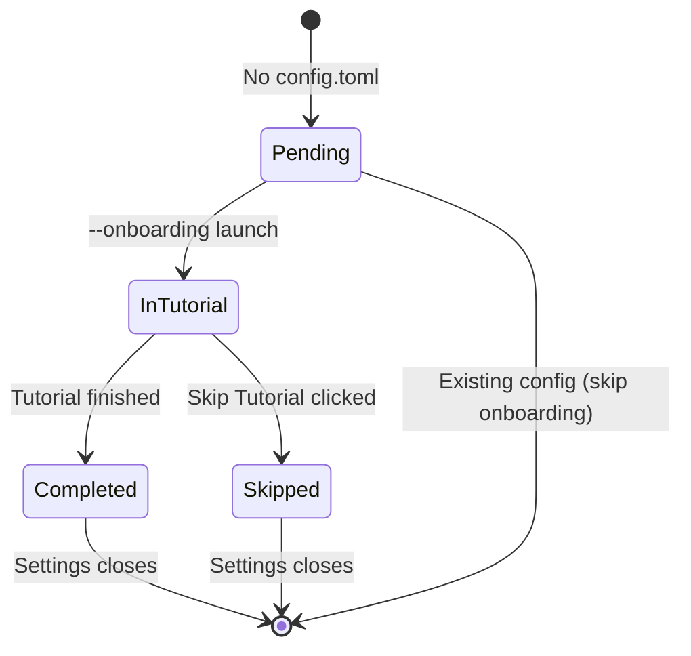
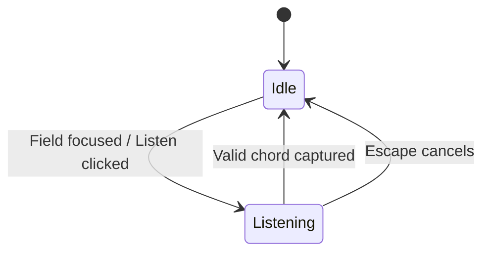

# State Machines — settings

## Onboarding state (`onboarding-completion`)

| State | Next launch behaviour |
| --- | --- |
| Pending | Daemon launches settings with `--onboarding` |
| InTutorial | User must complete or skip |
| Completed / Skipped | Tray-only daemon; Settings opens to main dialog |

## Shortcut capture state (`LC-shortcut-capturer`)

Listening mode ignores typed characters; only physical key combinations are accepted (FR-18).
