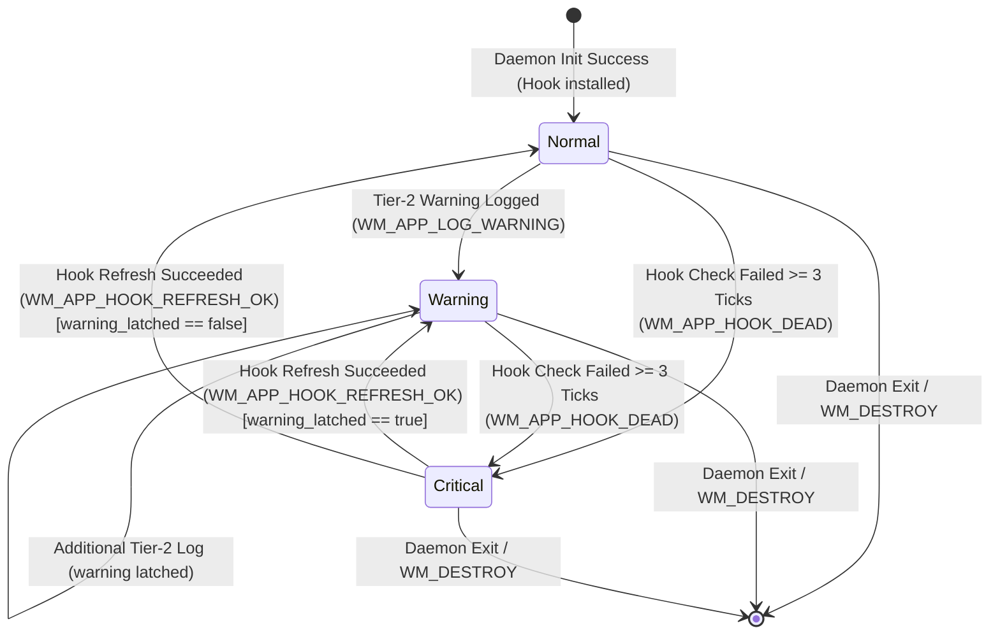

# State Machines — window-management

Conceptual state machines governing runtime entities owned by the `window-management` Product Component.

## 1. Tray Health State Machine (`tray-health-state`)

Governs the user-visible health state of the daemon, error tier escalation (AD-7), and tray icon visual indicators.



### State Definitions

| State | Visual Asset / Badge | User Notification | Interaction Permitted | Log Severity |
| --- | --- | --- | --- | --- |
| `Normal` | Default monochrome / brand icon | None | Full cycling, snapping, tray context menu | Info |
| `Warning` | Default icon + **Amber / Red Dot overlay** | None (silent append to `wiradesk.log`) | Full cycling, snapping, tray context menu | Warn |
| `Critical` | Default icon + **Red X overlay** | Exactly 1x Windows Toast Notification | Tray context menu only (cycling disabled) | Error |

### Transition Rules

| From | To | Trigger / Message | Condition & Side Effect |
| --- | --- | --- | --- |
| `[*] ` | `Normal` | Daemon startup | `SetWindowsHookExW` succeeds within startup retry budget (`HOOK_RETRY_MAX = 5`). Tray icon created via `Shell_NotifyIconW(NIM_ADD)`. |
| `Normal` | `Warning` | `WM_APP_LOG_WARNING` (`0x8004`) | Non-fatal runtime issue logged (e.g. non-fatal API refusal); `warning_latched = true`; icon updated to Warning (`NIM_MODIFY`). |
| `Warning` | `Warning` | `WM_APP_LOG_WARNING` (`0x8004`) | Additional warning logged; `warning_latched` remains `true`. |
| `Normal` / `Warning` | `Critical` | `WM_APP_HOOK_DEAD` (`0x8003`) | Consecutive heartbeat refresh failures reach threshold (`HOOK_CHECK_FAIL_THRESHOLD = 3`); icon updated to Critical; if `!hook_dead_toast_sent`, fire 1x Toast Notification and set `hook_dead_toast_sent = true`. |
| `Critical` | `Warning` | `WM_APP_HOOK_REFRESH_OK` (`0x8008`) | Subsequent heartbeat refresh succeeds while `warning_latched == true`. Restores Warning icon; resets `hook_dead_toast_sent = false`. |
| `Critical` | `Normal` | `WM_APP_HOOK_REFRESH_OK` (`0x8008`) | Subsequent heartbeat refresh succeeds while `warning_latched == false`. Restores Normal icon; resets `hook_dead_toast_sent = false`. |
| Any | `[*] ` | `WM_DESTROY` / User Exit | Tray icon deleted (`NIM_DELETE`); hook thread joined; process exits cleanly. |

---

## 2. Low-Level Keyboard Hook Lifecycle (hook instance, not `hook-command`)

Governs the operational lifecycle of the `WH_KEYBOARD_LL` hook instance on the dedicated Hook Thread.

This machine belongs to the **hook instance**, which is not a domain entity and deliberately has no
row in `domain-model.md`. The entity named `hook-command` has its own, much shorter lifecycle there —
`Pending` → `Dispatched` | `Dropped` — describing one intercepted keypress rather than the hook that
intercepted it. They were briefly filed under one name; two machines under one entity name is how a
reader ends up looking for `Degraded` in the wrong table.

```mermaid
stateDiagram-v2
    [*] --> Installing: hook::spawn()
    Installing --> Active: SetWindowsHookExW OK
    Installing --> Failed: SetWindowsHookExW Failed (5 retries exhausted)
    Active --> Active: Valid Keystroke Intercepted / Throttle Passed / Enqueued
    Active --> Refreshing: Heartbeat Tick (WM_APP_HOOK_CHECK every 10s)
    Refreshing --> Active: Hook Replaced OK (Post WM_APP_HOOK_REFRESH_OK)
    Refreshing --> Degraded: Reinstall Failed (fail_count < 3)
    Degraded --> Refreshing: Subsequent Heartbeat Tick
    Degraded --> Dead: Reinstall Failed (fail_count >= 3)
    Dead --> Refreshing: Subsequent Heartbeat Tick (Continuous Retry)
    Dead --> Active: Reinstall Succeeded (Post WM_APP_HOOK_REFRESH_OK)
    Active --> ShuttingDown: WM_APP_HOOK_SHUTDOWN
    Degraded --> ShuttingDown: WM_APP_HOOK_SHUTDOWN
    Dead --> ShuttingDown: WM_APP_HOOK_SHUTDOWN
    ShuttingDown --> [*]: UnhookWindowsHookEx & PostQuitMessage(0)
    Failed --> [*]: Post WM_APP_HOOK_INIT_FAILED -> Fatal Modal & Exit
```

### Transition Table

| From | To | Trigger | Action & Invariants |
| --- | --- | --- | --- |
| `Installing` | `Active` | Hook install succeeds (attempts 1..=5) | Post `WM_APP_HOOK_READY` with hook thread id to Worker; spawn health heartbeat thread. |
| `Installing` | `Failed` | Hook install fails after 5 retries (1s delay) | Post `WM_APP_HOOK_INIT_FAILED` to Worker; Worker invokes `error::fatal` (Tier 1 modal) and exits process. |
| `Active` | `Active` | Keystroke event (`HC_ACTION`) | If exact shortcut match, evaluate VM/RDP bypass; if bypass, call `CallNextHookEx`; if not bypass, check throttle (≥50 ms) and push `u8` to ring buffer; post `WM_APP_COMMAND_READY` to Worker. Swallow main key down/up; pass modifier up. |
| `Active` / `Degraded` | `Refreshing` | Heartbeat tick `WM_APP_HOOK_CHECK` (every 10s) | Invoke `SetWindowsHookExW` on Hook Thread to verify/renew hook registration. |
| `Refreshing` | `Active` | Reinstall succeeds | Unhook prior `HHOOK`; reset `hook_check_fail_count = 0`; post `WM_APP_HOOK_REFRESH_OK` to Worker. |
| `Refreshing` | `Degraded` | Reinstall fails (`fail_count < 3`) | Increment `hook_check_fail_count`; retain prior `HHOOK`; log debug trace. |
| `Degraded` | `Dead` | Reinstall fails (`fail_count >= 3`) | Retain fail count; post `WM_APP_HOOK_DEAD` to Worker; Worker escalates tray to Tier 3 Critical. |
| `Dead` | `Active` | Reinstall succeeds on later heartbeat | Unhook prior handle; reset `hook_check_fail_count = 0`; post `WM_APP_HOOK_REFRESH_OK` to Worker (recovering tray state). |
| Any | `ShuttingDown` | `WM_APP_HOOK_SHUTDOWN` | Unhook active `HHOOK`; reset runtime atomic pointer; call `PostQuitMessage(0)` to terminate Hook Thread message loop. |
